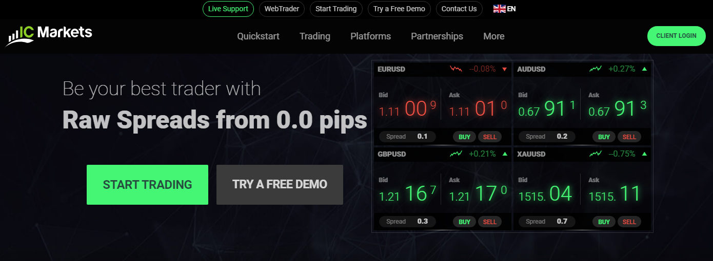
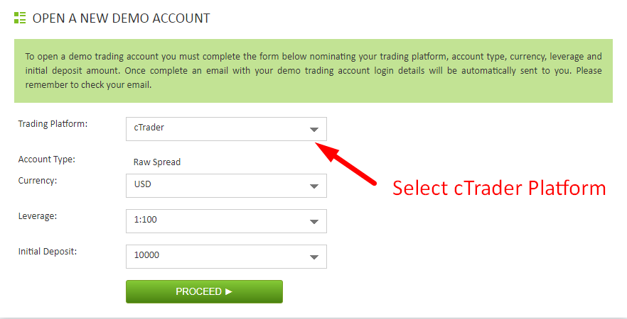
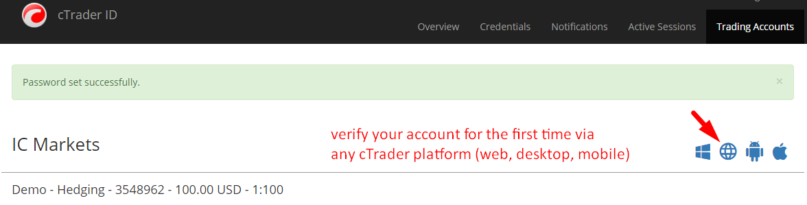

# Как подключиться к IC Markets через Quantower

Чтобы подключить платформу Quantower к брокеру IC Markets и отправлять торговые приказы, вам необходимо использовать cTrader Gateway. Если у вас уже есть торговый счет в IC Markets, перейдите к предпоследнему шагу в этом руководстве.



* Перейдите на официальный сайт [IC Markets](https://www.icmarkets.com/) и создайте торговый счет, заполнив регистрационную форму.

* При регистрации всегда выбирайте платформу cTrader, где вам нужно ее указать.

* После создания демо-учетной записи проверьте адрес электронной почты, который вы использовали при регистрации учетной записи. В письме с темой «Добро пожаловать в cTrader ID» указан ваш идентификатор, который будет использоваться в качестве логина на платформах Quantower и cTrader. Установите пароль для авторизации, нажав на кнопку «Установить пароль».

* Перед первым подключением через платформу Quantower вам необходимо активировать свою учетную запись в системе cTrader. Вы можете сделать это через веб-платформу IC Markets cTrader [https://ct.icmarkets.com/](https://ct.icmarkets.com/)

* После входа в платформу cTrader \(веб, настольную или мобильную\) вам необходимо принять Лицензионное соглашение.
* После этого на платформе Quantower в диспетчере подключений выберите соединение cTrader Gateway с Demo или Real и нажмите кнопку «Подключить». Появится форма авторизации, где нужно указать адрес электронной почты или cTrader ID, а также пароль. Это стандартная авторизация OAUTH, где вы можете увидеть информацию о подключении. Разрешите доступ и начните торговать :\)

* Now you can place and manage your orders via Quantower or cTrader. Good luck!

