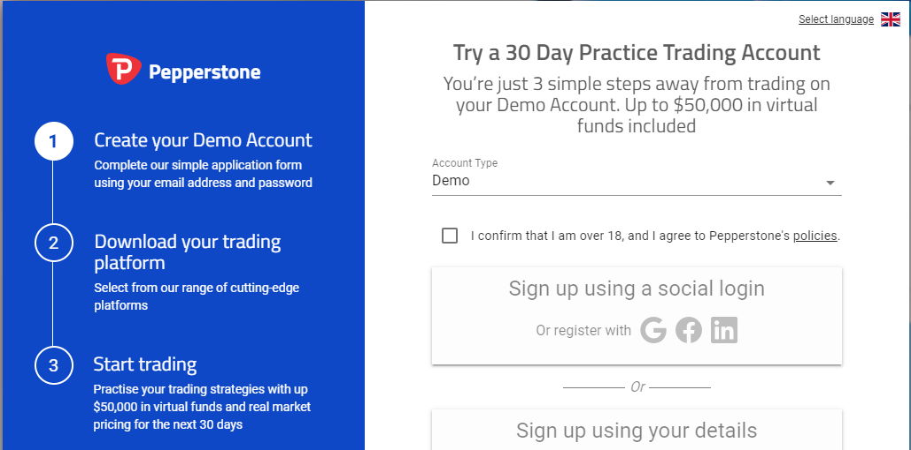
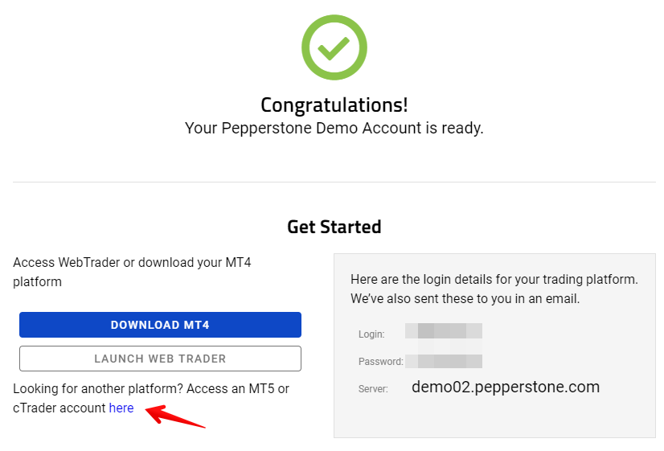
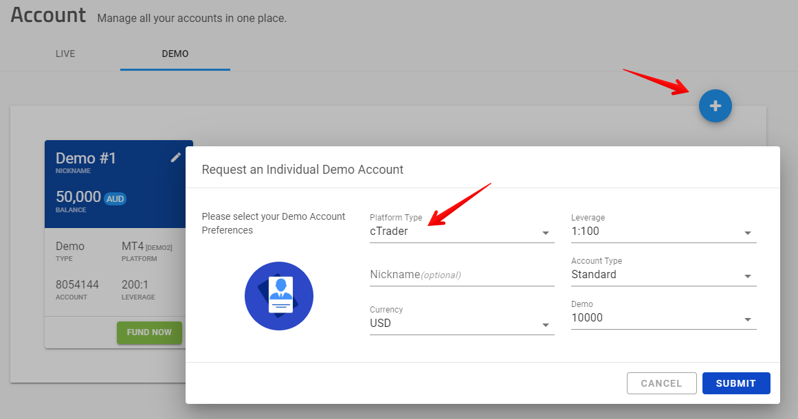
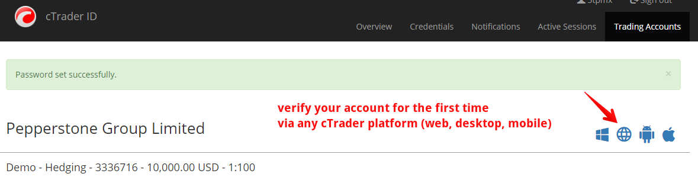
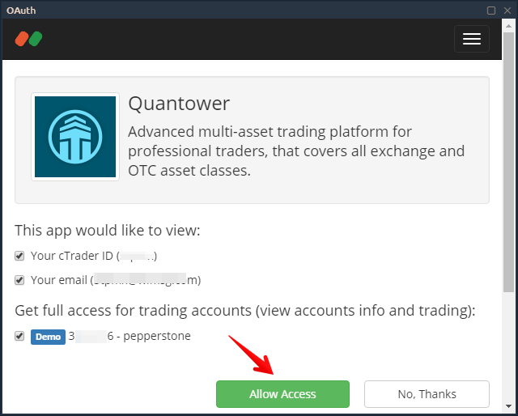

# Как подключиться к Pepperstone через Quantower

Чтобы подключить платформу Quantower к брокеру Pepperstone, вам необходимо использовать cTrader Gateway. Если у вас уже есть торговый счет в Pepperstone, перейдите к предпоследнему шагу в этом руководстве.



* Перейдите на официальный сайт [**Pepperstone**](https://pepperstone.com/) и **создайте торговый счет**, заполнив регистрационную форму. Pepperstone предоставляет демо-счет сроком на 30 дней.

* After filling out the form and successful registration, you will be assigned a demo account number for MT platform. To connect Quantower to Pepperstone broker, you must create a demo for cTrader.

* Click on **Request a new account** and choose the cTrader platform. Your account login credentials will be send to your registered email address.

* After creating a demo account, check the E-Mail that you used when registering your account. In the letter with subject **"Welcome to cTrader ID"** is your ID that will be used as a login in platforms Quantower and cTrader. Set the password for authorization by clicking on the **"Set Password"** button.

* Before connecting for the first time through Quantower platform, you need to activate your account in the cTrader system. You can do it via Pepperstone **cTrader Web-based** platform [https://ct.pepperstone.com/](https://ct.pepperstone.com/)

* Once you logged in to the cTrader paltform \(web, desktop or mobile\) you need to accept the License Agreement.
* After that, in the Quantower platform in the connection manager, select cTrader Gateway connection with Demo or Real and press **"Connect"** button. An authorization form will appear, where you need to specify an email or cTrader ID, as well as a password. This is a standard OAUTH authorization where you can see the connection information. **Allow access** and start trading :\)

* You can place and manage your orders via Quantower or cTrader. Good luck!

