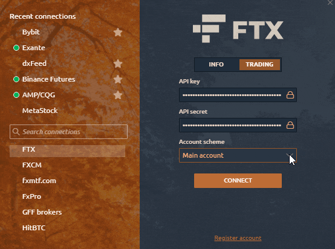

# Подключение к FTX

Чтобы использовать функции [Quantower из пакета All-in-one бесплатно](https://www.quantower.com/connections), вам просто нужно подключиться к бирже FTX со своей учетной записью \(API Key\). Если у вас нет аккаунта, [**откройте его со скидкой 5% на торговые комисии**](https://ftx.com/#a=quantower) по партнерской ссылке. All our paid features like volume analysis, power trades, advanced features, DOM surface or TPO profile chart are already available for all FTX symbols at zero cost.

## How to get Full License of Quantower for free with FTX?

Just **enter your API Key and Secret Key** and login to the trading mode. That's all! It doesn't matter to us when your account was created.



## **How to switch between Main and Sub-Accounts in FTX?**

Added the ability to select the main and sub-accounts. Due to the specifics of the exchange API, the speed of order processing was executed with a delay of up to 5 seconds, which led to a slippage of the order and incorrect opening of orders. For example, if you work only on the Main account, the processing of orders is much faster than when you connect to multiple accounts \(Main + Sub-accounts\).

