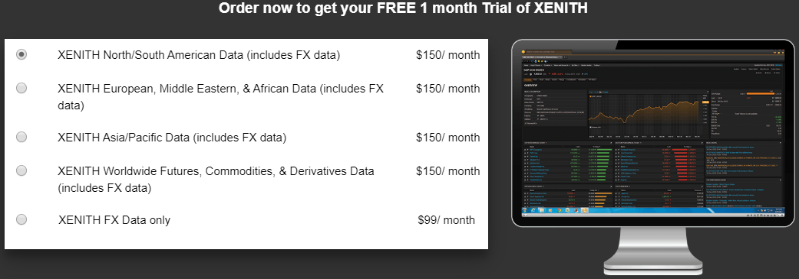
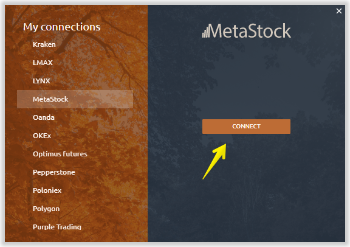
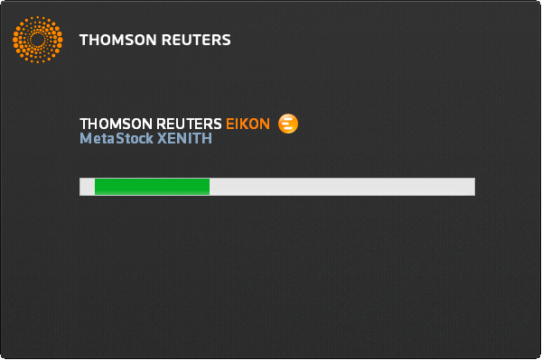

# Подключение к MetaStock

* \*\*\*\*[**Как создать учетную запись MetaStock XENITH / EIKON?**](connection-to-metastock.md#kak-sozdat-uchetnuyu-zapis-metastock-xenith-eikon)\*\*\*\*
* [**Скачайте и установите Metastock XENITH**](https://app.gitbook.com/@quantower/s/quantower-ru/~/drafts/-Mf2S4zWrMsbBFI05SuA/connections/connection-to-metastock#download-and-install-metastock-xenith)\*\*\*\*
* \*\*\*\*[**Запуск Quantower с подключением к Metastock**](https://app.gitbook.com/@quantower/s/quantower-ru/~/drafts/-Mf2S4zWrMsbBFI05SuA/connections/connection-to-metastock#launch-quantower-with-metastock-connection)\*\*\*\*

## Как создать учетную запись MetaStock XENITH / EIKON?

[**Перейдите по ссылке**](https://www.metastock.com/offer/ek/?whc=quantowerek&pc=Eq-quantower) и нажмите кнопку _**«Получить БЕСПЛАТНУЮ пробную версию XENITH на 1 месяц»**_. Выберите рыночные данные, на которые вы хотите подписаться.

Metastock предлагает базу данных различных аналитических данных, разделенных не только по типам, но и по регионам. Например, если вам нужны рыночные данные для конкретной биржи или региона \(Азия, Европа\), вы можете легко выбрать их на их веб-сайте. Но мы рекомендуем использовать для этого обратиться в поддержку Metastock, которая поможет вам создать план данных, соответствующий вашим требованиям.

**Создайте учетную запись**, чтобы получать их продукты. Если у вас уже есть учетная запись, войдите в систему.

## Скачайте и установите Metastock XENITH

После того, как вы выбрали необходимую подписку и создали новую учетную запись, вам необходимо принять "Пользовательское соглашение", загрузить и установить Metastock XENITH. Ссылка доступна в личном кабинете после регистрации.

## Запуск Quantower с подключением к Metastock

Select Metastock connection in the Quantower connection manager and press Connect. That will also launch Metastock software. Enter the credentials you’ve got from Metastock in their application.

