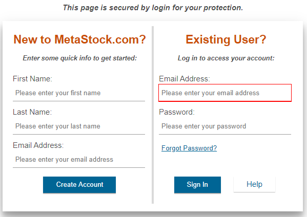
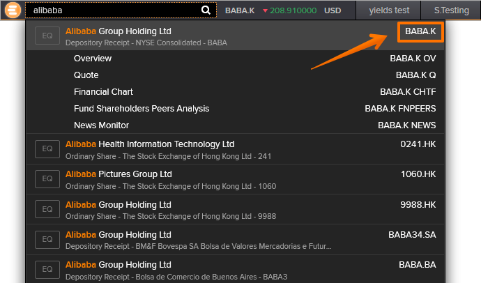
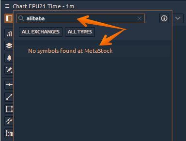
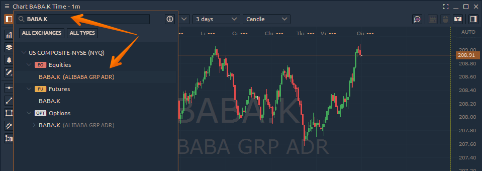
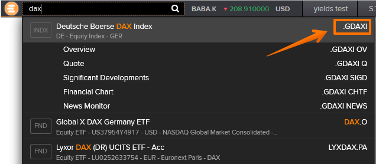

# Подключение к MetaStock

* [**Как создать учетную запись MetaStock XENITH / EIKON?**](connection-to-metastock.md#kak-sozdat-uchetnuyu-zapis-metastock-xenith-eikon)
* [**Скачайте и установите Metastock XENITH**](https://app.gitbook.com/@quantower/s/quantower-ru/\~/drafts/-Mf2S4zWrMsbBFI05SuA/connections/connection-to-metastock#download-and-install-metastock-xenith)
* [**Запуск Quantower с подключением к Metastock**](https://app.gitbook.com/@quantower/s/quantower-ru/\~/drafts/-Mf2S4zWrMsbBFI05SuA/connections/connection-to-metastock#launch-quantower-with-metastock-connection)
* [**Как добавить символ на график или на другую панель**](connection-to-metastock.md#kak-dobavit-simvol-na-grafik-ili-na-druguyu-panel)

## Как создать учетную запись MetaStock XENITH / EIKON?

[**Перейдите по ссылке**](https://www.metastock.com/offer/ek/?whc=quantowerek\&pc=Eq-quantower) и нажмите кнопку _**«Получить БЕСПЛАТНУЮ пробную версию XENITH на 1 месяц»**_. Выберите рыночные данные, на которые вы хотите подписаться.

Metastock предлагает базу данных различных аналитических данных, разделенных не только по типам, но и по регионам. Например, если вам нужны рыночные данные для конкретной биржи или региона (Азия, Европа), вы можете легко выбрать их на их веб-сайте. Но мы рекомендуем использовать для этого обратиться в поддержку Metastock, которая поможет вам создать план данных, соответствующий вашим требованиям.

.png>)

**Создайте учетную запись**, чтобы получать их продукты. Если у вас уже есть учетная запись, войдите в систему.

## Скачайте и установите Metastock XENITH

После того, как вы выбрали необходимую подписку и создали новую учетную запись, вам необходимо принять "Пользовательское соглашение", загрузить и установить Metastock XENITH. Ссылка доступна в личном кабинете после регистрации.

## Запуск Quantower с подключением к Metastock

Выберите соединение с Metastock в диспетчере соединений Quantower и нажмите "Подключить". Это также запустит программное обеспечение Metastock. Введите учетные данные, полученные от Metastock, в их приложение.

## Как добавить символ на график или на другую панель


Из-за ограничений API подключение к MetaStock Xenith позволяет находить символы только по точному тикеру (!)


Поисковая система на платформе Eikon позволяет искать акции по текстовому описанию или буквам любого регистра. К сожалению, этот механизм не распространяется на другие платформы через API.

По этой причине важно использовать точный тикер акций, представленный на платформе Eikon. В противном случае вы не получите результатов поиска.

.png>)

