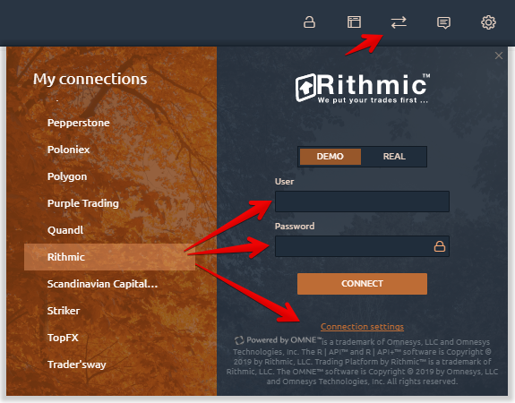
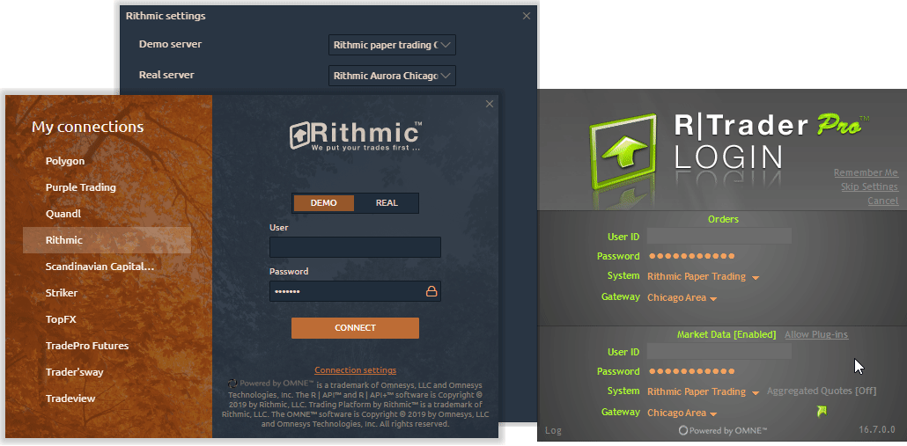
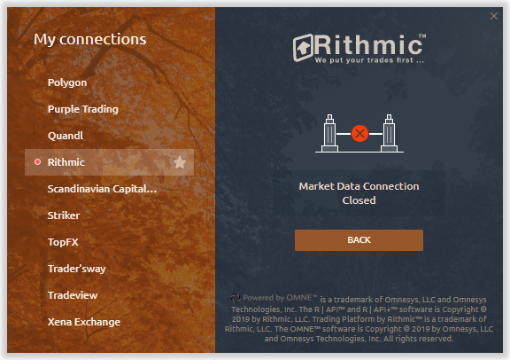

# Подключение к Rithmic

Чтобы подключить Quantower к брокеру, использующему технологию Rithmic, достаточно иметь (или создать новую) учетную запись.

* [**Как подключить существующую учетную запись**](connection-to-rithmic.md#kak-podklyuchit-sushestvuyushuyu-uchetnuyu-zapis)
* [**Создание и подключение новой учетной записи.**](connection-to-rithmic.md#creating-a-new-accounts-and-further-connection)
* [**Как активировать данные Market by Order (MBO)**](connection-to-rithmic.md#kak-aktivirovat-dannye-market-by-order-mbo)
*   [**Проблемы при подключении к Rithmic**](connection-to-rithmic.md#problemy-pri-podklyuchenii-k-rithmic)

    [_Ошибка Market Data Connection Closed (Broken)_](connection-to-rithmic.md#market-data-connection-closed-broken)

    [_Нет данных Level2 для некоторых символов_](connection-to-rithmic.md#net-dannykh-level2-dlya-nekotorykh-simvolov)

## Как подключить существующую учетную запись

* [**Загрузите и установите RTrader Pro**](https://yyy3.rithmic.com/?page\_id=16) с официального сайта Rithmic
* Откройте диспетчер соединений на платформе Quantower, выберите Rithmic и укажите тип соединения (Demo / Real).
* Нажмите «Настройки подключения» и активируйте опцию «Использовать RTrader», чтобы избежать дополнительной оплаты за подписку на рыночные данные. При необходимости трейдер может изменить сервер. По умолчанию сервер Rithmic Paper Chicago настроен для демо счетов, а сервер Rithmic Aurora Chicago настроен для реальных счетов.
* Введите свой логин и пароль и нажмите "Подключиться".


С 1 мая 2020, биржа [**CME изменила правила определения профессионального участника рынка**](https://yyy3.rithmic.com/?p=1069) и, как следствие, увеличила комиссию за рыночные данные. Чтобы правильно определить профессионального участника, Ritmic изменил параметры подключения на своей платформе, а также в API для таких платформ, как Quantower.&#x20;

Чтобы избежать дополнительной оплаты за подписку на рыночные данные, трейдеру необходимо подключиться через платформу RTrader Pro в режиме **Allow Plugins,** а также активировать настройку в Quantower, которая называется **Use RTrader**.


## Создание и подключение новой учетной записи.

* [**Создайте новый демо счет**](https://rithmic.com/demo.html#sign-up) или откройте реальный счет у любого брокера, поддерживающего технологию Rithmic, примите соглашения и начните использовать нашу платформу.



* Для регистрации [**Rithmic Demo**](https://rithmic.com/demo.html#sign-up) перейдите на их официальный сайт или [перейдите по этой ссылке ](https://rithmic.com/demo.html#sign-up)
* Заполните все обязательные поля.&#x20;
* Примите «Соглашение о подписке на рыночные данные» и «Самостоятельная сертификация рыночных данных»&#x20;
* Аккаунт будет активирован в течение 30-60 минут.

## Как активировать данные Market by Order (MBO)

Данные «Market by Order» (MBO) показывают объем индивидуального ордера, стоящего в очереди в данных level2 по определенной цене. Чтобы активировать отображение этих данных, откройте настройки подключения и установите флажок «Включить режим «Market by Order»(MBO)».

После активации вы сможете увидеть эти данные в панели [DOM Trader](https://help.quantower.com.ru/trading-panels/dom-trader).

На панели [DOM Trader](https://help.quantower.com.ru/trading-panels/dom-trader) откройте "_Настройки" -> "Столбцы" -> "Биды/Аски" (если вы используете режим разделения или "Биды" и "Аски" как отдельные столбцы) -> "Цветовая схема размера" -> "MBO"._ \
Кроме того, вы можете установить **Фильтр для ордеров больше, чем (MBO)**, если хотите видеть ордера определенного размера.

## Проблемы при подключении к Rithmic

### **Ошибка Market Data Connection Closed (Broken)**

Иногда при подключении к Rithmic вы можете увидеть ошибку «**Market Data Connection Closed (Broken)** ». Ниже мы опишем возможные причины, а также решения.


Чаще всего это сообщение об ошибке встречается **новыми пользователями Rithmic** по разным причинам и не контролируется платформой Quantower.


.png>)

#### Подключиться к Rithmic можно двумя способами:

1. Напрямую, **без использования платформы RTrader Pro**. Такой способ позволяет подключать только одну платформу (!).

2\. **Через платформу RTrader Pro.** Это соединение использует режим плагина и позволяет подключать несколько платформ одновременно (!)

**Причины, по которым может возникнуть эта ошибка и варианты решений:**&#x20;

*   Вы не приняли соглашения «Соглашение о подписке на рыночные данные» и «Самостоятельная сертификация рыночных данных» во время регистрации на веб-сайте Rithmic или в платформе RTrader. Мы рекомендуем подключиться через платформы RTrader или RTrader Pro, чтобы проверить свою учетную запись.

    ✅ _**Решение:**_ примите соглашения в платформе RTrader Pro
*   Новая учетная запись была создана менее часа назад. Обычно полная активация новой учетной записи занимает от 30 минут до 1 часа.

    ✅ _**Решение:**_ откройте платформу RTrader Pro и подключитесь со своим логином. Если подключение прошло успешно, значит ваша учетная запись уже активна в системе Rithmic.
*   Убедитесь, что ваш логин соответствует Демо или Реальному подключению

    ✅ _**Решение:**_ попробуйте оба варианта подключения в Quantower

*   Если Quantower был подключен к Rithmic раньше через плагин RTrader (т.е. активен флажок **Использовать RTrader**), и в данный момент платформа RTrader Pro не подключена или опция **Allow Plugins** не активна, тогда Quantower не сможет подключиться.

    ✅ _**Решения (несколько вариантов):**_

    1\) Запустите платформу RTrader Pro с включенным плагином **(Allow Plugins)** и снова подключитесь к своей учетной записи в Quantower;

    2\) Попробуйте подключиться к Rithmic как прямое соединение: закройте платформу RTrader Pro, отключите опцию Use Rtrader в настройках Quantower и перезапустите Quantower. После этого снова запустите Quantower и подключитесь к своей учетной записи как прямое соединение;

*   В случае прямого подключения (без режима RTrader Plugin) вы не можете использовать один и тот же логин на разных платформах одновременно. Подключение может быть только одним логином на одной платформе (!). При попытке подключения с одним логином на разных платформах, произойдет выход с первой платформы (которая была подключена), но логин на второй платформе не будет успешно подключен (на которой мы пытаемся войти)

    ✅ **Решение:** используйте режим плагина RTrader для нескольких подключений или закройте все платформы и подключитесь через Quantower в качестве прямого подключения (без режима плагина Rtrader).

*   Ошибка может возникнуть из-за того, что сервер Rithmic недоступен для подключения. Обычно с этой ошибкой можно столкнуться на выходных.&#x20;

    ✅ _**Решение:**_ В этом случае лучше подождать до вечера воскресенья, чтобы посмотреть, сможете ли вы подключиться, чтобы определить, является ли это проблемой или есть какая-то другая проблема.
* Демо-счета Rithmic имеют ограничение 14 дней на каждую биржу по предоставлению потоковых данных в реальном времени. Если вы ранее использовали демо Rithmic, вы не сможете войти в систему с новым демо Rithmic.
* Если вы не можете подключиться в течение нескольких дней, вам необходимо связаться с вашим брокером по этому поводу.

Если вы включили плагин Use RTrader в настройках подключения, но по-прежнему не можете подключиться к Rithmic, убедитесь, что у вас более одного активного сеанса для данных Market.

.png>)

### Нет данных Level2 для некоторых символов

Эта проблема может быть связана с тем, что у вас нет подписки на данные Level2. Чтобы проверить это, запустите платформу RTrader Pro и откройте панель «Книга заказов» (Order Book).&#x20;

Если у вас нет данных по Bid / Ask на платформе RTrader, вам необходимо подписаться на эти данные через поддержку Rithmic. После этого вы также увидите данные Level2 на нашей платформе.

