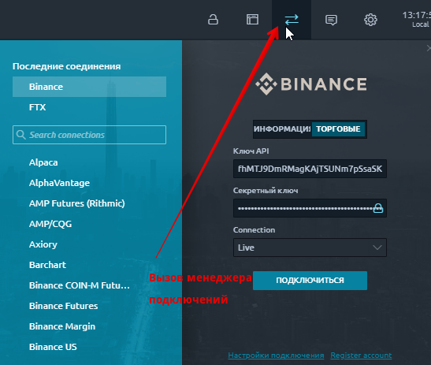
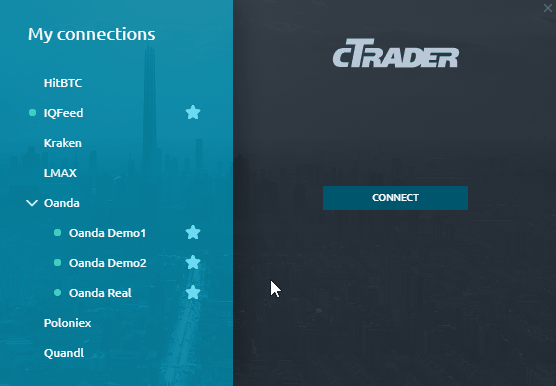
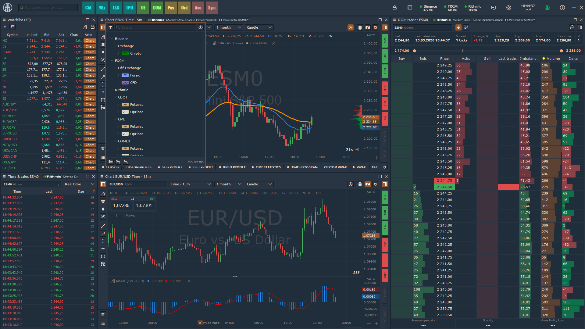
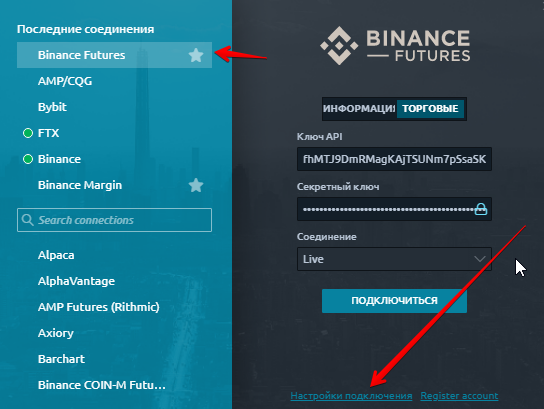

# Менеджер подключений


Как работать с диспетчером подключений в Quantower


**Подключения** - это интеграция со сторонними поставщиками, которые предоставляют различные данные: торговые котировки, историю символов и т. д.

## Основная информация

**Диспетчер подключений** - это экран, который позволяет вам выбрать из доступных подключений те, с которыми вы торгуете, и подключиться к ним, используя свои учетные записи. При подключении к любому брокеру или бирже диспетчер подключений запоминает ваши учетные данные и будет использовать их для дальнейших автоматических подключений (повторное подключение в случае ошибок). Если вы не хотите хранить свои учетные данные в диспетчере, просто щелкните значок «Заблокировать» в форме входа.

Окно диспетчера подключений состоит из двух столбцов: список подключений и информация о подключении. Столбец информации о подключении содержит информацию об активном подключении или форме входа в систему, если текущее подключение неактивно.

Каждое активное соединение отмечается зеленой точкой состояния слева от его имени. Значок «Звездочка» указывает на то, что соединение является избранным и отображается на панели инструментов Центра управления. Этот значок также используется для добавления / удаления соединения из избранного.

Форма входа для подключения зависит от требований интеграции. Обычно в нем есть поля для входа и пароля, а также кнопка «**Подключиться**». Эта кнопка запускает процесс авторизации. Некоторые интеграции имеют свои [**настройки подключения.**](connections-manager.md#nastroiki-podklyucheniya) Создание учетной записи перенаправляет вас на веб-сайт поставщика интеграции.

После подключения информационная колонка будет содержать данные о пинге и текст текущего статуса подключения. Также есть кнопка «**Отключить**».

## Мультиподключение


Quantower поддерживает несколько подключений одновременно, но эта функция доступна по платным лицензиям - Advanced Features, Crypto Package, Multi-Asset package и All-In-One License. На странице [**сравнение лицензий**](https://help.quantower.com.ru/getting-started/license-comparison) можно увидеть ограничения по мультиподключениям для бесплатной лицензии.


## Настройки подключения

У каждого подключения есть свои особенности. Для некоторых подключений можно выбирать дополнительные URL для коннекта по API. Для некоторых подключений/брокеров можно выбирать отдельные рынки и биржи.&#x20;

Что бы проверить дополнительные настройки, доступные для выбранного коннекта, перейдите по ссылке "Настройки подключения", которая размещена внизу в окне менеджера подключений:

**Далее, в зависимости от выбранного коннекта, Вы сможете настроить дополнительные параметры, которые относятся к настройкам отдельного соединения.**

* **\[Binance Futures]**  Есть возможность выбрать необходимость загрузки истории сделок. Для некоторых коннектов, например для биржи Binance, история сделок сохраняется локально на Вашем компьютере. И история сделок будет отображаться на графике и в информационных панелях с данными о истории только при отмеченном параметре "загружать историю сделок". Так же можно разрешить/не разрешать изменение кредитного плеча, установить период обновления, базу расчета прибыли и т.д.

![\[Binance Futures\] ](../.gitbook/assets/fyuchersy-binans.png)

* **\[Bybit]** Выбор альтернативной ссылки для получения данных:

![\[Bybit\]](../.gitbook/assets/babit-nastroiki.png)

* &#x20;**\[CQG]** Выбор определенных рынков, что бы оптимизировать в дальнейшем выбор торговых пар в дереве символов для торговли.

![\[CQG\] ](../.gitbook/assets/amp-dopolnitelnye-nastroiki.png)

* &#x20;**\[Binance Margin]** Выбрать необходимость загрузки истории сделок. Для некоторых коннектов, например для биржи Binance, история сделок сохраняется локально на Вашем компьютере. И история сделок будет отображаться на графике и в информационных панелях с данными о истории только при отмеченном параметре "загружать историю сделок"

![\[Binance Margin\] ](../.gitbook/assets/binans-marzhin.png)
