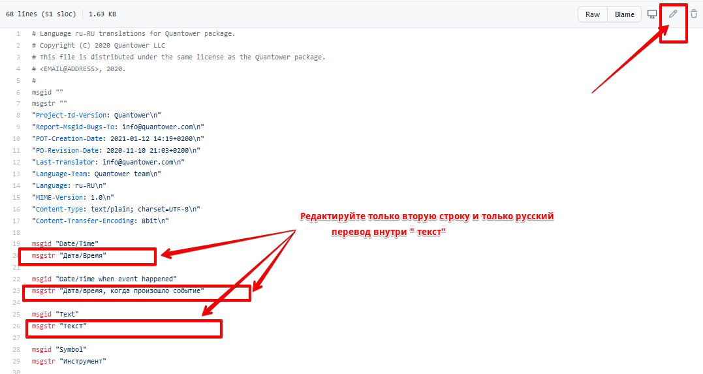
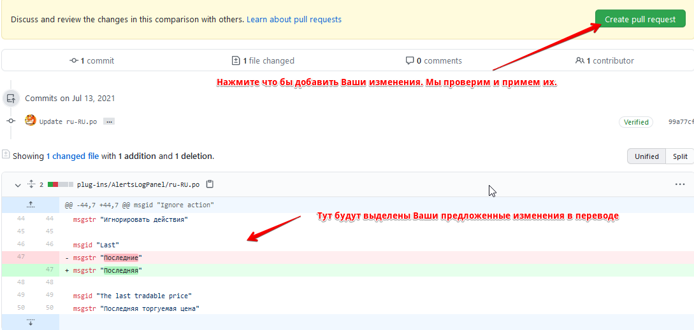

# Локализация

Quantower предлагает пользователям несколько языков, что значительно упрощает процесс работы с платформой. Помимо английского, доступно еще 14 языков, которые мы постоянно обновляем и добавляем новые.

В случае ошибок или неточностей в переводе любой пользователь может внести изменения в текст. Для этого напишите нам в поддержку или измените текст в файле, который находится в репозитории Github. В следующий раз, когда вы обновите платформу, все ваши изменения будут применены автоматически.

## Как внести изменения в файл локализации на Github 

* Перейдите в раздел [**Quantower / Localization на Github**](https://github.com/Quantower/Localization), где находятся файлы перевода для каждой панели. Вот ссылка [https://github.com/Quantower/Localization](https://github.com/Quantower/Localization)
* Зарегистрируйте учетную запись или войдите в Github, используя свой логин и пароль. Мы можем предоставить вам учетную запись для внесения изменений в файлы локализации. Для этого напишите нам в поддержку.
* Файлы локализации хранятся в двух папках: **Common** - содержит все общие фразы для всего терминала; **Плагины** - включают папки со всеми панелями, которые содержат файлы перевода для определенных панелей.

* Go to the Common folder and click on the language file you want to change. Click on the _**"Edit"**_ icon and change the required text only in the second line. The first line — **msgid** — is the key in the English version. The second line — **msgstr** — translation of the English key into the selected language.Перейдите в папку Common и кликнтите на файл языка, который хотите изменить. Нажмите на иконку «Редактировать» и измените необходимый текст только во второй строке. Первая строка - **msgid** - это ключ в английской версии. Вторая строка - **msgstr** - перевод английского ключа на выбранный язык.

* После внесения изменений нажмите кнопку **\[Предложить изменение файла\]** внизу страницы.

* Вы увидите все внесенные вами изменения, которые вы можете проверить и отредактировать при необходимости. Нажмите **\[Create pull request\]**, чтобы отправить нам запрос на изменение текста перевода. После того, как мы примем запрос, все внесенные изменения появятся в следующем обновлении платформы.

Если у вас возникнут дополнительные вопросы, напишите нам в поддержку, и мы вам поможем.

