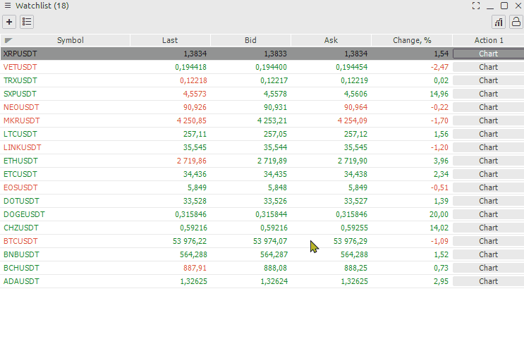

# Уведомления

**Уведомление** на финансовом рынке - это стандартный сигнал, который уведомляет вас, когда цена достигает определенного уровня на графике, предустановленного в настройках. Уведомление приходит в виде: звука, уведомления, открываемого на мониторе, электронного письма в телеграмме, отправляемого мгновенно, как только цена приближается к определенному значению.

**Оповещения** уже доступны в Quantower по умолчанию . Вы можете выбрать звуковые файлы для предупреждений из предложенных или установить свой собственный сигнал, который вам нравится, в качестве саундтрека. Все остальные параметры предупреждений в Quantower, относящиеся к обычным графическим фигурам - изменение цвета, перетаскивание, вызов меню двойным щелчком и т. д.

## Как настроить оповещения Quantower на графике

В **настройках уведомлений** можно указать один или несколько триггеров. Чтобы вы не пропустили оповещение, можно оставить сразу несколько оповещений.  

## Управление уведомлениями в Quantower

Когда у вас будет много уведомлений, используйте **Диспетчер объектов** для управления ими. Двойной щелчок по предупреждению переместит вас в точку на графике, где установлено это предупреждение. Вы также можете отредактировать его или удалить ненужные предупреждения.


**Важно:** предупреждение будет работать только на открытом графике. Если вы переключите график, на котором вы установили оповещение, с одного символа на другой, оповещение не сработает.


## How to set up Quantower Alerts on watchlist

[Watchlist](../analytics-panels/watchlist.md) panel shows brief pricing information on selected instruments, which you can group into lists. There are two ways to get to the settings menu.

* From the menu of this window, select Setup Actions
* Right-click on the desired symbol and find Alert in the menu

And so let's look at how to set up an alert. To do this, we need to do a few actions. Activate the alert / Enable Action Give a name to the alert. Specify the symbol of interest. Add a condition. Select an action when the condition occurs


Do not forget to activate the Enable Action button


## How to copy conditions of Alerts

You can also copy the Alert state and change only some parameters, such as the symbol and its values

