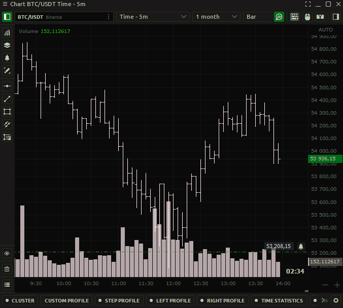
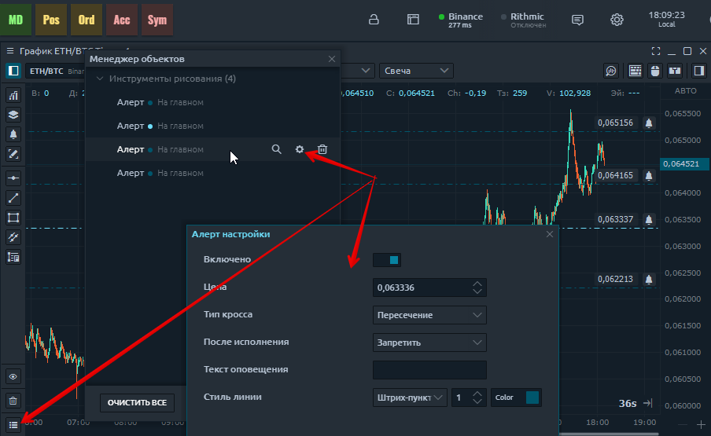
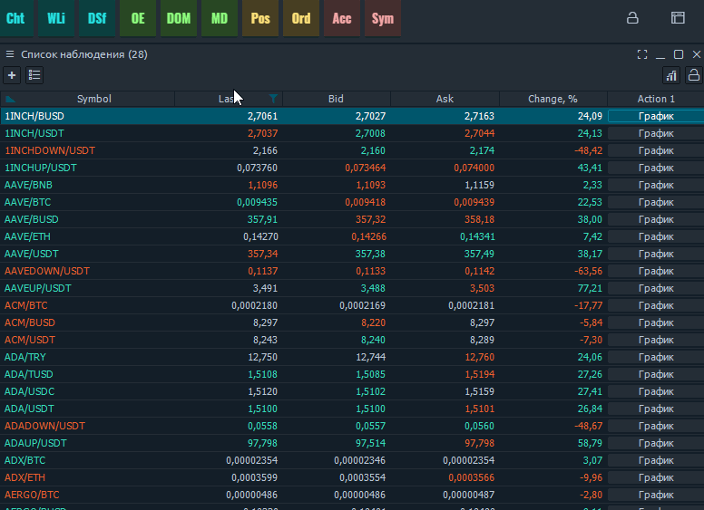
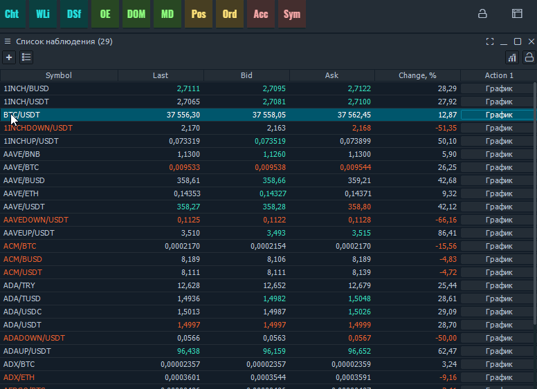
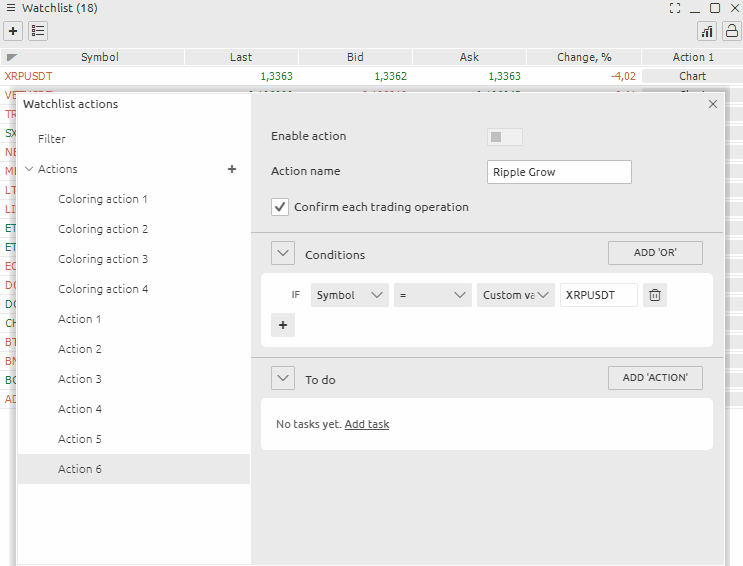

# Уведомления

**Уведомление** на финансовом рынке - это стандартный сигнал, который уведомляет вас, когда цена достигает определенного уровня на графике, предустановленного в настройках. Уведомление приходит в виде: звука, уведомления, открываемого на мониторе, электронного письма в телеграмме, отправляемого мгновенно, как только цена приближается к определенному значению.

**Оповещения** уже доступны в Quantower по умолчанию . Вы можете выбрать звуковые файлы для предупреждений из предложенных или установить свой собственный сигнал, который вам нравится, в качестве саундтрека. Все остальные параметры предупреждений в Quantower, относящиеся к обычным графическим фигурам - изменение цвета, перетаскивание, вызов меню двойным щелчком и т. д.

## Как настроить оповещения Quantower на графике

В **настройках уведомлений** можно указать один или несколько триггеров. Чтобы вы не пропустили оповещение, можно оставить сразу несколько оповещений.  

## Управление уведомлениями в Quantower

Когда у вас будет много уведомлений, используйте **Диспетчер объектов** для управления ими. Двойной щелчок по предупреждению переместит вас в точку на графике, где установлено это предупреждение. Вы также можете отредактировать его или удалить ненужные предупреждения.


**Важно:** предупреждение будет работать только на открытом графике. Если вы переключите график, на котором вы установили оповещение, с одного символа на другой, оповещение не сработает.


## Как настроить оповещения Quantower в списке наблюдения

На панели [списка наблюдения](https://app.gitbook.com/@quantower/s/quantower-ru/~/drafts/-MaTw4ofFETlRDhQugU7/analytics-panels/watchlist) отображается краткая информация о ценах на выбранные инструменты, которые вы можете сгруппировать в списки.   
  
Попасть в меню настроек оповещений можно двумя способами.

* В меню этого окна выберите Действия настройки.
* Щелкните правой кнопкой мыши нужный символ и найдите в меню Предупреждение.

 Итак, давайте посмотрим, как настроить оповещение. Для этого нам нужно проделать несколько действий. Активировать предупреждение / Включить действие / Дать название предупреждению. Укажите интересующий символ. Добавьте условие. Выберите действие при возникновении условия


Не забудьте добавить действие, которое должно произойти.


## How to copy conditions of Alerts

You can also copy the Alert state and change only some parameters, such as the symbol and its values

