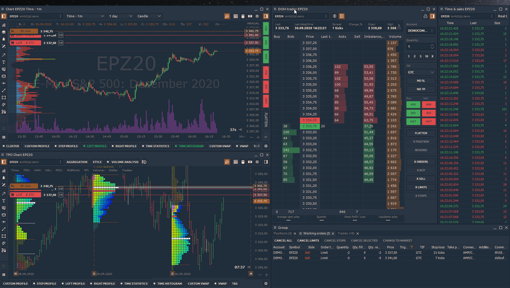
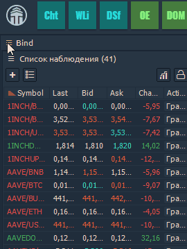

# Binds - Объединение панелей

 Самый инновационный и, мы уверены, полезный слой организации панелей - это **Binds \(Объединение панелей\)**. Он был разработан, чтобы позволить пользователю создавать свои собственные «**Суперпанели**» - наборы базовых панелей, которые должны быть "склеены". Как правило, Binds позволяет создавать любую комбинацию панелей любым необходимым способом; единственный предел - ваша фантазия.

## Как объединить несколько поверхностей

1. разместите несколько панелей на рабочем месте вплотную друг к другу;
2. select “_**Create bind**_” from any panel’s context menu \(this turns the Bind mode on\); выберите «Создать связку» из контекстного меню любой панели \(при этом включается режим привязки\);
3. щелкните панели, которые вы хотите связать вместе, или просто удерживайте левую кнопку мыши и перетащите \(«начертите»\) на эти панели, чтобы выделить их в одной области;
4. нажмите кнопку «СОЗДАТЬ СВЯЗКУ» в правом нижнем углу области «Bind» \(или нажмите кнопку «Enter» на клавиатуре\);
5. Вот и все - теперь у вас есть своя Супер-панель.


Помните: пересекающиеся панели нельзя связать


Каждая Суперпанель действует как единая панель, поэтому, при изменении ее размера, пропорционально изменяются размеры всех содержащихся в ней панелей. Вы также можете перетащить внутренние разделители, чтобы изменить размеры между панелями. После того, как вы поместите несколько разделителей в одну строку, они сохранятся, и их размер изменится как единое целое.

Чтобы отредактировать содержимое Binds или отвязать панели, вы должны отменить привязку, используя параметр контекстного меню. “Unbind”.


Обратите внимание, что не все элементы Quantower можно связать. Эта функция не позволяет объединять экраны, такие как Диспетчер подключений, Настройки. Это ограничение было сделано из-за невозможности изменить размер экранов, в то время как привязки должны содержать только элементы с изменяемым размером.


