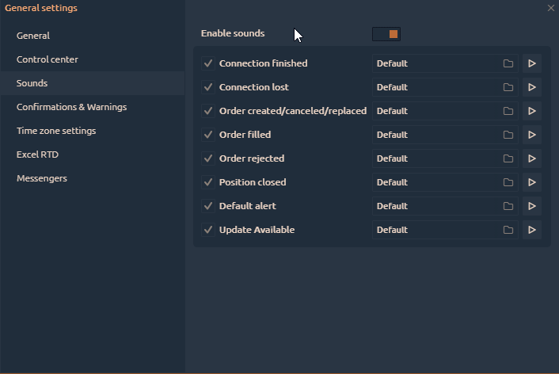

# Общие настройки

Щелкните значок шестеренки [на главной панели инструментов](https://app.gitbook.com/@quantower/s/quantower-ru/~/drafts/-MabubYk5qaqYBPs4dmu/general-settings/main-toolbar), чтобы открыть Общие настройки.

Все настройки сгруппированы в несколько вкладок:

*  ****[**Общие настройки**](general-settings-1.md#vkladka-obshie-nastroiki)\*\*\*\*
*  ****[**Центр управления**](general-settings-1.md#control-center)\*\*\*\*
*  **Звуки**
*  **Подтверждения**
*  **Настройки часового пояса**
*  **Excel RTD**
*  **Мессенджеры**
*  **Горячие клавиши**


Большинство настроек применяются автоматически после их изменения, но в некоторых случаях вам будет предложено подтвердить применение изменений; это действие требуется для сложных настроек, где одно изменение повлияет на сложную логику.


## Вкладка Общие настройки

**Тема** - выберите одну из 8 цветовых схем, которые вам больше всего подходят.

* Default Blue theme
* Dark Autumn
* Dark Forest
* Dark Gold
* Grayscale
* Light Forest
* Light Gold
* Light Water

Язык \(бета\) — Quantower поддерживает 17 языков. В случае ошибок или неточностей в переводе любой пользователь может внести изменения в текст. Прочтите [руководство о том, как внести изменения в выбранный язык](https://help.quantower.com/customization/localization).

**Default symbol** — укажите торговый символ, который по умолчанию будет открываться во всех торговых панелях.

**Автосохранение настроек \(каждые 5 минут\)** - Quantower сохранит все изменения настроек приложения в папке «Настройки» и будет перезаписывать  их каждые 5 минут, пока приложение активно. Это также экономит при закрытии приложения

**Сокращать объем и тики** - эта опция отображает значения объема или количество тиков в упрощенной форме \(1K = 1 000; 10K = 10 000 и т. Д.\)

 **Аббревиативные  цены на криптовалюту** - эта опция отображает сокращенные значения цен на криптовалюту, которые имеют большое количество нулей.

**Unload inactive workspaces.** Если этот параметр включен, все ранее созданные рабочие области не будут получать обновления рыночных данных. Это уменьшит использование памяти.

**Скрыть часть имени учетной записи**. Укажите количество символов, которые будут скрыты для имени и идентификатора вашего торгового счета. Этот параметр используется для сохранения конфиденциальности учетной записи.

**Beta Version.** Когда эта опция активирована, вы будете получать обновления для новых функций, которые все еще находятся в стадии тестирования. Мы стремимся, чтобы наши трейдеры использовали полностью рабочий функционал, но для этого нам нужна помощь каждого пользователя. Поэтому мы просим как можно больше людей использовать бета-версию, чтобы сообщить нам о возможных ошибках, которые ускользнули от наших тестеров.



## Центр управления

Центр управления - это начальная точка платформы, используемая одновременно как пусковая установка и информатор. А для оптимального использования пространства на нем мы добавили возможность отображать / скрывать некоторые элементы управления.

## Звуки

Звуки - это хороший способ дополнительного взаимодействия с пользователем, позволяющий информировать о некоторых действиях, даже если вы в данный момент не находитесь перед своим компьютером. Звуки могут быть включены или отключены для определенного действия.

**Включить звуки** - включает или отключает все звуки приложения во всем мире.

Группа действий в Quantower, когда должен воспроизводиться звук, состоит из наиболее важных ситуаций использования приложения. Этот список не окончательный и в дальнейшем может быть расширен или изменен. Каждая опция имеет набор элементов управления:

* включить / отключить флажок
* название действия
* звуковой путь \(вы можете выбрать свой собственный путь к любому .wav файлу\)
* кнопка предварительного прослушивания \(воспроизведение / остановка\)

## Confirmations

| **Confirm order placement** | true | Ask before placing an order |
| :--- | :--- | :--- |
| **Confirm order cancellation** | true | Ask before canceling an order |
| **Confirm order/position modification** | true | Ask before an order or position modifications apply |
| **Confirm position reversing** | true | Ask before reversing the position |
| **Confirm application close** | true | Ask before closing the Quantower terminal |
| **Confirm bind close** | true | Ask before closing the binds |
| **Show deal tickets** | true | Show the pop-up screens with the trading notifications |
| **Confirm hotkeys action** | true | Ask before making any action with Hotkey |

## Time zones

In case you are trading in various markets that are in different time zones, you will find it useful to switch the time indicator in [**Control center**](main-toolbar.md) to one of your favorite market times.

In Time zone settings group you can select what time zones are your favorite and should be displayed in a pop-up screen when you click the [**Time**](main-toolbar.md#time-and-time-zones) in **Control center**. Once you select several items from this list, you will then be able to switch between them easily.

## Excel RTD

Start from version 1.39 Quantower supports RealTimeData \(RTD\) for sending data and other market information to Microsoft Excel®. Read our guide about [how to enable and use RTD function with Quantower](../miscellaneous-panels/excel-rtd-trading/).

## Messengers

Quantower Alert Bot will send a message to your Telegram account about all events that you set in the platform. For example, set a price alert on the chart, and when the price will reach this level, a notification to the messenger will be sent.

To add a bot to the Telegram, open the platform's **General Settings -&gt; Messengers -&gt; Duplicate alerts to Telegram**.

Specify your personal chat ID, which you can find out by clicking on the **Get ID** button. A new Chat ID Echo bot will open and it will show _**"Your Telegram Chat ID is: xxxxxxx"**_  
Enter your chat ID in the corresponding field and then connect to the Quantower Alert Bot.

## Global Hotkeys

