# Общие настройки

Щелкните значок шестеренки [на главной панели инструментов](https://app.gitbook.com/@quantower/s/quantower-ru/\~/drafts/-MabubYk5qaqYBPs4dmu/general-settings/main-toolbar), чтобы открыть Общие настройки.

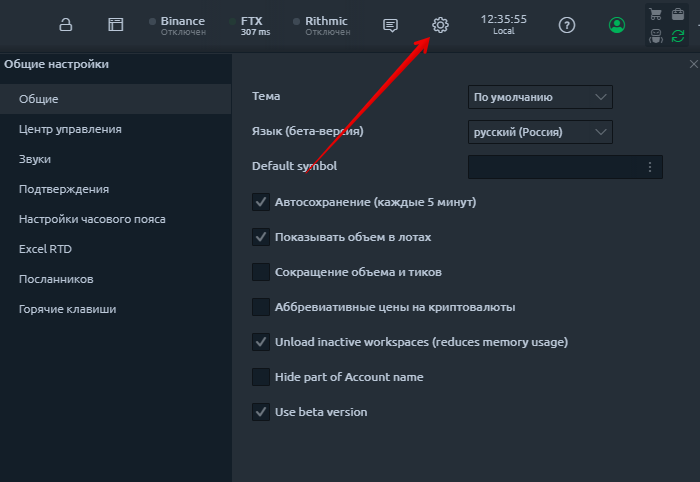

Все настройки сгруппированы в несколько вкладок:

* &#x20;**** [**Общие настройки**](general-settings-1.md#vkladka-obshie-nastroiki)****
* &#x20;**** [**Центр управления**](general-settings-1.md#control-center)****
* &#x20;**** [**Звуки**](general-settings-1.md#zvuki)****
* &#x20;**** [**Подтверждения**](general-settings-1.md#podtverzhdeniya)****
* &#x20;**** [**Настройки часового пояса**](general-settings-1.md#chasovye-poyasa)****
* &#x20;**** [**Excel RTD**](general-settings-1.md#excel-rtd)****
* &#x20;**** [**Мессенджеры**](general-settings-1.md#messendzhery)****
* &#x20;**** [**Горячие клавиши**](general-settings-1.md#goryachie-klavishi)****


Большинство настроек применяются автоматически после их изменения, но в некоторых случаях вам будет предложено подтвердить применение изменений; это действие требуется для сложных настроек, где одно изменение повлияет на сложную логику.


## Вкладка Общие настройки

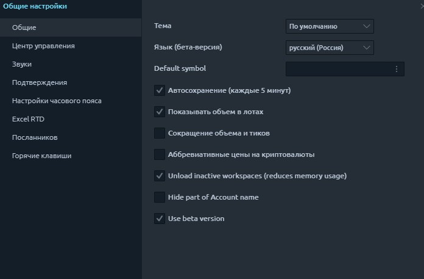

**Тема** - выберите одну из 8 цветовых схем, которые вам больше всего подходят.

* Default Blue theme
* Dark Autumn
* Dark Forest
* Dark Gold
* Grayscale
* Light Gold
* Light Water

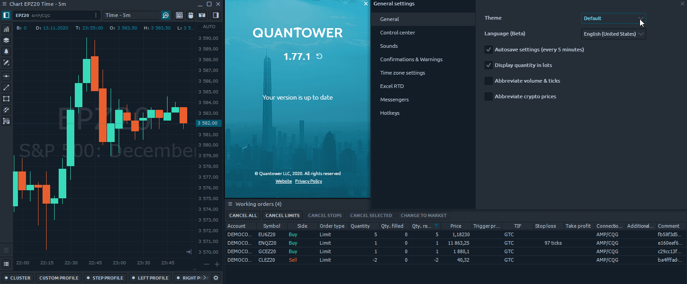

Язык (бета) — Quantower поддерживает 17 языков. В случае ошибок или неточностей в переводе любой пользователь может внести изменения в текст. Прочтите [руководство о том, как внести изменения в выбранный язык](https://help.quantower.com/customization/localization).

**Default symbol** — укажите торговый символ, который по умолчанию будет открываться во всех торговых панелях.


Обратите внимание, что торговый символ, добавленный по умолчанию будет действовать только для выбранного подключения. \
Если Вы захотите сменить брокера(биржу), для корректной работы, будет необходимо снова добавить по умолчанию торговый символ другого брокера.&#x20;


**Автосохранение настроек (каждые 5 минут)** - Quantower сохранит все изменения настроек приложения в папке «Настройки» и будет перезаписывать  их каждые 5 минут, пока приложение активно. Это также экономит при закрытии приложения

**Сокращать объем и тики** - эта опция отображает значения объема или количество тиков в упрощенной форме (1K = 1 000; 10K = 10 000 и т. Д.)

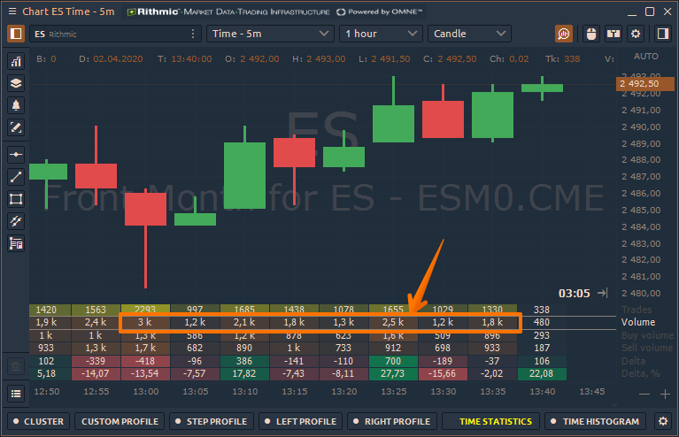

&#x20;**Аббревиативные  цены на криптовалюту** - эта опция отображает сокращенные значения цен на криптовалюту, которые имеют большое количество нулей.

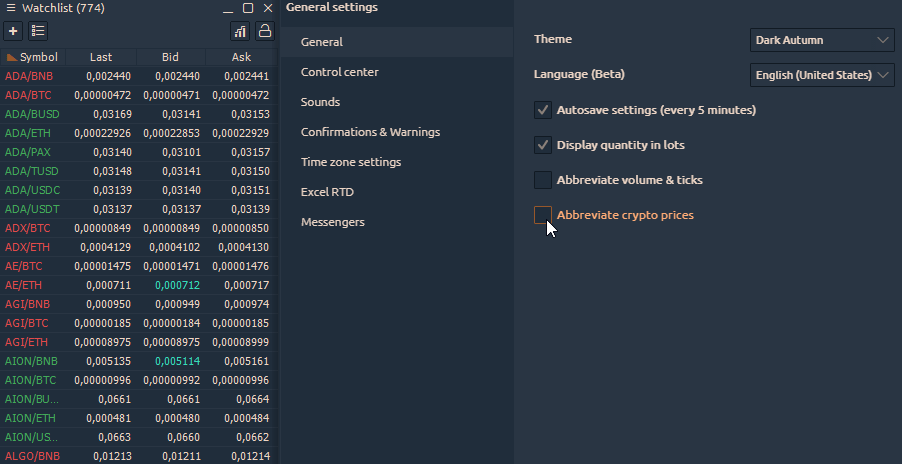

**Unload inactive workspaces.** Если этот параметр включен, все ранее созданные рабочие области не будут получать обновления рыночных данных. Это уменьшит использование памяти.

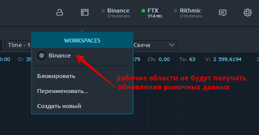

**Скрыть часть имени учетной записи**. Укажите количество символов, которые будут скрыты для имени и идентификатора вашего торгового счета. Этот параметр используется для сохранения конфиденциальности учетной записи.

.png>)

**Beta Version.** Когда эта опция активирована, вы будете получать обновления для новых функций, которые все еще находятся в стадии тестирования. Мы стремимся, чтобы наши трейдеры использовали полностью рабочий функционал, но для этого нам нужна помощь каждого пользователя. Поэтому мы просим как можно больше людей использовать бета-версию, чтобы сообщить нам о возможных ошибках, которые ускользнули от наших тестеров.



## Центр управления

Центр управления - это начальная точка платформы, используемая одновременно как пусковая установка и информатор. А для оптимального использования пространства на нем мы добавили возможность отображать / скрывать некоторые элементы управления.

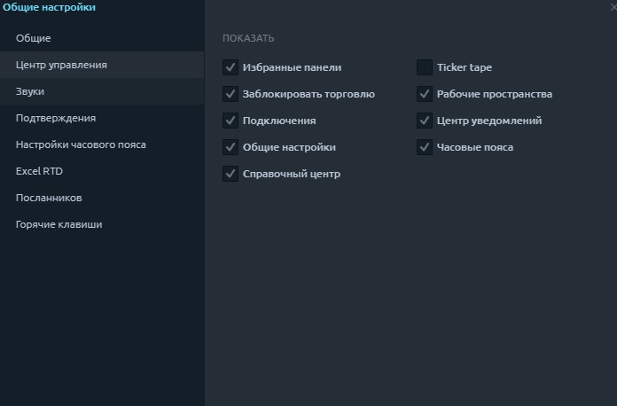

## Звуки

Звуки - это хороший способ дополнительного взаимодействия с пользователем, позволяющий информировать о некоторых действиях, даже если вы в данный момент не находитесь перед своим компьютером. Звуки могут быть включены или отключены для определенного действия.

**Включить звуки** - включает или отключает все звуки приложения во всем мире.

Группа действий в Quantower, когда должен воспроизводиться звук, состоит из наиболее важных ситуаций использования приложения. Этот список не окончательный и в дальнейшем может быть расширен или изменен. Каждая опция имеет набор элементов управления:

* включить / отключить флажок
* название действия
* звуковой путь (вы можете выбрать свой собственный путь к любому .wav файлу)
* кнопка предварительного прослушивания (воспроизведение / остановка)

## Подтверждения

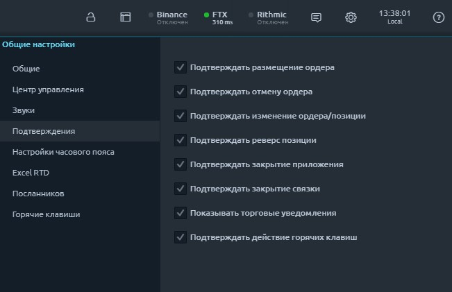

| Подтвердите размещение ордера              | ДА | Спросить перед оформлением ордера                                   |
| ------------------------------------------ | -- | ------------------------------------------------------------------- |
| **Подтверждать отмену ордера**             | ДА | Спросить перед отменой ордера                                       |
| **Подтвердить изменение ордера / позиции** | ДА | Спросить перед изменением ордера / позиции                          |
| **Подтверждать реверс позиции**            | ДА | Спросить, прежде чем менять позицию                                 |
| **Подтвердить закрытие приложения**        | ДА | Спросить перед закрытием                                            |
| **Подтвердить закрытие связки**            | ДА | Спросить перед закрытием связки                                     |
| **Показать торговые уведомления**          | ДА | не показывать всплывающие экраны с торговыми уведомлениями          |
| **Подтвердить действие горячих клавиш**    | ДА | Спросить, прежде чем совершать какие-либо действия с помощью Hotkey |

## Часовые пояса

Если вы торгуете на разных рынках, которые находятся в разных часовых поясах, вам будет полезно переключить индикатор времени в [**Центре управления**](https://app.gitbook.com/@quantower/s/quantower-ru/\~/drafts/-MacJL1dRz-GXYEu528\_/general-settings/main-toolbar) на одно из ваших любимых рыночных времен.

В группе настроек часового пояса вы можете выбрать, какие часовые пояса являются вашими любимыми и которые должны отображаться во всплывающем экране при нажатии кнопки «Время в центре управления». Выбрав несколько элементов из этого списка, вы сможете легко переключаться между ними.

.png>)

## Excel RTD

Начиная с версии 1.39 Quantower поддерживает RealTimeData (RTD) для отправки данных и другой рыночной информации в Microsoft Excel®. Прочтите наше руководство о том, [**как включить и использовать функцию RTD с Quantower**](https://app.gitbook.com/@quantower/s/quantower-ru/\~/drafts/-MacasRg-ats6GX4a2rB/miscellaneous-panels/excel-rtd-trading)**.**

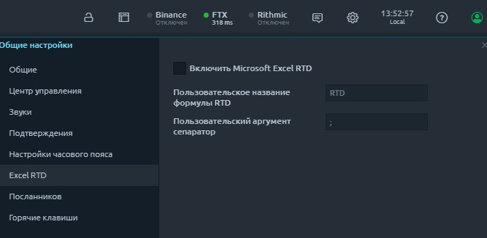

## Мессенджеры

Quantower Alert Bot отправит сообщение в вашу учетную запись Telegram обо всех событиях, которые вы установили на платформе. Например, установите на график ценовое оповещение, и когда цена достигнет этого уровня, будет отправлено уведомление в мессенджер.

Чтобы добавить бота в Telegram, откройте **Общие настройки платформы -> Мессенджеры -> Дублировать оповещения в Telegram.**

Укажите свой личный идентификатор чата, который вы можете узнать, нажав на кнопку «**Get ID**». Откроется новый бот **Chat ID Echo**, и он покажет «_**Your Telegram Chat ID is: xxxxxxx"**_ ».\
Введите свой **chat ID**  в соответствующее поле, а затем подключитесь к **Quantower Alert Bot.**

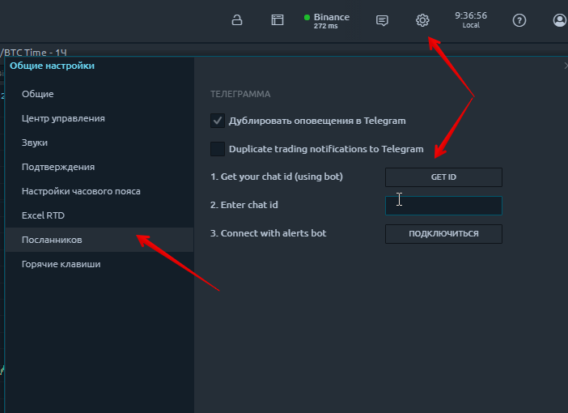

## Горячие клавиши

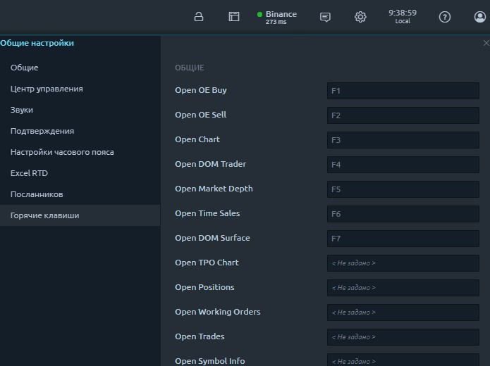
