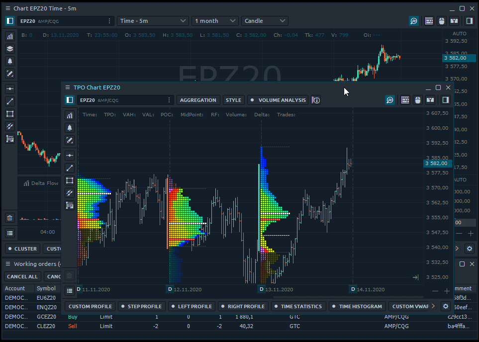

# Группировка панелей

Самый простой уровень объединения нескольких панелей - это группа. Этот способ позволяет расположить несколько панелей как вложенные вкладки, а затем переместить созданную группу как одну панель.

 Чтобы сгруппировать две панели, просто щелкните и перетащите заголовок одной панели на другую. Чтобы разгруппировать панели, просто перетащите вкладку активной панели из панели вкладок группы.

Панели также могут быть переупорядочены внутри групповых вкладок, а также закрыты при группировании. Каждая вновь созданная группа имеет имя по умолчанию «Группа», которое можно легко изменить через контекстное меню панели.


Группировка очень полезна для экономии места и объединения нескольких общих панелей.


