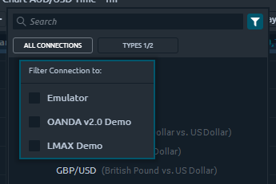
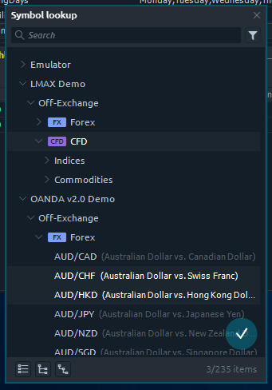
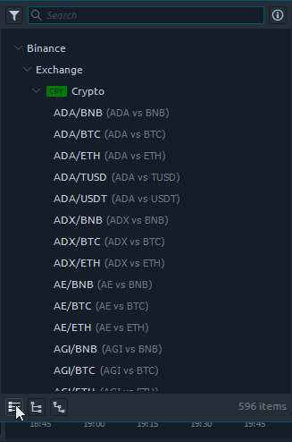

# Менеджер торговых символов \(тикеров\)

Окно менеджера поиска символов - это специальный экран, позволяющий искать и выбирать любой доступный символ из активных соединений. В терминале Quantower есть различные поверхности, для которых требуется настроить параметр символа \(список наблюдения, диаграмма, информация о символах и т. д.\). В зависимости от требований, менджер поиска символов может позволять выбор одного или нескольких котировок.

При каждом коннекте к выбранному соединению, вы будете получать список всех доступных символов этого соединения на экране менеджера поиска символов. Поскольку Quantower допускает одновременно несколько подключений, у вас может быть в менеджере несколько похожих символов с данными, которые могут немного отличаться. Это нормально, потому что разные поставщики могут предоставить нам разные данные о котировках.

## Поле поиска

Окно поиска символов обычно вызывается из поля поиска. Это поле состоит из двух частей, которые позволяют открыть экран поиска:

* Торговый символ \(тикер\) с именем подключения
* Значок «**Поиск**» в виде трех вертикальных точек:

Если вы нажмете на имя символа, вы увидите, что появится экран поиска и символы, введенные вами, будут применены в качестве фильтрации для списка символов..

Если вы щелкните значок «Поиск», вы увидите всплывающий экран поиска без какой-либо фильтрации, примененной к списку символов.

В любом случае вы получите экран поиска, готовый для выбора символа. Экран поиска состоит из трех элементов:

* Панель инструментов с полем поиска и фильтром
* Список подключений и их символы
* Нижний колонтитул

Для выхода нужно просто кликнуть в любом месте вне окна выбора.

## Searching & Filtering

Usually, each connection gives you a numerous list of trading Symbols to select from. If you know name, you can start typing it in “_**Search field**_”, and the below list will be instantly filtered to the items, containing the entered phrase.

By the way, you can apply more general filtering to the list; just click the “_**Filter**_” icon on the right side of the search field and you will see the second level of symbols filtering.

Here you will be able to filter the list by three parameters:

* Connection \(currently active connections\)
* Symbol type \(FOREX, CFD’s, Options etc.\)
* Exchange \(Off-Exchange, NYSE, NASDAQ etc.\)

Once selecting some items among filtering parameters, the list becomes filtered to the selected values only.


Be careful. While the Searchfield is become reset each Lookup screen invokes, the second level filters stay as they were set up last time. So if you can’t find the required Symbol type — please check if you have this type enabled.


## Symbols list

The list of symbols is a result of filtering in Lookup screen. Here you can see the nested tree of Symbols, grouped in the following order:

* Connection
* Exchange
* Type
* Subtypes

The Symbol types are marked with additional icons to help you identify the required one more quickly. The Symbol item row consists of Name and description.

To select the Symbol — click on it; to apply the symbol to the required panel, just double-click on it. This action closes the Lookup screen

## Multiple symbols select

In some cases, when panel can accept more than one Symbol item from lookup \(like the Watchlist\), you have an ability to select multiple items by holding the "_**Ctrl key**_" and clicking on the list. Once you ready to apply multiple items — press the "_**blue circle icon**_" on the right bottom corner of the list. You may also select any category level item to apply all its contents to the required panel.

## List footer

To help you deal with the big lists of Symbols, there is a footer toolbar with a set of mass actions. It allows to:

* Collapse all nodes
* Expand head nodes \(top-level nodes, usually Connections\)
* Expand first-level child nodes

The other useful information is placed on the right side of footer toolbar — items count. It may show the total amount of available Symbols \(after the filtering was applied\) as well as 3/235 \(3 from 235\) value, saying that you have selected multiple items among available.

