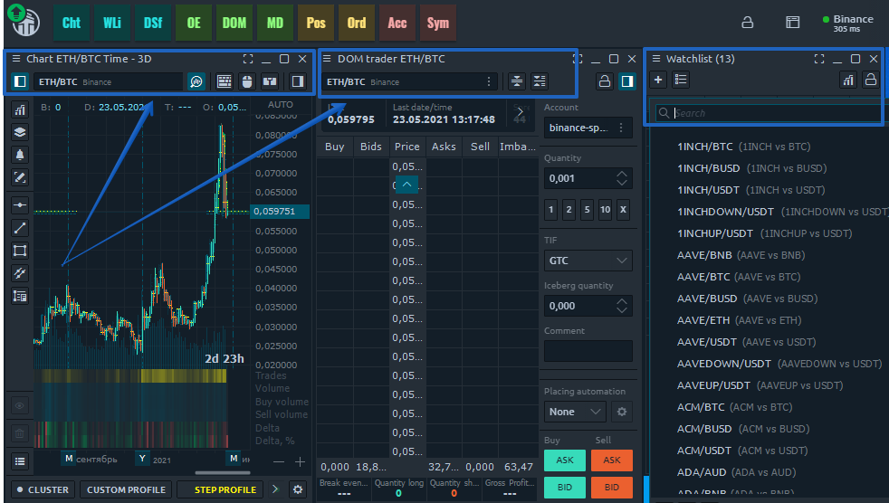
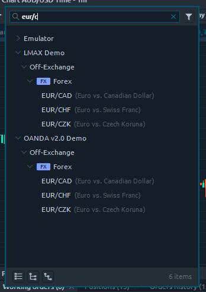
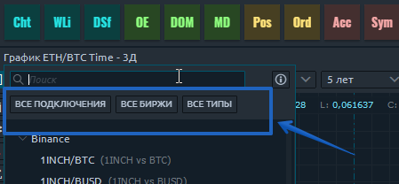
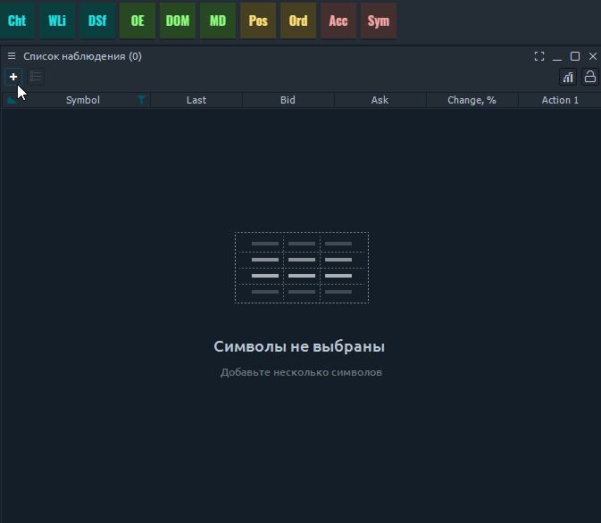

# Менеджер торговых символов \(тикеров\)

Окно менеджера поиска символов - это специальный экран, позволяющий искать и выбирать любой доступный символ из активных соединений. В терминале Quantower есть различные поверхности, для которых требуется настроить параметр символа \(список наблюдения, диаграмма, информация о символах и т. д.\). В зависимости от требований, менджер поиска символов может позволять выбор одного или нескольких котировок.

При каждом коннекте к выбранному соединению, вы будете получать список всех доступных символов этого соединения на экране менеджера поиска символов. Поскольку Quantower допускает одновременно несколько подключений, у вас может быть в менеджере несколько похожих символов с данными, которые могут немного отличаться. Это нормально, потому что разные поставщики могут предоставить нам разные данные о котировках.

## Поле поиска

Окно поиска символов обычно вызывается из поля поиска. Это поле состоит из двух частей, которые позволяют открыть экран поиска:

* Торговый символ \(тикер\) с именем подключения
* Значок «**Поиск**» в виде трех вертикальных точек:

Если вы нажмете на имя символа, вы увидите, что появится экран поиска и символы, введенные вами, будут применены в качестве фильтрации для списка символов..

Если вы щелкните значок «Поиск», вы увидите всплывающий экран поиска без какой-либо фильтрации, примененной к списку символов.

В любом случае вы получите экран поиска, готовый для выбора символа. Экран поиска состоит из трех элементов:

* Панель инструментов с полем поиска и фильтром
* Список подключений и их символы
* Нижний колонтитул

Для выхода нужно просто кликнуть в любом месте вне окна выбора.

## Поиск и фильтрация

Обычно каждое подключение дает вам на выбор многочисленный список торговых символов. Если вы знаете название торговой пары, вы можете начать вводить его в «Поле поиска», и нижеприведенный список будет мгновенно отфильтрован до элементов, содержащих введенную фразу.

**Фильтр второго уровня.** Кстати, к списку можно применить более общую фильтрацию; просто щелкните значок «Фильтр» справа от поля поиска, и вы увидите второй уровень фильтрации символов.   
Второй уровень фильтрации добавляется при наличии двух и больше одновременных подключений.

Здесь вы сможете отфильтровать список по трем параметрам:

* Все подключения \(активные в настоящее время подключения\)
* Все типы \(FOREX, CFD, опционы и т. Д.\)
* Все биржи \(внебиржевой, NYSE, NASDAQ и т. Д.\)

После выбора некоторых элементов среди параметров фильтрации список фильтруется только по выбранным значениям.


Внимание\(!\) В то время как поле поиска сбрасывается при каждом вызове экрана поиска, фильтры второго уровня остаются такими, как они были настроены в прошлый раз. Поэтому, если вы не можете найти нужный тип символа - проверьте, включен ли у вас этот тип.


## Вложенное дерево символов

Список символов является результатом фильтрации на экране поиска. Здесь вы можете увидеть вложенное дерево символов, сгруппированных в следующем порядке:

* Подключения
* Биржи
* Типы символов
* Подтипы

Типы символов отмечены дополнительными значками, чтобы помочь вам быстрее определить нужный. Строка элемента «Символ» состоит из имени и описания.

Чтобы выбрать символ - щелкните по нему; чтобы применить торговый тикер к нужной панели, просто дважды щелкните по нему. Это дейтсвие одновременно и закроет окно с поиском и добавит тикер на панель.

## Множественный выбор торговых пар

В некоторых случаях, когда на панели предусматривается выбор сразу нескольких котировок \(например, нужно добавить сразу несколько торговых пар в список наблюдения\), у вас есть возможность выбрать несколько элементов, удерживая «клавишу Ctrl» и щелкая по списку. Когда вы будете готовы применить несколько элементов, нажмите «значок синего круга» в правом нижнем углу списка. Вы также можете выбрать любой элемент уровня категории, чтобы применить все его содержимое к требуемой панели.

## Нижний колонтитул списка

 Чтобы помочь вам справиться с большими списками символов, есть панель инструментов нижнего колонтитула с набором массовых действий. Это позволяет:

* Свернуть все узлы
* Разверните головные узлы \(узлы верхнего уровня, обычно подключения\)
* Разверните дочерние узлы первого уровня

Другая полезная информация размещена в правой части панели инструментов нижнего колонтитула - количество элементов. Он может отображать общее количество доступных символов \(после применения фильтрации\), а также значение 3/235 \(3 из 235\), говорящее о том, что вы выбрали несколько элементов среди доступных.

