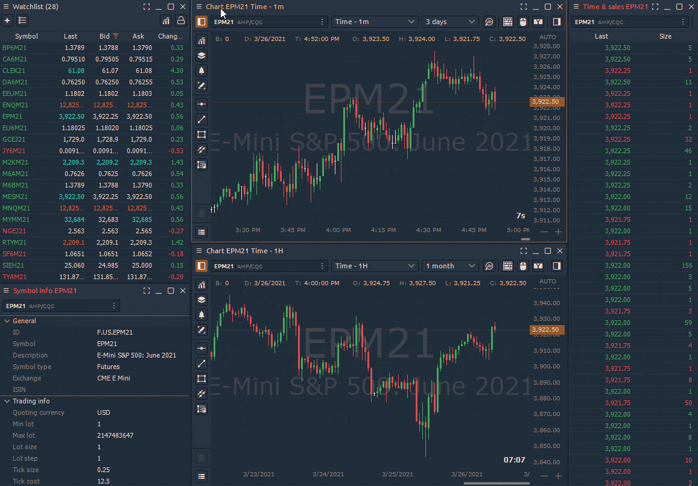

# Связывание панелей по цвету

В [Quantower ](https://www.quantower.com)можно связать несколько панелей по одному инструменту с помощью цвета. Просто выберите один цвет ссылки на двух панелях, и у них будет параметр синхронизированного символа. \
\
**После установки связи по цвету:**\
\- заголовки панелей станут окрашены в соответствующий цвет;\
\-символ, к которому Вы сделали привязку панелей, станет кликабельным в списке наблюдения;\
\-при нажатии на торговую пару/инструмент (линк), одновременно откроются все связанные панели, которые Вы отметили одним цветом.\
\
Как пример, одним нажатием по паре, можно открыть одновременно разные таймфреймы одной котировки. \

