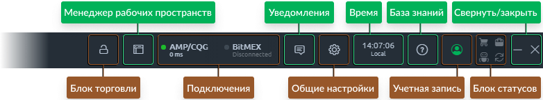
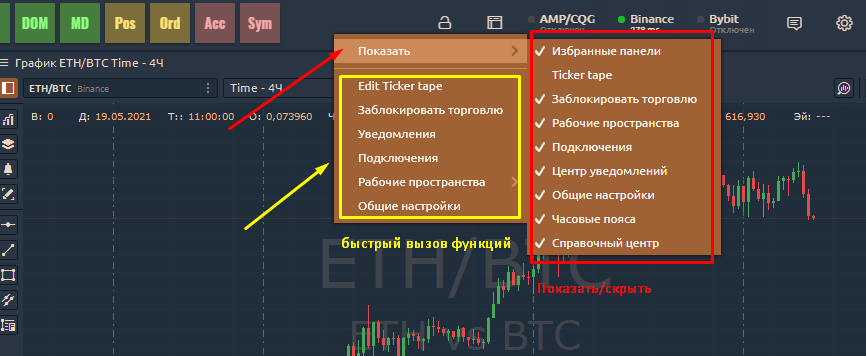
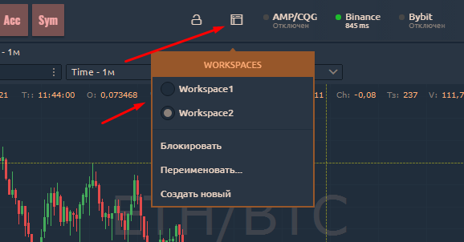
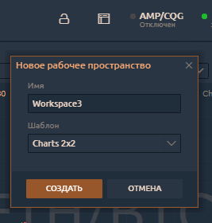
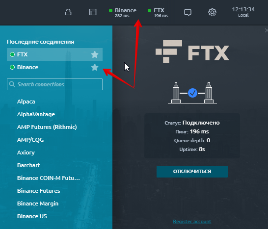

# Основная панель инструментов Quantower

**Основная панель инструментов** — является основной отправной точкой платформы, используемой одновременно как пусковая установка и информер.

.png>)

Основная панель инструментов технически представляет собой панель, но ведет себя иначе: ее можно перетаскивать между экранами (если у вас их несколько), и она всегда будет оставаться в верхней части экрана. Она адаптирует свою ширину к ширине экрана и участвует в рабочем пространстве, что означает, что другие панели могут быть прикреплены к ней.

В этом руководстве вы узнаете о следующих функциях:

* ****[**Настройка главной панели инструментов**](main-toolbar.md#nastroika-glavnoi-paneli-instrumentov)****
* ****[**Главное меню со всеми поверхностями**](main-toolbar.md#glavnoe-menyu-so-vsemi-poverkhnostyami)****
* ****[**Как добавить поверхность в избранное**](main-toolbar.md#kak-dobavit-poverkhnost-v-izbrannoe)****
* ****[**Как заблокировать торговлю**](main-toolbar.md#kak-zablokirovat-torgovlyu)****
* ****[**Workspaces - менеджер организации рабочего пространства**](main-toolbar.md#workspaces-menedzher-organizacii-rabochego-prostranstva)****
* ****[**Менеджер торговых подключений**](main-toolbar.md#menedzher-torgovykh-podklyuchenii)****
* ****[**Боковая панель со всеми уведомлениями**](main-toolbar.md#centr-uvedomlenii)****
* ****[**Общие настройки платформы**](main-toolbar.md#obshie-nastroiki)****
* ****[**Время и часовые пояса**](main-toolbar.md#vremya-i-chasovye-poyasa)****

Поскольку панель инструментов является основной панелью управления, у нее есть возможность свернуть весь интерфейс платформы, щелкнув значок «**Свернуть**». В результате этого действия все панели приложений сворачиваются на панель задач и буквально исчезают с ваших экранов; она влияет на все панели на всех экранах.

Значок «**Закрыть**» просто закрывает платформу. Вы можете настроить параметр «не запрашивать подтверждение закрытия» во всплывающем экране при первом закрытии.

## Настройка главной панели инструментов

Для оптимального использования пространства на главной панели инструментов мы добавили возможность отображать / скрывать некоторые элементы управления. Например:\
\-**чтобы скрыть** часовые пояса, Рабочие области, Подключения и т. д., щелкните контекстное меню правой кнопкой мыши и перейдите в раздел «Показать» и уберите отметку с этих элементов управления; \
\-**чтобы отобразить,** необходимо нажать на галочки элементов управления и они появятся на панели инструментов.

## Главное меню со всеми поверхностями

Все поверхности размещаются на экране «Боковая панель», который появляется, когда вы щелкаете значок логотипа на панели инструментов. Главное меню состоит из значков панелей, сгруппированных по функциям. Собственно, в этом меню можно найти все панели.

Каждую группу в этом меню можно свернуть, чтобы сделать список поверхностей  более чистым и удобным для себя. Отсюда вы можете открыть любую панель, щелкнув левой кнопкой мыши по ее значку. Каждая группа имеет свой цвет, чтобы помочь вам определить функциональное назначение каждой панели.

Нижний колонтитул главного меню содержит несколько функций:

* “**О программе**” -кнопка  открывает экран с информацией о терминале (версия, откат, проверка обновлений и т. д.).
* Если система обнаруживает новую версию Quantower, вместо этой ссылки появляется кнопка **«НОВАЯ ВЕРСИЯ»;**
* &#x20;кнопка “**Выход**” закрывает приложение.&#x20;


Список ссылок в нижнем колонтитуле может содержать больше или меньше элементов, в зависимости от текущих требований приложения.


## **Как добавить поверхность в избранное**

Возможно, вы уже видели значок звездочки в правом верхнем углу некоторых плиток на боковой панели. Это функция «Избранные панели», позволяющая выбрать наиболее часто используемые панели и разместить их значки на главной панели инструментов для быстрого доступа к ним.

Способ использования очень простой - наведите указатель мыши на правый верхний угол любой плитки панели на боковой панели и щелкните появившийся значок звездочки. Вот и все: панель появляется на панели «Избранные панели» на главной панели инструментов. Чтобы удалить из избранного, просто нажмите активированный значок звездочки на плитке панели или щелкните правой кнопкой мыши значок на панели «Избранное» и выберите «Скрыть с панели инструментов».

## Как заблокировать торговлю

Если вы хотите предотвратить выполнение торговых операций вручную, вы можете использовать кнопку «Заблокировать торговлю» на главной панели инструментов. После нажатия на него отображается подтверждающее сообщение о том, что торговля заблокирована и все функции, связанные с открытием или закрытием ордеров и позиций, будут отключены. Разблокировать торговлю можно и наоборот.

Эта функция полезна в том случае, если вы хотите только анализировать рынок или редактировать свое рабочее пространство (в основном, чтобы избежать ошибочных щелчков).

## Workspaces - менеджер организации рабочего пространства


Создайте и сохраните свое рабочее пространство в Quantower


Менеджер рабочего пространства позволяет вам видеть, создавать, редактировать и удалять ваши рабочие среды, а также блокировать их изменение. Он представлен специальным значком, при нажатии на который открывается список доступных Рабочих областей.

Текущая активная рабочая область отмечена цветом и имеет  точку слева от ее имени. Вы можете переключить текущее рабочее пространство, щелкнув левой кнопкой мыши любой из доступных элементов в списке. Нижняя часть списка (после разделителя) состоит из действий, относящихся к текущей активной рабочей области и позволяет:

* **Блокировать** — отключает возможность добавлять, удалять, перемещать или изменять размер любой панели в текущей рабочей области;
* **Переименовать...** — вызывает всплывающий экран, где вы можете установить новое имя для текущей рабочей области;
* **Создать новое** — открывает всплывающий экран с формой создания новой рабочей области.

При создании нового рабочего пространства у вас есть возможность указать его будущее имя и выбрать, должно ли оно быть пустым после создания или содержать некоторый предопределенный набор панелей.

Вы также можете удалить любую рабочую область, щелкнув значок **«Корзина»** справа от имени рабочей области (значок отображается при наведении курсора на имя).

## **Менеджер торговых подключений**

****

Список **избранных** подключений можно увидеть на Главной панели инструментов в блоке "Избранные подключения". По умолчанию вы увидите здесь несколько элементов, каждый из которых представляет одно из доступных подключений. Экран диспетчера подключений открывается при нажатии любого элемента в блоке "Избранные подключения".

Чтобы отобразить какое-либо соединение на этой панели, вам нужно щелкнуть значок «Звездочка» справа от имени соединения на панели диспетчера подключений. Щелкните еще раз, и соединение будет удалено с панели избранного.

При добавлении на панель избранного каждое соединение будет отображаться в виде плитки, содержащей важную информацию:

* **Имя подключения**
* **Текст статуса** (может быть статусным сообщением или временем пинга в мс, когда соединение активно)
* **Точка активного соединения,** визуальное представление состояния подключения. Может быть серым (отключен), желтым (подключен), зеленым (активен).

Вы можете удалить соединение из избранного, щелкнув его правой кнопкой мыши и выбрав пункт «Скрыть с панели инструментов». Здесь вы также можете попросить подключиться или отключиться.

## Центр уведомлений

Большинство действий во время использования платформы генерируют различные уведомления. Могут быть системные уведомления (некоторые проблемы с подключением или ошибки) и тикеты сделок.

**Тикет сделки**  — уведомления о торговых операциях. Каждый раз, когда вы создаете ордер или открываете новую позицию - мы будем создавать для этого тикет сделки. (в общих настройках[ можно отключить тикеты](https://app.gitbook.com/@quantower/s/quantower-ru/\~/drafts/-Ma2xMblWJFPjAqsJZlG/general-settings/general-settings-1#confirmations))

Не смотря на то, что некоторые торговые действия могут быть выполнены сразу одним щелчком мыши, они обычно состоят из нескольких связанных операций, каждая из которых будет отображаться в билетах сделки. Вот почему вы можете увидеть в Центре уведомлений гораздо больше элементов, чем вы сделали.

**Центр уведомлений** — это место, где все уведомления хранятся в одном списке. Вы можете открыть этот список, щелкнув значок Уведомления в Центре управления.

.png>)

Когда у вас появится  группа новых уведомлений, небольшое число появится в левом верхнем углу значка центра уведомлений. Он показывает, сколько у вас непрочитанных уведомлений. Как только вы откроете список - он поймет, что вы их прочитали и номер исчезнет.

Вы будете видеть все уведомления с самого начала работы платформы. Вы также можете очистить этот список, щелкнув ссылку «**Очистить все**». Это действие скроет все видимые в данный момент уведомления из этого списка (но они по-прежнему будут доступны на панели журнала событий).

Нажав на одно из уведомлений, вы увидите окно с подробной информацией.

## Общие настройки

Значок «Шестеренка» открывает общий экран настроек, где вы можете настроить наиболее распространенные параметры нашего терминала. Более подробная информация об экране настроек доступна в соответствующем разделе этой документации.

## Время и часовые пояса

Панель времени также отображается на главной панели инструментов, показывая время в выбранном часовом поясе. По умолчанию используется ваш местный часовой пояс. Вы можете изменить список часовых поясов, щелкнув значок «Шестеренка», а затем выбрав нужные на [экране общих настроек](https://app.gitbook.com/@quantower/s/quantower-ru/\~/drafts/-Ma3I-dze4jNwr22DF43/general-settings/general-settings-1#time-zones). Вы также можете выбрать несколько часовых поясов, и они появятся в виде списка на раскрывающейся панели, что позволит вам быстро переключаться между ними.

