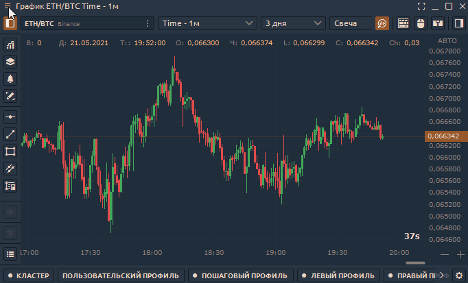

# Установить по умолчанию

Гибкие настройки платформы позволяют настроить любую панель по своему усмотрению. Измените шрифт, цвет, добавьте индикаторы, определите отображение необходимых столбцов в таблице и т. д.

Но если вы не хотите каждый раз настраивать вновь открываемые панели этого типа, мы создали параметр «**Установить по умолчанию**», который переопределяет начальные настройки.

## Как работает параметр "Установка по умолчанию"?

* **Откройте панель**, для которой вы хотите назначить новые настройки.
* **Настройте панель. **Например, на панели графика добавьте любой индикатор, измените размер шрифта оси цены, измените цвет фона.
* Щелкните [контекстное меню панели](standalone-panels.md#kontekstnoe-menyu-paneli) (левый верхний угол) и щелкните «Установить по умолчанию». Вы увидите сообщение «Настройки сохранены как настройки по умолчанию».
* При каждом открытии этого типа поверхность теперь будет открываться с этими настройками по умолчанию.


Если вы включите [**инструменты объемного анализа**](https://help.quantower.com/analytics-panels/chart/volume-analysis-tools) на графике и сохраните настройки графика по умолчанию, то каждая новая панель графика будет загружать данные тиков и объемов. Это увеличит потребление трафика и снизит скорость построения данных диаграммы.


В последней версии платформы мы убрали опцию **«Сбросить по умолчанию».** Поэтому каждый раз, нажимая на **«Установить по умолчанию»**, вы переопределяете предыдущие настройки.
