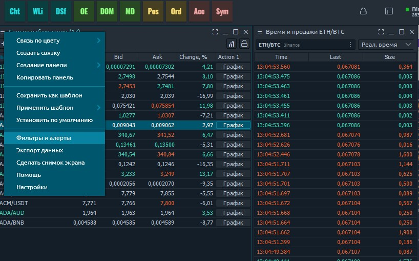
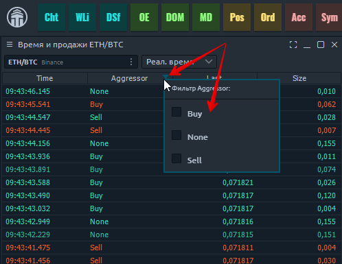

# Менеджер фильтров и уведомлений

Этот менеджер настройки позволяет вам установить определенное поведение при изменении некоторых данных в таблице. Эта функция доступна в панелях:

* [**Список наблюдения**](https://app.gitbook.com/@quantower/s/quantower-ru/\~/drafts/-MaYzvomjGa\_2w\_IlU3-/analytics-panels/watchlist)
* [**Лента сделок**](https://app.gitbook.com/@quantower/s/quantower-ru/\~/drafts/-MaYzvomjGa\_2w\_IlU3-/analytics-panels/time-and-sales#setup-actions-filters-and-actions)
* [**Статистика цен**](https://app.gitbook.com/@quantower/s/quantower-ru/\~/drafts/-MaYzvomjGa\_2w\_IlU3-/analytics-panels/price-statistic)
* [**Рабочие ордера**](https://app.gitbook.com/@quantower/s/quantower-ru/\~/drafts/-MaYzvomjGa\_2w\_IlU3-/portfolio-panels/working-orders)
* [**Позиции**](https://app.gitbook.com/@quantower/s/quantower-ru/\~/drafts/-MaYzvomjGa\_2w\_IlU3-/portfolio-panels/positions)
* [**Сделки**](https://app.gitbook.com/@quantower/s/quantower-ru/\~/drafts/-MaYzvomjGa\_2w\_IlU3-/portfolio-panels/trades)
* [**История ордеров**](https://app.gitbook.com/@quantower/s/quantower-ru/\~/drafts/-MaYzvomjGa\_2w\_IlU3-/portfolio-panels/orders-history)

Настройки  состоят из двух вариантов:

1. **Настройка Фильтров** - где вы можете настроить фильтры для разных столбцов
2. **Настройка уведомлений (либо действий при условии)** — где вы можете настроить несколько действий на основе данных в строках и столбцах.

## Уведомления (настройка действий в уведомлениях)

&#x20;В настоящее время таблицы Quantower поддерживают четыре типа действий в уведомлениях:

* Показать сообщение
* Воспроизвести звук
* изменить цветовой ряд
* изменить цвет ячейки

Функциональность действий таблицы можно найти в пункте контекстного меню панели «Настроить действия», и после запуска он открывает «экран действий», где вы можете управлять своими действиями. Процесс создания Действия не сложен.

1. Создать элемент действия
2. Установите условия («ИЛИ» и «И»)
3. Установить задачи (Показать сообщение, Воспроизвести звук, Цветная строка, Цветная ячейка)
4. Сохранить действие
5. Включить действие

### Задачи выполняемые в действиях&#x20;

Как только какое-то условие выполнено, действие выполнит соответствующие задачи. Каждая задача будет выполняться столько раз, сколько было указано в условии.

| Показать сообщение | Отображает всплывающее окно с указанным пользователем сообщением                                                               |
| ------------------ | ------------------------------------------------------------------------------------------------------------------------------ |
| Воспроизвести звук | Воспроизводит выбранный пользователем звуковой файл                                                                            |
| Цветовой ряд       | Изменяет стиль всей строки, в которой выполнено условие. Позволяет изменить цвет фона и / или текста.                          |
| Цвет ячейки        | Изменяет стиль указанной ячейки (ячеек) строки, в которой было выполнено условие. Позволяет изменить цвет фона и / или текста. |


Будьте осторожны с часто встречающимися условиями. Некоторые из них могут выполняться несколько раз в секунду, поэтому такие задачи, как «Воспроизвести звук», могут вызывать беспокойство. Задание «Показать сообщение», запущенное несколько раз, будет отображаться в виде одного окна сообщения.


## Фильтры в таблицах

Строки в таблице можно фильтровать по некоторым значениям данных в их столбце. Есть два способа применить фильтрацию:

* Доступ к быстрой фильтрации можно получить, щелкнув значок «Фильтр» в заголовке любого столбца таблицы.

После выбора какой-либо опции - строки таблицы будут отфильтрованы до тех, которые содержат выбранное значение. Быстрый фильтр можно отменить, нажав опцию «**Отменить фильтрацию**».

Быстрая фильтрация может применяться только к одному столбцу таблицы. Для фильтрации нескольких столбцов мы рекомендуем использовать «Действия по настройке».

* **расширенный фильтр,** для применения более сложной фильтрации (**мультифильтрации**). В контекстном меню панели выберите пункт «Фильтры и алерты».

Слева на этом экране есть две вкладки, первая из которых представляет собой расширенный фильтр.

Этот экран позволяет включать / отключать фильтрацию, а также настраивать условия фильтрации. Эти условия установлены как:\
\
"_**ЕСЛИ**_** "(условие1 "И" условие2)**_**"ИЛИ"**_**(условиеN)...**

Вы можете настроить столько условий, сколько захотите. Из-за возможной сложной логики фильтрации вам необходимо применить изменения после завершения настройки фильтра.
