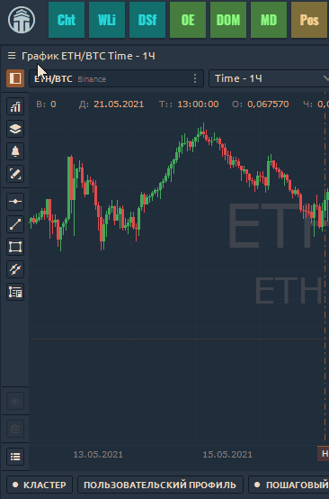
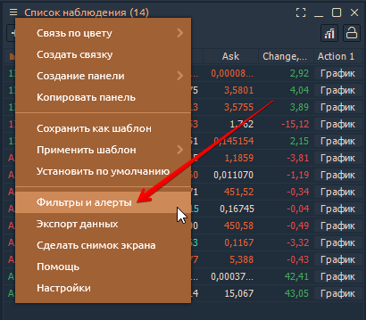
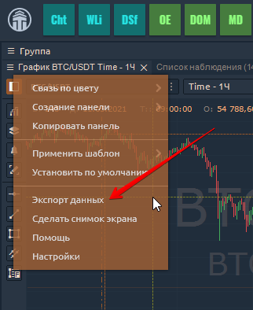

# Одиночная панель

Автономные панели - второстепенные элементы любого рабочего пространства, и они ведут себя так же, как любое обычное окно ПК:

* можно изменять размер и размещать в любом месте экрана;
* могут прилипать друг к другу в пределах своих границ, когда они достаточно близко;
* может придерживаться своего размера, чтобы повторить размеры других панелей при изменении размера;
* можно сворачивать на панель задач ОС как обычные окна

## Контекстное меню панели

Каждая панель имеет **собственное контекстное меню**, расположенное в левом верхнем углу, прямо перед заголовком панели.

Это меню обычно состоит из следующих функций:

* **Связь по цвету.** Позволяет связать несколько панелей общим символом с помощью определения цвета. Подробнее в разделе [**"Связанные панели"**](https://app.gitbook.com/@quantower/s/quantower-ru/\~/drafts/-Ma7xTODeGYMgEpmiuQ-/general-settings/link-panels)**.**
* **Создать Bind** Объединение нескольких панелей в Суперпанель. Подробнее: [**"Binds объединение панелей".**](https://app.gitbook.com/@quantower/s/quantower-ru/\~/drafts/-Ma8piLxj907L8bDjdQX/general-settings/binds)
* **Создать панель.** Открывает новую панель для текущего инструмента. Вы можете открыть следующие панели:  [**Создать ордер**](https://app.gitbook.com/@quantower/s/quantower-ru/\~/drafts/-Ma80V15tvxILSGD6fGC/trading-panels/order-entry)**,**[ **График,**](https://app.gitbook.com/@quantower/s/quantower-ru/\~/drafts/-Ma80V15tvxILSGD6fGC/analytics-panels/chart) [**трейдер DOM,**](https://app.gitbook.com/@quantower/s/quantower-ru/\~/drafts/-Ma80V15tvxILSGD6fGC/trading-panels/dom-trader) [**Глубина рынка,**](https://app.gitbook.com/@quantower/s/quantower-ru/\~/drafts/-Ma80V15tvxILSGD6fGC/trading-panels/market-depth) [**Лента сделок,**](https://app.gitbook.com/@quantower/s/quantower-ru/\~/drafts/-Ma80V15tvxILSGD6fGC/analytics-panels/time-and-sales) [**поверхность DOM**](https://app.gitbook.com/@quantower/s/quantower-ru/\~/drafts/-Ma80V15tvxILSGD6fGC/analytics-panels/dom-surface)**,** [**график TPO**](https://app.gitbook.com/@quantower/s/quantower-ru/\~/drafts/-Ma8piLxj907L8bDjdQX/analytics-panels/tpo-chart)**,** [**Информация о символе**](https://app.gitbook.com/@quantower/s/quantower-ru/\~/drafts/-Ma8piLxj907L8bDjdQX/analytics-panels/tpo-chart)**.**

* **Копировать панель**. Просто создает еще одну полностью аналогичную панель (полную копию).
* [**Применить шаблон.**](https://app.gitbook.com/@quantower/s/quantower-ru/\~/drafts/-Ma96l-5cKuNsF1kr68X/general-settings/templates) Настроить панель, объединить в группу или привязать и сохранить как шаблон. Создав несколько шаблонов, вы можете применить любой из них к этой конкретной панели.

* [**Установить по умолчанию.**](https://app.gitbook.com/@quantower/s/quantower-ru/\~/drafts/-MaDSngnB6Chw3rN5tcw/general-settings/set-as-default)  По умолчанию для каждого типа панели есть свои настройки. Вы можете настроить их, как хотите, и даже установить свои личные настройки по умолчанию. Просто выберите вариант «Установить по умолчанию», и Quantower сохранит настройки вашей текущей панели и применит их для каждой вновь открытой панели этого типа.
* [**Фильтры и Уведомления**](https://app.gitbook.com/@quantower/s/quantower-ru/general-settings/setup-actions-and-advanced-filters) (появляются в меню только только для таких поверхностей, как Список наблюдения, Лента сделок, Позиции, Рабочие ордера и т. д.). Эта опция позволяет вам устанавливать предупреждения и расширенную фильтрацию для значений в таблице.

* [**Экспорт данных.** ](https://app.gitbook.com/@quantower/s/quantower-ru/\~/drafts/-MaDa7e9OreASp45gkVI/miscellaneous-panels/history-exporter#how-to-export-historical-data-via-other-panels)Сохранение данных из диаграммы или таблицы во внешний CSV-файл. Вы можете сохранять данные о ценах, значениях индикаторов, значения в таблицах. Также вы можете использовать паверхность [**ЭКСПОРТЕР ИСТОРИИ**](https://app.gitbook.com/@quantower/s/quantower-ru/\~/drafts/-MaDa7e9OreASp45gkVI/miscellaneous-panels/history-exporter).

* **Сделать снимок экрана.** Создает и копирует снимок экрана панели в буфер обмена для его последующей вставки в социальную сеть.
* **Помощь**. Если у вас есть вопросы по работе с панелью или конкретным функциям, щелкните по этой ссылке, и вы сразу же перейдете к документации по этой панели.
* **Настройки.** Персональные настройки для каждой панели. Открывает экран настроек, где вы можете настроить панель по своему усмотрению, а затем, в случае необходимости, сохранить эти настройки как настройки по умолчанию.
