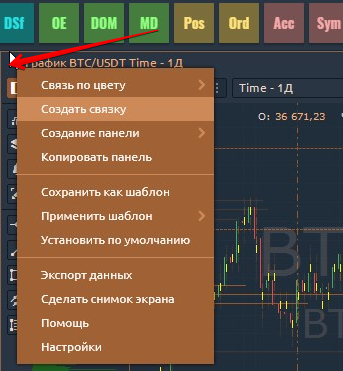
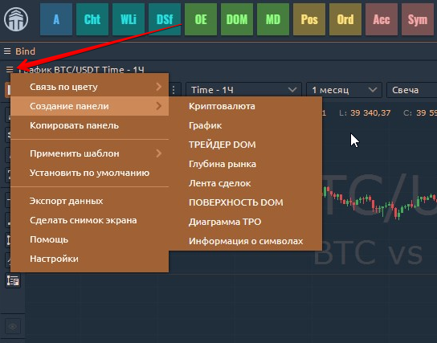
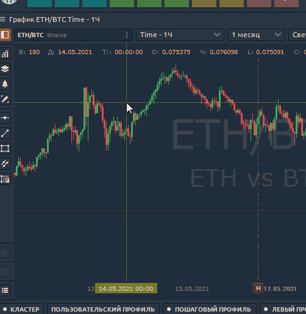

# Одиночная панель

Автономные панели - второстепенные элементы любого рабочего пространства, и они ведут себя так же, как любое обычное окно ПК:

* можно изменять размер и размещать в любом месте экрана;
* могут прилипать друг к другу в пределах своих границ, когда они достаточно близко;
* может придерживаться своего размера, чтобы повторить размеры других панелей при изменении размера;
* можно сворачивать на панель задач ОС как обычные окна

## Контекстное меню панели

Каждая панель имеет **собственное контекстное меню**, расположенное в левом верхнем углу, прямо перед заголовком панели.

Это меню обычно состоит из следующих функций:

* **Связь по цвету.** Позволяет связать несколько панелей общим символом с помощью определения цвета. Подробнее в разделе [**"Связанные панели"**](https://app.gitbook.com/@quantower/s/quantower-ru/~/drafts/-Ma7xTODeGYMgEpmiuQ-/general-settings/link-panels)**.**
* **Создать Bind** Объединение нескольких панелей в Суперпанель. Подробнее: [**"Binds объединение панелей".**](https://app.gitbook.com/@quantower/s/quantower-ru/~/drafts/-Ma8piLxj907L8bDjdQX/general-settings/binds)\*\*\*\*
* **Создать панель.** Открывает новую панель для текущего инструмента. Вы можете открыть следующие панели:  [**Создать ордер**](https://app.gitbook.com/@quantower/s/quantower-ru/~/drafts/-Ma80V15tvxILSGD6fGC/trading-panels/order-entry)**,**[ **График,**](https://app.gitbook.com/@quantower/s/quantower-ru/~/drafts/-Ma80V15tvxILSGD6fGC/analytics-panels/chart) ****[**трейдер DOM,**](https://app.gitbook.com/@quantower/s/quantower-ru/~/drafts/-Ma80V15tvxILSGD6fGC/trading-panels/dom-trader) ****[**Глубина рынка,**](https://app.gitbook.com/@quantower/s/quantower-ru/~/drafts/-Ma80V15tvxILSGD6fGC/trading-panels/market-depth) ****[**Лента сделок,**](https://app.gitbook.com/@quantower/s/quantower-ru/~/drafts/-Ma80V15tvxILSGD6fGC/analytics-panels/time-and-sales) ****[**поверхность DOM**](https://app.gitbook.com/@quantower/s/quantower-ru/~/drafts/-Ma80V15tvxILSGD6fGC/analytics-panels/dom-surface)**,** [**график TPO**](https://app.gitbook.com/@quantower/s/quantower-ru/~/drafts/-Ma8piLxj907L8bDjdQX/analytics-panels/tpo-chart)**,** [**Информация о символе**](https://app.gitbook.com/@quantower/s/quantower-ru/~/drafts/-Ma8piLxj907L8bDjdQX/analytics-panels/tpo-chart)**.**

* **Копировать панель**. Просто создает еще одну полностью аналогичную панель \(полную копию\).
* \*\*\*\*[**Применить шаблон.**](https://app.gitbook.com/@quantower/s/quantower-ru/~/drafts/-Ma96l-5cKuNsF1kr68X/general-settings/templates) Настроить панель, объединить в группу или привязать и сохранить как шаблон. Создав несколько шаблонов, вы можете применить любой из них к этой конкретной панели.

* \*\*\*\*[**Save as default**](set-as-default.md)**.** Each panel type has its own settings by Default. You can tune them whatever you want and even make your personal defaults. Just select “_**Set as Default**_” option, and Quantower will store your current panel’s settings and will apply them for each newly opened panel of this type.
* \*\*\*\*[**Setup Actions**](setup-actions-and-advanced-filters.md) \(only for table panels like Watchlist, Time & Sales, Positions, Working Orders etc.\). This option allows you to set Alerts and advanced filtering to values in the table.
* \*\*\*\*[**Export Data.**](../miscellaneous-panels/history-exporter.md#how-to-export-historical-data-via-other-panels) Saving the data from a chart or table to an external CSV file. You can save Price data, indicator values, values in tables. Also, you can use the [**HISTORY EXPORTER**](../miscellaneous-panels/history-exporter.md) panel.

* **Make Screenshot.** Creates and copies a screenshot of the panel to the clipboard for its further paste into the social network.
* **Help**. If you have questions about working with the panel or specific functionality, click on this link and you will immediately redirect to the documentation for this panel.
* **Settings**. Personal settings per each panel. Opens a Settings screen where you can tune your panel as you like and then, in case of need, save these settings as Defaults.

