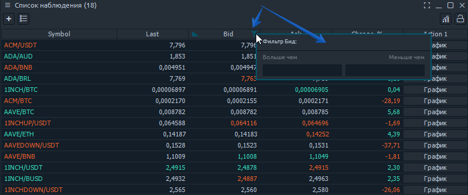

# Управление таблицами

## Табличные панели

Табличные панели представлены как отдельный класс - все они имеют не менее 99% функциональности в зависимости от вида таблицы. Мы используем общий компонент таблицы для всех этих панелей, поэтому поведение и функции в основном одинаковы.

Некоторые табличные панели имеют специальную панель инструментов, которую можно использовать для массовой фильтрации или быстрых действий. Другие панели таблиц могут не иметь заголовков столбцов, потому что они действительно не нужны для понимания данных, поэтому были скрыты для экономии места; это отключает возможность фильтрации данных столбца на таких панелях.

## Управление столбцами

Данные в таблицах организованы в строки и столбцы, где параметры каждого элемента \(строки\) отображаются в столбцах. Не все доступные столбцы по умолчанию отображаются на каждой панели таблицы. Мы выбрали наиболее популярные и важные для каждой панели и сделали возможность изменять набор столбцов по своему усмотрению.

Щелкните правой кнопкой мыши заголовок любого столбца, чтобы увидеть контекстное меню «Набор столбцов». Затем щелкните любой элемент в этом меню, чтобы изменить видимость столбца. Минимум в таблице должен остаться 1 столбец; последний видимый столбец нельзя будет скрыть.

Другие полезные функции управления столбцами - это сортировка и изменение размера. Каждый столбец можно перетаскивать за заголовок между другими столбцами внутри таблицы, чтобы задать требуемую последовательность. Вы также можете перетащить вертикальные границы между двумя столбцами, чтобы изменить их размер.

## Фильтрация

Набор строк в таблице можно отфильтровать по некоторому значению данных в их столбце. Есть два способа применить фильтрацию:

* Быстрый фильтр таблицы
* Расширенный фильтр таблицы


Быстрый фильтр таблицы - это еще одна точка доступа к расширенной опции фильтрации, позволяющей применять простые фильтры в несколько кликов.


Доступ к быстрому фильтру таблицы можно получить, щелкнув значок «Фильтр» в заголовке любого столбца таблицы.

Depending on the data type in a column, the Quick filter will give you the corresponding form for input; currently “_**String**_”, “_**Date/time**_” & “_**Number**_” filtering are supported. Once you select some option — the table rows will be filtered to that ones, containing the selected value. Quick filter can be cancelled by pressing “_**Cancel filtering**_” option.

## Sorting

Each table can be sorted by column value. To sort the table, click on column’s header; you will see a “_**Sorting**_” icon appears. The next click on this header will revert the sorting by this column. You can sort your table only by one column simultaneously.

## Grouping

If you want to organize your rows more precisely, you can use a “_**Rows grouping**_” feature. It allows separating all table items in groups, made from data of some column. Currently, only “_**String**_” data columns are supported for grouping.

To apply the grouping just right-click on the table body and find an option “_**Group by**_”; the second-level of context menu will contain all of available columns that can be grouped by. You can group by one column only. To cancel grouping — follow the previous steps and uncheck the column.

