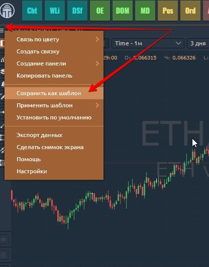
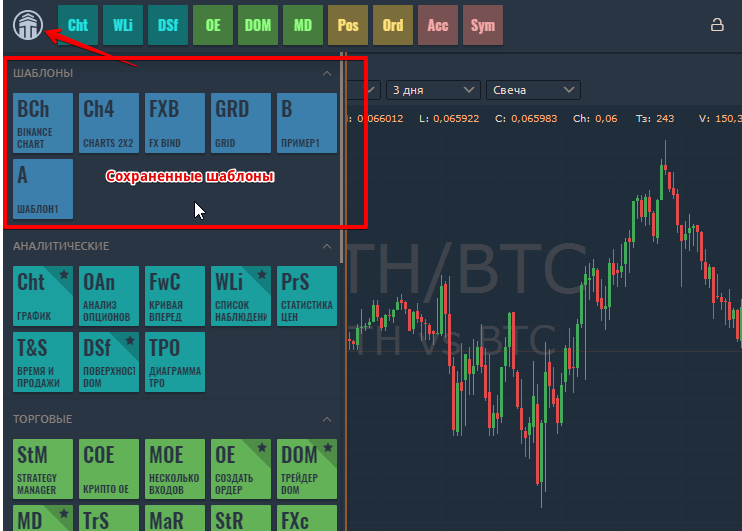
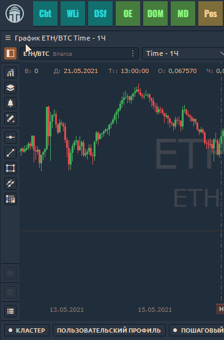
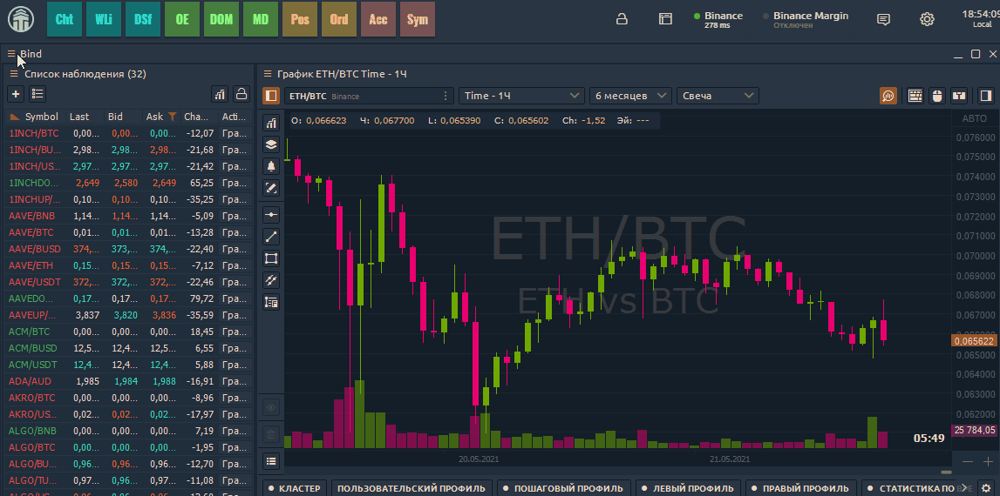
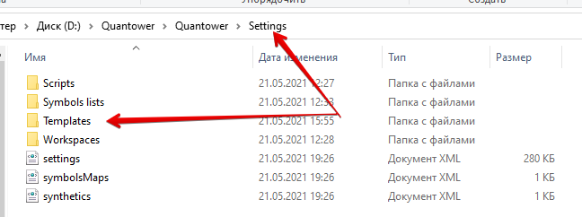

# Шаблоны

Из-за широкого списка функций большинство поверхностей на платформе Quantower имеют огромный список возможностей настройки. Чем мощнее поверхность - тем больше в ней настроек. Это позволяет любому пользователю настраивать каждую функцию самостоятельно, и иногда этот процесс может занять много времени.

Чтобы сэкономить вашу работу по настройке рабочего пространства, мы разработали функцию «**Шаблоны**». Это поможет вам сохранить ваши настройки в специальных объектах - шаблонах - и создать их позже, сохранив все примененные настройки.

Вы можете сохранять любые [**Одиночные панели**](https://app.gitbook.com/@quantower/s/quantower-ru/\~/drafts/-MaEToFHUmH6IcARPyfA/general-settings/standalone-panels), [**сгрупированные поверхности**](https://app.gitbook.com/@quantower/s/quantower-ru/\~/drafts/-MaEToFHUmH6IcARPyfA/general-settings/group-of-panels)** **или [**Bind**](binds.md)** (**Объединенные поверхности), как шаблон, так что его полезность очень многообещающая.&#x20;

## Как создать шаблон?

Процесс создания шаблона прост, как 1-2-3:

1. Откройте любую панель (или группу панелей или  Bind)
2. Настройте его в соответствии с вашими потребностями
3. Сохранить как шаблон и назовите его.

**Запуск шаблона**. Все созданные шаблоны хранятся на боковой панели Центра управления в группе «Шаблоны». Таким образом, вы можете запускать любой шаблон из этого места в любое время в один клик. Вы можете поместить сохраненные шаблоны на панель избранного в Центре управления, как и на любую другую панель по умолчанию.

**Применить шаблон**. Создав несколько шаблонов, вы можете применить любой из них к этой конкретной панели. \
&#x20;                                      &#x20;

&#x20;Если вы хотите отредактировать имя шаблона или удалить его из вашего терминала - воспользуйтесь контекстным меню на нем. В каждом шаблоне хранятся все данные настроек, включая размеры, расцветку, видимость внутренних элементов, предопределенный символ значений учетной записи, дополнительные специфические настройки и т. д. Другими словами: все, что вы можете настроить, и многое другое.


Если отдельная панель находится в связке **Bind **Объединенных панелей, то:\
\- сохранение нового шаблона к отдельной панели не применимо. В этом случае шаблон можно сохранить **только для всей группы Bind**. \
\- применить же шаблон из сохраненных в списке можно к каждой поверхности по отдельности.



Вы можете поделиться своими шаблонами с другими трейдерами Quantower, поделившись с ними файлами шаблонов. Файлы шаблонов можно найти в папке \
&#x20;_**“Quantower -> Settings -> Templates”**_


