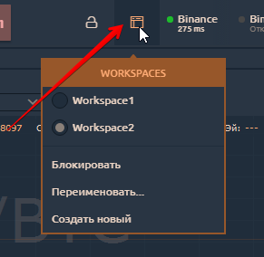

# Workspaces - менеджер рабочих пространств

Высший уровень организации торговой площадки, это - **Workspace**.&#x20;


**Quantower автоматически сохраняет** каждое рабочее пространство в свой локальный файл **каждые 5 минут**, чтобы обеспечить их безопасность.


В качестве группирующего слоя верхнего уровня рабочие области хранят все свое содержимое в специальных локальных файлах. Эти файлы можно найти в _**Quantower -> Settings -> Workspaces**_ папке. Каждый файл представляет некоторую рабочую область; все файлы имеют похожие имена. Технически файл рабочей области представляет собой XML-документ, содержащий все настройки всех панелей, находящихся в рабочей области.


How to create and save your custom workspace


**Workspaces менеджер **позволяет вам видеть, создавать, редактировать и удалять ваши рабочие среды, а также блокировать их изменение. Workspaces представлен специальным значком, при нажатии на который открывается список доступных Рабочих областей.

Текущая активная рабочая область отмечена цветом и имеет точку слева от ее имени. Вы можете переключить текущее рабочее пространство, щелкнув левой кнопкой мыши любой доступный элемент в списке. Нижняя часть списка (после разделителя) состоит из действий, относящихся к текущей активной рабочей области и позволяет:

* **Блокировать** — отключает возможность добавлять, удалять, перемещать или изменять размер любой панели в текущей рабочей области;
* **Переименовать** — вызывает всплывающий экран, где вы можете установить новое имя для текущей рабочей области;
* **Создать новый** — открывает всплывающее окно с формой создания новой рабочей области.

.png>)

При создании нового рабочего пространства у вас есть возможность указать его будущее имя и выбрать, должно ли оно быть пустым после создания или содержать некоторый предопределенный набор панелей.


Список шаблонов Workspace будет постоянно расширяться.


Вы также можете удалить любую из рабочих областей, щелкнув значок «**Корзина**» справа от имени рабочей области (значок появляется при наведении курсора на имя).
