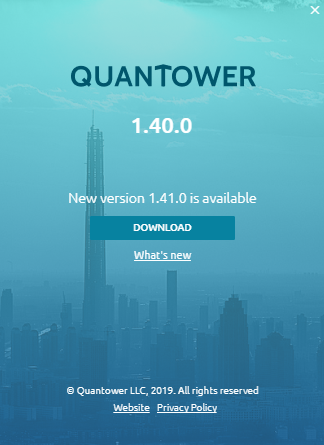
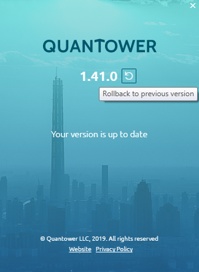

# Обновление платформы

Наша команда стремится выпускать новые обновления как можно скорее, обычно не реже пары раз в месяц.

Quantower автоматически проверяет наличие обновлений при запуске и повторно проверяет их каждые 10 минут в фоновом режиме. Это поможет вам узнавать о последних обновлениях сразу после их выпуска.

Когда будет доступна новая версия, рядом с логотипом появится зеленая стрелка. Щелкните значок «**Логотип**» и откройте боковую панель, затем нажмите кнопку «**НОВАЯ ВЕРСИЯ**» внизу и перейдите на экран «О программе».

Нажмите кнопку «**ЗАГРУЗИТЬ**», и Quantower загрузит последнюю версию и подготовит ее к обновлению. Когда процесс загрузки завершится, Quantower спросит вас о перезапуске. Это действие необходимо для применения новой версии, но вы можете отменить перезагрузку и продолжить работу с приложением. В этом случае обновления будут применены при следующем запуске Quantower.


Если вы согласитесь на перезапуск приложения для обновления, оно закроется и снова откроется с новой версией. Это может занять некоторое время, и торговля будет недоступна.


Все ваши локальные настройки будут сохранены и применены для будущих обновлений, поскольку обновление изменяет только основные файлы.

Если вы используете платформу со слишком старой версией, вам будет предложено обновить ее до последней версии, чтобы избежать проблем с подключениями и торговыми операциями.

## Rollback to the previous version

The rollback function allows you to go back to any previously supported version and switch to it in a few clicks.

