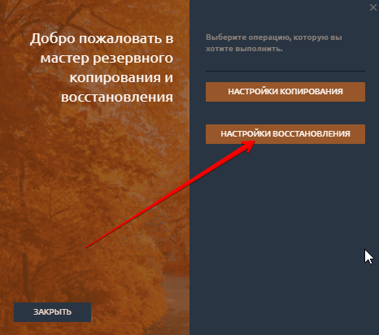
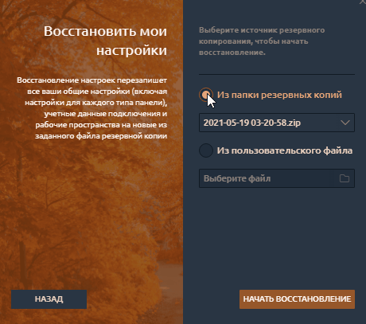

# Менеджер резервного копирования и восстановления

Плагин менеджера резервного копирования и восстановления позволяет сохранить ваши настройки в безопасности и восстановить их в случае проблем с приложением. Этот интеллектуальный инструмент может создавать резервные копии ваших глобальных настроек, учетных данных подключений, рабочих пространств и настроек макета каждой панели в одном локальном файле, который впоследствии можно использовать для их восстановления несколькими щелчками мыши.



## Настройки резервного копирования

Процесс резервного копирования прост и не требует много пояснений. Просто выберите путь, по которому будет храниться файл резервной копии (по умолчанию - папка резервных копий Quantower; рекомендуется), и нажмите кнопку **\[СОЗДАТЬ РЕЗЕРВНУЮ КОПИЮ]**.

Как только процесс будет запущен, вы увидите экран прогресса, показывающий ход процесса резервного копирования. Когда резервное копирование будет завершено, вы можете нажать кнопку \[ЗАВЕРШИТЬ], чтобы перейти к стартовому экрану. Каждая резервная копия создается с автоматическим именем по шаблону: «Date Time.zip». \
Путь к архиву, где находятся Ваши резервные копии, Вы можете изменить.\


Вы можете найти некоторые файлы резервных копий в папке Quantower Backup, содержащие букву «A» в конце - это автоматические резервные копии, периодически выполняемые Quantower (ежедневно, перезаписываемые **каждые 5 минут**).


## Как восстановить настройки

Если вы хотите восстановить некоторые предыдущие настройки или применить некоторые пользовательские настройки (полученные от другого пользователя Quantower, который ранее сделал резервную копию своих настроек), нажмите кнопку \[НАСТРОЙКИ ВОССТАНОВЛЕНИЯ].

Здесь вы можете найти два способа выбора файла резервной копии:

* Из папки резервных копий
* Из пользовательского файла

«Папка резервных копий» - это папка Quantower по умолчанию, в которой сохраняются все автоматически созданные файлы резервных копий и предлагаются для хранения ваши, созданные вручную. Диспетчер резервного копирования и восстановления проверяет эту папку и отображает все найденные файлы для импорта настроек. Вы также можете выбрать другое расположение файла резервной копии, используя опцию «Из пользовательского файла».


Убедитесь, что вы указываете правильный файл резервной копии (созданный ранее менеджером резервного копирования), чтобы избежать проблем с импортом и восстановлением настроек.


После выбора необходимого файла резервной копии и нажатия кнопки \[НАЧАТЬ ВОССТАНОВЛЕНИЕ] вы увидите процесс восстановления. По завершении вас спросят о перезапуске приложения. Это необходимое действие для применения недавно импортированных настроек.


В случае каких-либо проблем с файлом резервной копии менеджер B\&R сохранит ваши текущие настройки Quantower и сообщит вам об этом.

