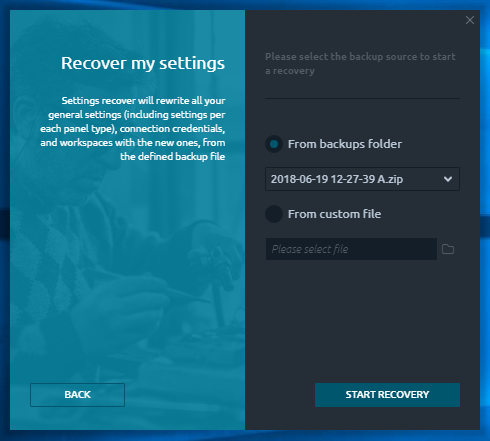

# Менеджер резервного копирования и восстановления

Плагин менеджера резервного копирования и восстановления позволяет сохранить ваши настройки в безопасности и восстановить их в случае проблем с приложением. Этот интеллектуальный инструмент может создавать резервные копии ваших глобальных настроек, учетных данных подключений, рабочих пространств и настроек макета каждой панели в одном локальном файле, который впоследствии можно использовать для их восстановления несколькими щелчками мыши.



## Настройки резервного копирования

Процесс резервного копирования прост и не требует много пояснений. Просто выберите путь, по которому будет храниться файл резервной копии \(по умолчанию - папка резервных копий Quantower; рекомендуется\), и нажмите кнопку **\[СОЗДАТЬ РЕЗЕРВНУЮ КОПИЮ\]**.

Как только процесс будет запущен, вы увидите экран прогресса, показывающий ход процесса резервного копирования. Когда резервное копирование будет завершено, вы можете нажать кнопку \[ЗАВЕРШИТЬ\], чтобы перейти к стартовому экрану. Каждая резервная копия создается с автоматическим именем по шаблону: «Date Time.zip».   
Путь к архиву, где находятся Ваши резервные копии, Вы можете изменить.  


You may find some backup files in Quantower Backup folder, containing the “**A**” letter at the end — these are the Automatic backups, periodically made by Quantower \(daily, overridden each 5 min\).


## Restore settings

In case you want to restore some previous settings or wish to apply some custom settings \(got from another Quantower user, that backed up its settings previously\), follow the **\[ RECOVER SETTINGS \]** button.

Here you can find two ways of Backup file selection:

* From backups folder 
* From custom file

The “_**Backups folder**_” is the default Quantower folder where it saves all automatically created backup files and proposes it to store yours, manually created. The Backup & restore manager checks this folder and displays you all the found files to import settings. You may also select some different location of your backup file, using the “_**From custom file**_” option.


Please make sure, that you are specifying the correct backup file \(made by B&R manager earlier\) to avoid the problems with settings import and restore.


Once you select the required backup file and press the **\[ START RECOVERY \]** button, you will see the recovery process flow. When finished, you will be asked about the application restart. This is the required action to apply your newly imported settings.


In case of any problems with the backup file, B&R manager will keep your current Quantower settings and inform you about it.


