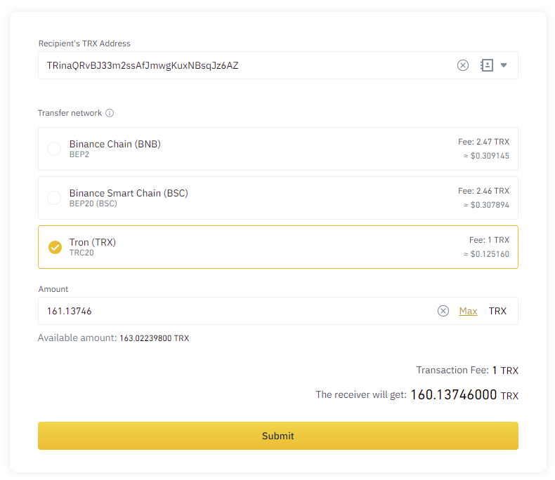
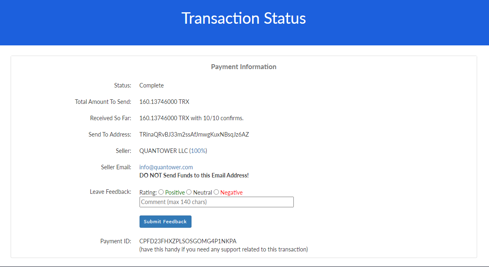
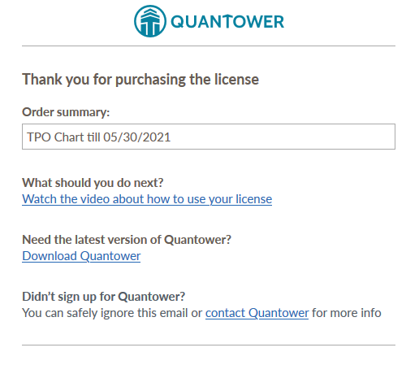

# “Coinpayments” payment

Хотя процесс передачи монет между цифровыми кошельками довольно обычен и прост, мы решили упомянуть некоторые дополнительные аспекты покупки лицензии Quantower с использованием криптовалюты.

Когда вы решите оплатить лицензию с помощью своих криптоактивов, вам следует нажать «Купить» для нужной функции. Затем вы должны нажать «Оплатить с помощью Coinpayments». Теперь вы будете перенаправлены к продавцу Coinpayments, где вам нужно выбрать монету, а затем - «Завершить кассу». Вы можете зарегистрироваться здесь, но это не обязательно.

Здесь мы хотели бы поделиться советом


Может быть комиссия за перевод, в зависимости от того, какие монеты вы переводите и с какого кошелька. Поэтому убедитесь, что вы переведете достаточное количество монет \(включая комиссию\) для завершения платежа. Если вы отправляете меньше монет, чем запрашивали Coinpayments, вы можете восполнить недостающую сумму дополнительным переводом.



Время передачи и количество подтверждений различаются по разным монетам. Биткойн требует большего количества подтверждений и времени для перевода, некоторые менее популярные монеты переводятся намного быстрее. Иногда стоит купить альтернативную монету и заплатить ею, чтобы ускорить процесс покупки.


## Страница сведений о покупке

Далее вы будете перенаправлены на временную страницу оплаты, которая будет активна в течение 2 часов. За это время вам необходимо передать выбранную монету, чтобы совершить покупку. Мы рекомендуем вам оставаться на этой странице, пока вы не увидите сообщение об успешной покупке.

На этой странице есть несколько важных элементов:

* **Идентификатор платежа.** Скопируйте и сохраните его где-нибудь, на случай технического сбоя \(ваш компьютер выключится, и вы не попадете на эту страницу\). Этот идентификатор необходим для связи с Coinpayments для дальнейшей поддержки транзакции.
* **Есть ссылка на страницу статуса транзакции**, где вы можете отслеживать процесс перевода монеты \(одобрено, сумма и т. Д.\). Эта страница обновляется автоматически.

## Сделать перевод

Теперь вам нужно сделать перевод выбранных монет из вашего кошелька. Этот процесс зависит от того, откуда вы отправляете. В качестве примера вы можете увидеть, как Binance информирует о комиссиях и получении сумм после перевода:

Допустим, вы отправили свои монеты и теперь ждете назначения лицензии. Процесс подтверждения обычно занимает 10-45 минут, но зависит от целевого времени блока монеты и количества требуемых подтверждений. Если вы видите, что ваши монеты были успешно отправлены из вашего кошелька, это не означает, что Coinpayments уже получили их. Если ваш платеж длится более 30 минут - обратитесь в нашу службу поддержки.

## Проверка присвоения лицензии

В Coinpayments есть некоторые технические процессы, которые необходимо выполнить, прежде чем они сообщат нам об успешном платеже. Это требует времени, поэтому ваша лицензия не может быть назначена вашей учетной записи, пока мы не получим одобрение от Coinpayments. Даже если есть статус **Завершено**.

Чтобы проверить, была ли ваша лицензия назначена вашей учетной записи, вы должны отслеживать следующие источники:

* адрес электронной почты вашего аккаунта, на который вы должны получить уведомление об успешном платеже;
* на панели учетной записи Quantower в разделе «История платежей».

Как только мы получим одобрение от Coinpayments, мы немедленно предоставим вам лицензию и отправим вам электронное письмо с подтверждением об успешной покупке. С этого момента вы можете использовать свою расширенную функцию.

