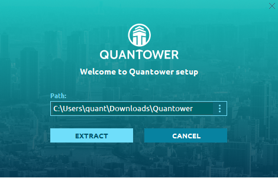
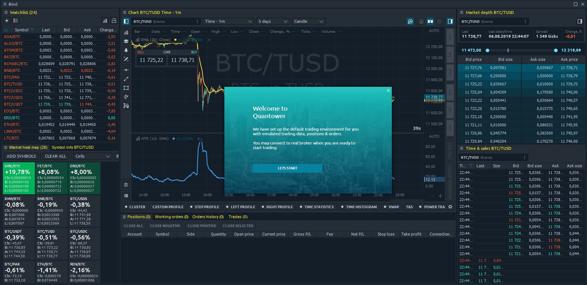

# Установка программы и требования к ПК

* * \*\*\*\*[**Installation Steps**](installation.md#installation-steps)\*\*\*\*
* \*\*\*\*[**Uninstallation**](installation.md#uninstall)\*\*\*\*

После того, как вы загрузили приложение Quantower с [официального сайта Quantower,](https://www.quantower.com/) вы готовы начать процесс установки. С этого момента мы должны прояснить основные различия между "процессом установки" Quantower и стандартным Windows® процессом установки, к которому привыкло большинство пользователей.




Quantower не копирует свои файлы в системные папки \(AppData или Program Files\) ОС и не записывает изменения в системный реестр.


Что это значит? Программа не нарушает целостность ОС, и в случае удаления не оставит никаких отпечатков своего присутствия на вашем компьютере. Программа установки Quantower буквально извлекает файлы в указанную пользователем папку.

Такой подход позволяет сохранять \(и запускать\) Quantower на съемном диске для использования на любом другом компьютере в качестве переносного приложения. Это может быть удобно, когда вам нужно перенести Quantower со всеми его настройками на другой компьютер; просто скопируйте папку Quantower и вставьте туда, где вам нужно.

## `Требования к ПК`


* Windows 10
* [.NET Framework v.4.8](https://dotnet.microsoft.com/download/dotnet-framework/thank-you/net48-web-installer)
* Доступное дисковое пространство— 1 GB \(зависит от объема загруженной истории\)
* **Требования к оборудованию для Quantower зависят от того, что вы с ним делаете**. Большинство настольных систем могут запускать Quantower без каких-либо проблем.
* Следующие технические характеристики оборудования настоятельно рекомендуются для скорости системы:16 GB RAM, минимум  4 core CPU, и SSD.



**Microsoft официально прекратила поддержку Windows 8 и Windows 7**. Поэтому платформа может не запускаться или работать некорректно. Более подробную информацию о поддерживаемых версиях смотрите на официальном сайте Microsoft.

Мы рекомендуем использовать Windows 10.


## Установка пошагово

1. [**Download the app installer**](https://updates.quantower.com/Quantower/x64/latest/Quantower.exe) and launch the _**Quantower.exe**_ file
2. Select the folder to extract application files
3. Once an extraction process being finished the platform will start automatically with **Binance connection** in Info Mode and with the default workspace


Please note, that you may need to allow an in-going and outgoing connection for _**Starter.exe**_ file \(the main executable of Quantower terminal\) in your Firewall settings


## Uninstall

If you need to uninstall the application, just _**delete the folder with all application files**_. You may also keep your personal settings \(connection information & workspaces\) by copying the Settings folder \(can be found right in Quantower folder\) before application delete. These Settings folder can be pasted to any other Quantower folder later.

You may also refer to [**Backup & Restore manager**](backup-and-restore-manager.md) to backup your settings in one file and restore them later.

