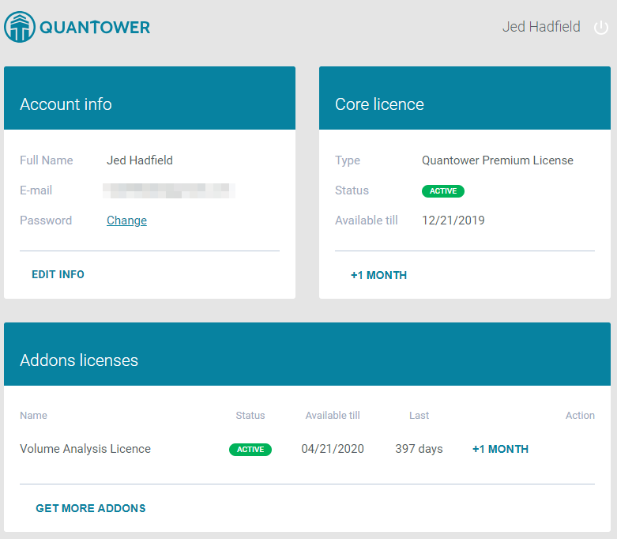

# Лицензии Quantower

Мы предоставляем самые популярные функции торговли и аналитики бесплатно, но некоторые ценные и специфичные для рынка функции доступны по платной лицензии.


В случае возникновения проблем с вашей учетной записью Quantower или покупкой лицензии - обратитесь в [нашу службу поддержки](https://www.quantower.com/contact-us).


Чтобы использовать любую платную Лицензию, трейдер должен иметь активную учетную запись Quantower. Если у вас ее нет, вы можете [создать аккаунт ](https://accounts.quantower.com/)в процессе покупки лицензии.





## Типы лицензий

Мы предлагаем пользователям бесплатную лицензию, пакет Crypto, два комплексных пакета, а также лицензии на отдельные функции.

**Бесплатная лицензия** предоставляется по умолчанию после создания учетной записи Quantower. Кроме того, она будет доступна постоянно, если у вас нет активной платной лицензии. Используя бесплатную лицензию, вы получите:

* одно активное подключение к любому брокеру, каналу данных или бирже
* 2 индикатора на график
* 1 наложение символа на график

**Crypto package** содержит необходимый функционал для профессионального анализа и торговли на рынке криптовалют. Для этого пакета доступны:

* все подключенные [криптовалютные биржи](https://www.quantower.com/connections)
* одновременное подключение к нескольким биржам
* [Инструменты объемного анализа ](https://www.quantower.com/volumeanalysistools)— Кластерные диаграммы, Профиль объема, Статистика по времени, Гистограмма по времени, VWAP
* [Набор расширенных функций](https://www.quantower.com/advancedfeatures)—  Ренко, Каги, P&F и Хейкен Аши виды графиков, неограниченное количество Overlays, безлимитные индикаторы, торговый симулятор, уведомления с графика и по индикаторам.

**Multi-Asset Package** включает все опции, доступные в Crypto Package, а также предоставляет доступ к Forex, Futures, Stock брокерам и другим каналам данных.

**All-in-One Package** включает в себя все доступные функции и подключения. Кроме того, все новые функции будут автоматически добавлены и доступны, пока действует ваша подписка.

[**DOM Surface**](https://www.quantower.com/blog/dom-surface-panel-for-deep-order-flow-analysis) лицензия активирует полный доступ к панели DOM Surface. В бесплатной версии панели все накопленные данные исчезают через 3 минуты.

[**Power Trades Scanner**](https://help.quantower.com/analytics-panels/chart/power-trades) лицензия активирует сканер, который показывает выполнение большого количества заказов за короткое время.

[**Volume Analysis**](https://www.quantower.com/volumeanalysistools) лицензия активирует все доступные инструменты объема:

* Кластерные графики
* Профили объема \(Правый& Левый, пользовательский объем, пошаговый профиль\)
* Гистограмма по времени
* Статистика по времени
* VWAP инструменты

[**Advanced Features**](https://www.quantower.com/advancedfeatures) лицензия включает нестандартные типы графиков, одновременные подключения, дополнительные функции для работы с историей символа, неограниченное количество наложений графиков и симуляцию торговли.

[**Options Trading**](https://www.quantower.com/options-trading-features) лицензия активирует панель Options Analytics. В настоящее время он доступен для бесплатного использования.

## Приобретение лицензии

Если вы хотите обновить свою бесплатную лицензию, перейдите на страницу [Pricing page](https://www.quantower.com/pricing), выберите необходимую лицензию, срок ее действия и нажмите кнопку «**КУПИТЬ**».

Процесс покупки начинается с авторизации в сервисе Quantower. Используйте свой адрес электронной почты и пароль для входа в учетную запись. Если у вас еще нет аккаунта в Quantower, то создайте его, следуйте инструкциям в руководстве [по учетной записи Quantower](quantower-account.md#registraciya-uchetnoi-zapisi). Сразу после успешного входа в систему вы будете перенаправлены в корзину покупок.

Корзина покупок содержит ранее выбранный тип лицензии, срок действия и окончательную цену. Вы можете изменить срок действия на любой желаемый вариант.

Следующим шагом является выбор поставщика платежных услуг и нажатие кнопки «**Оплатить**».


Также вы можете совершать платежи в криптовалюте или использовать прямые банковские переводы. Для этого обратитесь в нашу службу поддержки.


After that, you will be redirected to the provider’s payment page. Once you complete all the payment steps, you will be redirected back to the confirmation page of Quantower Accounts. Follow the **GO TO DASHBOARD** link to get to your Quantower Account dashboard, where you should see you current Core License information and Payment transactions history.

## License terms

Currently, all licenses can be purchased for a 1-month term minimum. You can also get any Quantower paid License for the LIFETIME period — [contact our support](https://www.quantower.com/contact-us) for this.

## Quick tips on License purchase

* A free License is valid ALL THE TIME while your Quantower Account is active.
* Any paid License is active from the purchase date till the end date \(“Available till”\).
* Once your paid License is expired, the Account will be automatically downgraded to the Free License.
* Every new purchase for the similar license type extends the “Available till” date on the purchasing term.
* Subscription and automatic payments are currently unavailable.

