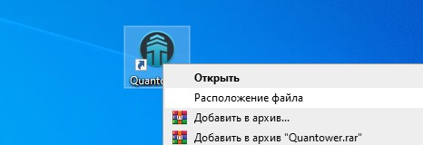

# Сбросить до значений по умолчанию

Папка настроек содержит все рабочие области, сохраненные шаблоны, а также все визуальные изменения, которые были применены к панелям, индикаторам, инструментам рисования. Ниже мы рассмотрим основные операции, которые вы можете выполнять с папкой настроек для комфортной работы с платформой.

* \*\*\*\*[**Как сбросить все настройки до значений по умолчанию**](reset-settings-to-default.md#kak-sbrosit-vse-nastroiki-do-znachenii-po-umolchaniyu)\*\*\*\*
* \*\*\*\*[**Как скопировать ВСЕ настройки на другой ПК**](reset-settings-to-default.md#kak-skopirovat-vse-nastroiki-na-drugoi-pk)\*\*\*\*
* Как сбросить настройки конкретной панели, рисунка, индикатора
* Как поделиться своими шаблонами, рабочими пространствами с другими трейдерами



## Как сбросить все настройки до значений по умолчанию

Иногда необходимо сбросить все настройки платформы до значений по умолчанию. Для этого закройте платформу, щелкните правой кнопкой мыши значок **Quantower** и выберите в контекстном меню команду «**Открыть расположение файла**».


Вы можете сохранить текущие настройки, если захотите вернуться к ним позже. Просто переименуйте папку настроек во что-нибудь другое, например, в Settings\_My и т. д.


Откроется папка с основными файлами последней \(установленной\) версии программы.

**Зайдите в основную папку платформы  Quantower**  

Переименуйте папку настроек \(например, Settings**\_1** или Settings**\_old**\). После переименования папки запустите платформу. После перезапуска останется Ваша папка со старыми настройками "Settings**\_old"** и новая папка "Settings"  автоматически появится с настройками по умолчанию.


Перед отправкой ваших настроек разработчикам для проверки проблемы добавьте полную папку настроек в архив ZIP или RAR и отправьте ее по адресу **info@quantower.com** с кратким описанием вашей проблемы.


## Как скопировать ВСЕ настройки на другой ПК

Прежде, чем приступить к копированию, убедитесь в том, что программа закрыта на обоих ПК.

Зайдите в основную папку платформы  Quantower откуда вы хотите скопировать настройки. Если Вы не знаете, как ее найти, нажмите правой кнопкой мыши на ярлыке Quantower и нажмите "расположение файла"  

Основная папка с настройками платформы  Quantower:


При каждом запуске платформы  происходит **обращение к папке "Settings"**  за настройками. Если нет папки именно с таким названием, то автоматически создается новая папка "Settings"  с настройками по умолчанию.


Скопировать ВСЕ настройки на другой ПК  можно двумя способами:

1. Скопируйте папку "Settings"  и вставьте в папку с платформой на другом ПК  **путем замены .** В этом случае старые настройки на другом ПК все пропадут и после запуска платформы вступят в силу новые.
2. На втором ПК сначала сохранить старые настройки, **переименовав папку "Settings" на "Settings\_old".** А после вставить папку **"Settings"**  с новыми настройками, которые вы переносите с другого ПК. В таком варианте сохранятся старые настройки в другой папке и после запуска платформы вступят в силу новые.

## Как поделиться своими шаблонами, рабочими пространствами с другими трейдерами


Вы можете поделиться своими шаблонами с другими трейдерами Quantower, поделившись с ними файлами шаблонов. Файлы шаблонов можно найти в папке   
 _**“Quantower -&gt; Settings -&gt; Templates”**_


Напомним, что в платформе  Quantower все созданные шаблоны хранятся на боковой панели Центра управления[ **в группе «Шаблоны»**](https://help.quantower.com.ru/general-settings/templates). Таким образом, вы можете запускать любой шаблон из этого места в любое время в один клик. Вы можете поместить сохраненные шаблоны на панель избранного в Центре управления, как и на любую другую панель по умолчанию. 

