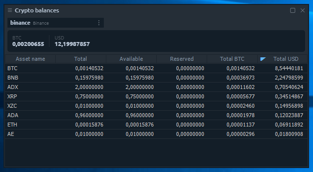

# Крипто-балансы


Эта панель относится к панелям, специально созданным для торговли криптовалютами, что означает, что ее можно использовать, когда у пользователя есть хотя бы одно активное соединение с крипто биржами.


На панели «Крипто-балансы» отображаются все ваши балансы по монетам. Здесь вы можете найти информацию о суммах на актив: общая, доступная для торговли, зарезервированная в открытых ордерах, рассчитанная в BTC, рассчитанная в долларах США.

Также есть информационная панель с общим количеством ваших монет в BTC и USD. По умолчанию мы скрываем активы с нулевым балансом, поэтому список выглядит более понятным, но вы можете включить полный список через настройки панели \(опция «Скрыть нулевые балансы»\).

