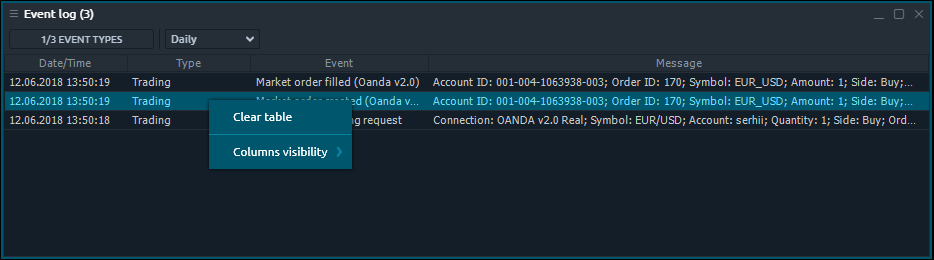

# Журнал событий

Панель журнала событий отображает подробную информацию обо всех событиях, произошедших в процессе работы с торговой платформой. Панель журнала событий относится к информационной группе боковой панели Центра управления. Если произойдет какая-либо ошибка, она будет записана здесь. Вы можете увидеть здесь всю ​​важную информацию о платформе и при необходимости передать ее в нашу техподдержку.

## Доступные столбцы

| Дата / время | Дата и время, когда произошло событие |
| :--- | :--- |
| **Тип** | Тип мероприятия. Может быть: Торговля, Система или Исключение. |
| **Событие** | Краткое наименование события |
| **Сообщение** | Полная информация о событии |
| **Название соединения** | Название соединения, с которым связано это событие. |

## Действия в контекстном меню

Кликнув правой кнопкой мыши на каждой строке панели журнала событий, вы получите контекстное меню со следующими функциями:

### Common actions

| **Clear table** | Remove all rows from Event Log panel. |
| :--- | :--- |
| **Columns visibility** | Allows to toggle the columns visibility |


"Clear table" action removes only data from current table, but not files from your drive. All history logs are still available - you can refill table via "Range selector" on panel tool bar.


