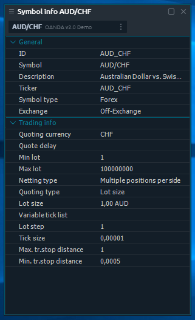

# Информация о символе

На этой панели отображается подробная информация о выбранном символе. Список параметров варьируется в зависимости от производителя и типа символа.

Вы можете связать эту панель с другими, чтобы синхронизировать выбор символа. Он хорошо работает в привязке к Списку наблюдения, Графику и другим панелям, связанным с символами.


Рекомендуется связать информационную панель символа со списком наблюдения и скрыть панель инструментов, содержащую поле поиска символа. Таким образом, вы получаете список наблюдения с подробной информацией по каждому символу.


