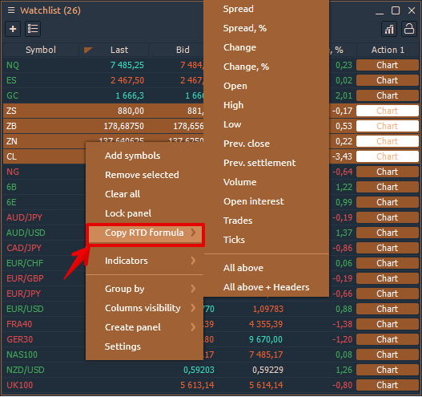
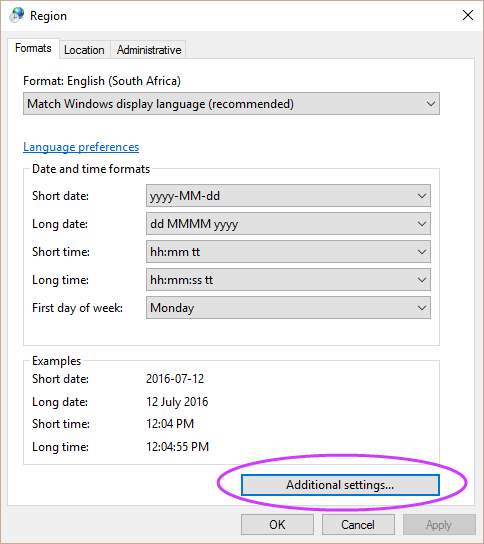
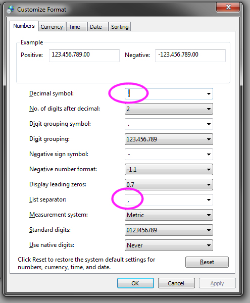

# Excel функции и RTD

Начиная с версии 1.39 Quantower поддерживает данные в реальном времени \(RTD\) для отправки данных и другой рыночной информации в Microsoft Excel®. Эта функция открывает множество возможностей для создания настраиваемых экранов и других способов более эффективного управления рабочим процессом.



> **RTD - это новый протокол**, который предлагает несколько преимуществ по сравнению с DDE, включая большую гибкость, лучшую производительность и надежность.

Мы подготовили электронную таблицу, в которой описан основной синтаксис формул RTD с подробным описанием бол_ее сложных формул. Включен набор популярных формул RTD, которые вы можете просто скопирова_ть и вставить в свою электронную таблицу. [**Загрузите данный файл с примерами формул**](https://updates.quantower.com/misc/RTD/rtd_samples.xlsx)**.**

Пример с данного файла для получения информации о символ**е** с помощью функции RTD:

### GetSymbolInfo -доступ к информации о конкретном символе

Предоставляет доступ к информации о конкретном символе, такой как **Description, ExchangeName, NettingType и других.** Вы можете просто скопировать / вставить эту формулу для использования в файлах Excel или получить ее прямо из панели «Информация о символе» для выбранного символа. Щелкните правой кнопкой мыши на панели и выберите пункт меню: _**«Копировать формулу RTD» -&gt; «Значение».**_

**Синтаксис:**

```text
=RTD("TradingPlatform";"";"GetSymbolInfo";"AUD_USD";"SymbolType";"Emulator")
```

_**Параметры**_

| _**Параметр**_ | Описание |
| :--- | :--- |
| **"TradingPlatform"** | Имя сервера Quantower RTD. Он исправлен, и вы можете использовать его во всех формулах. |
| **"GetSymbolInfo"** | Название метода |
| **"AUD\_USD"** | ID символа, данные по которому вы хотите получить. Вы можете получить его из панели SymbolInfo. |
| **"SymbolType"** | Указанный тип данных, которые вы хотите получать.  Например: Имя, Описание. |
| **"Emulator"** | Имя соединения, которое вы хотите использовать для поиска нужного символа. Вы можете оставить этот параметр пустым, если у вас только одно соединение. |

## Как активировать функцию RTD на платформе Quantower


Для правильной работы функции платформа Quantower и Excel должны иметь одинаковую версию - 64 или 32 бит.


Запустите Excel, а затем откройте Диспетчер задач, чтобы проверить версию Excel \(32-разрядную или 64-разрядную\). Платформа должна иметь одну и ту же версию для правильной работы с функцией RTD.


Зайдите в Общие настройки платформы, затем в раздел Excel RTD и отметьте «Включить Microsoft Excel RTD».


Также в настройках есть две важные настройки:

* **Пользовательское название формулы RTD** - в зависимости от языка вашей операционной системы имя функции RTD в Excel может называться по-разному. Первоначальное название функции в английской версии Excel - RTD, а в русской версии - **«ДРВ»**.
* **Пользовательский разделитель аргументов** - разделитель, участвующий в формуле. Это зависит от локализации вашей операционной системы. [Узнайте, как проверить разделитель аргументов в вашей системе.](https://app.gitbook.com/@quantower/s/quantower-ru/~/drafts/-Md7BQiWmCbcAOTi9WkO/miscellaneous-panels/excel-rtd-trading#how-to-check-argument-separator)

## Как получить данные инструмента из Quantower?

### 1. Получение данных путем копирования формулы

Самый простой способ получить данные в Excel - скопировать необходимые данные через контекстное меню панели. Например, после активации RTD в панели Watchlist появится дополнительный пункт в контекстном меню - скопировать формулу RTD.

* Select a necessary symbol or multiple symbols, right-click and select **Copy RTD Formula**. You can copy formulas for specific columns or for all columns.



* Go to Excel and paste the copied formulas. Now the data will be updated automatically.



You may notice that the data is updated with some delay. This is a throttling interval that is set by default in Excel \(2000 milliseconds\). If you want to [increase the speed of updating data, read the instructions on how to do it](https://help.quantower.com/miscellaneous-panels/excel-rtd-trading/changing-rtd-throttle-interval-in-excel).


### 2. Getting data through writing a formula

When retrieving instrument data using RTD, you need to specify the ID of the instrument and the properties you want to retrieve.

RTD formula uses the following basic structure:

```text
=RTD("TradingPlatform";"";"Param1";"Param2";"Param3";....")
```


The second parameter is the name of the external server running the RTD Server. As the Quantower RTD Server always runs locally, you must omit a value for the second parameter or supply an empty string \(“”\). However, you must account for the parameter in the formula.


## **Frequently Asked Questions**

### **How to check argument separator?**

For Windows 10:

* go to **Start &gt;type Control Panel  and press enter &gt; Region**
* click **Additional Settings**
* for **List Separator** check the argument. _\*\*_It must be the same as in RTD settings.





