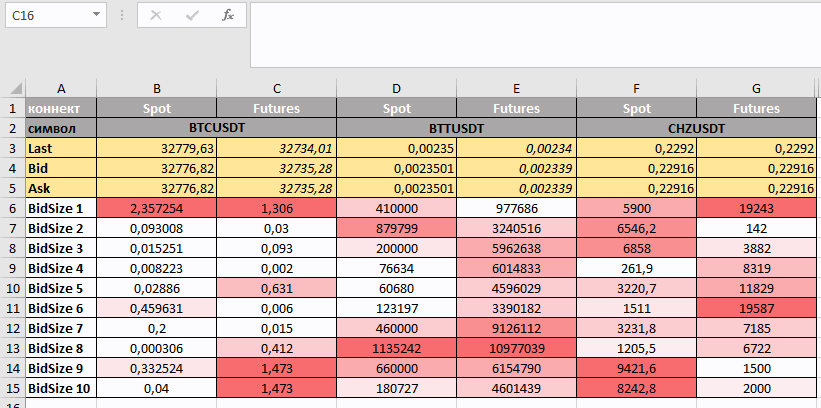

# Excel  RTD - данные в реальном  времени

Начиная с версии 1.39 Quantower поддерживает данные в реальном времени (RTD) для отправки данных и другой рыночной информации в Microsoft Excel®. Эта функция открывает множество возможностей для создания настраиваемых экранов и других способов более эффективного управления рабочим процессом.



> **RTD - это новый протокол**, который предлагает несколько преимуществ по сравнению с DDE, включая большую гибкость, лучшую производительность и надежность.

Используя **анализ данных в реальном режиме времени с помощью формулы RTD,** можно создать персональную аналитику данных, начиная от получения всех параметров котировок и заканчивая полноценным анализом рынка в реальном режиме, с графиками, и финансовым анализом. В данном разделе мы познакомим Вас с  основными возможностями, используя которые Вы сможете создать в  **Excel** свой пользовательский анализ данных в реальном режиме времени используя платформу **Quantower:**

* ****[**Как активировать функцию RTD на платформе Quantower**](./#kak-aktivirovat-funkciyu-rtd-na-platforme-quantower)****
  * [Как проверить разделитель аргументов?](./#kak-proverit-razdelitel-argumentov)
* ****[**Как получить данные в реальном режиме времени со списка наблюдения в Excel?** ](./#kak-poluchit-dannye-v-realnom-rezhime-vremeni-so-spiska-nablyudeniya-v-excel)****
  * [Получение данных путем копирования формулы](./#1-poluchenie-dannykh-putem-kopirovaniya-formuly)
  * [Получение данных путем написания формулы](./#2-poluchenie-dannykh-putem-napisaniya-formuly)
* ****[**Примеры самых популярных формул RTD с описанием**](./#primery-samykh-populyarnykh-formul-rtd-s-opisaniem)****\
  &#x20;       **1.** [**GetSymbolInfo** - информация о конкретном символе](./#1-getsymbolinfo-informaciya-o-konkretnom-simvole)\
  &#x20;       **2.** [**GetAccounInfo -** информация о конкретной учетной записи](./#2-getaccouninfo-informaciya-o-konkretnoi-uchetnoi-zapisi)\
  &#x20;       **3.**[ **GetMarketData -** данные символа Bid, Ask, Last, Open, High и т. д](./#3-getmarketdata-dannye-simvola-bid-ask-last-open-high-i-t-d)\
  &#x20;       **4.** [**GetLevel2Data  -** Level2 данные глубины рынка ](./#4-getlevel-2-data-level2-dannye-glubiny-rynka)\
  &#x20;      **5.** [**GetHistory** - история для указанного символа ](./#5-gethistory-istoriya-dlya-ukazannogo-simvola)

## Как активировать функцию RTD на платформе Quantower


Для правильной работы функции платформа Quantower и Excel должны иметь одинаковую версию - 64 или 32 бит.


Запустите Excel, а затем откройте Диспетчер задач, чтобы проверить версию Excel (32-разрядную или 64-разрядную). Платформа должна иметь одну и ту же версию для правильной работы с функцией RTD.

.png>)

Зайдите в Общие настройки платформы, затем в раздел Excel RTD и отметьте «Включить Microsoft Excel RTD».


Также в настройках есть две важные настройки:

* **Пользовательское название формулы RTD** - в зависимости от языка вашей операционной системы имя функции RTD в Excel может называться по-разному. Первоначальное название функции в английской версии Excel - RTD, а в русской версии - **«ДРВ»**.
* **Пользовательский разделитель аргументов** - разделитель, участвующий в формуле. Это зависит от локализации вашей операционной системы.&#x20;

### **Как проверить разделитель аргументов?**

Для Windows 10:

* перейдите в Пуск> введите Панель управления и нажмите ввод> **Регион**
* нажмите **Дополнительные настройки**
* для разделителя списка проверьте аргумент.  Он должен быть таким же, как в настройках RTD.



После активации RTD в  панели **"Список наблюдения" и в таблицах,** появится дополнительный пункт в контекстном меню - **скопировать формулу RTD.**


## **Как получить данные в реальном режиме времени со списка наблюдения в Excel?**

### 1. Получение данных путем копирования формулы

Самый простой способ получить данные в Excel - скопировать необходимые данные через контекстное меню панели. Например, после активации RTD в панели ["Список наблюдения"](https://help.quantower.com.ru/analytics-panels/watchlist) появится дополнительный пункт в контекстном меню - скопировать формулу RTD.

* Выберите необходимый символ или несколько символов, щелкните правой кнопкой мыши и выберите **«Копировать формулу RTD»**. Вы можете копировать формулы для определенных столбцов или для всех столбцов.
* Если Вы хотите **скопировать сразу готовую таблицу с данными**, добавьте в список наблюдения все необходимые данные (столбцы с аналитическими данными по символу) которые Вы планируете использовать  для последующего анализа в Excel и выделите все строки для вашей будущей таблицы Excel.&#x20;

> Зажав клавишу "Shift" можно выделить сразу несколько строк, зажав клавишу "Ctrl" выборочно.


* Зайдите в Excel и вставьте скопированные формулы. Теперь данные будут обновляться автоматически.



Вы можете заметить, что данные обновляются с некоторой задержкой. **Это скорость обновления, установленная по умолчанию в Excel (2000 миллисекунд).** Если вы хотите увеличить [скорость обновления данных, прочтите инструкцию, как это сделать.](https://help.quantower.com/miscellaneous-panels/excel-rtd-trading/changing-rtd-throttle-interval-in-excel)


### 2. Получение данных путем написания формулы

При получении данных определенных параметров с помощью RTD, вам необходимо указать идентификатор параметра и свойства, которые вы хотите получить.

Формула RTD использует следующую базовую структуру:

```
=ДРВ("TradingPlatform";"";"Param1";"Param2";"Param3";....")
```


Второй параметр - это имя внешнего сервера, на котором запущен сервер RTD. Поскольку сервер Quantower RTD всегда работает локально, вы должны опустить значение для второго параметра или указать пустую строку («»). Однако вы должны учитывать параметр в формуле.



## **Примеры самых популярных формул RTD с описанием**

Ниже описаны примеры **самых популярных формул RTD с описанием основного синтаксиса** на примере биржи Binance. Используя их, можно получить именно те данные, которые нужны для анализа и вставить в свою электронную таблицу. Так же Вы можете данные примеры загрузить с[ **данного файла Excel.**](https://updates.quantower.com/misc/RTD/rtd\_samples.xlsx)****

****

### 1.GetSymbolInfo - информация о конкретном символе


Предоставляет доступ к информации о конкретном символе, такой как **Description, ExchangeName, NettingType и других.** Вы можете просто скопировать / вставить эту формулу для использования в файлах Excel или получить ее прямо из панели «Информация о символе» для выбранного символа. Щелкните правой кнопкой мыши на панели и выберите пункт меню: _**«Копировать формулу RTD» -> «Значение».**_


```
Примеры: 

=ДРВ("tradingplatform";"";"GetSymbolInfo";"1INCHBTC";"Name";"Binance Spot")

=ДРВ("tradingplatform";"";"GetSymbolInfo";"1000LUNCBUSD";"Name";"Binance USDT-M Futures")

=ДРВ("tradingplatform";"";"GetSymbolInfo";"1INCHUSDT_SPOT";"Name";"Bybit")

=ДРВ("TradingPlatform";"";"GetSymbolInfo";"10000NFTUSDT_SWAP";"Name";"Bybit")

=ДРВ("TradingPlatform";"";"GetSymbolInfo";"BTCUSDT";"SymbolType";"Binance Spot")

```

_**Параметры**_

| _**Параметр**_        | Описание                                                                                                                                                |
| --------------------- | ------------------------------------------------------------------------------------------------------------------------------------------------------- |
| **"TradingPlatform"** | Имя сервера Quantower RTD. Вы можете использовать его во всех формулах.                                                                                 |
| **"GetSymbolInfo"**   | Название метода                                                                                                                                         |
| **"BTCUSDT"**         | ID символа, данные по которому вы хотите получить. Вы можете получить его из панели SymbolInfo.                                                         |
| **"SymbolType"**      | <p>Указанный тип данных, которые вы хотите получать. <br>Например: Имя, Описание.</p>                                                                   |
| **"Binance Spot"**    | Имя соединения, которое вы хотите использовать для поиска нужного символа. Вы можете оставить этот параметр пустым, если у вас только одно соединение.  |


### 2. GetAccounInfo - информация о конкретной учетной записи


Предоставляет доступ к информации о конкретной учетной записи, такой как имя, баланс, NettingType и другие. Вы можете просто скопировать / вставить эту формулу для использования в файлах Excel или получить ее непосредственно из панели «Информация об учетной записи» для выбранной учетной записи. Щелкните правой кнопкой мыши на панели и выберите пункт меню: «Копировать формулу RTD» -> «Значение».


<pre><code><strong>
</strong><strong>
</strong><strong>=ДРВ("tradingplatform";"";"GetAccountInfo";"binance";"Balance";"Binance USDT-M Futures")
</strong>
=ДРВ("tradingplatform";"";"GetAccountInfo";"binance";"DOTavailableBalance";"Binance USDT-M Futures")

=ДРВ("tradingplatform";"";"GetAccountInfo";"binance";"hedgeMode";"Binance USDT-M Futures")

=ДРВ("tradingplatform";"";"GetAccountInfo";"3111865";"Balance";"Bybit")

=ДРВ("tradingplatform";"";"GetAccountInfo";"3111865";"openPositions";"Bybit")

=ДРВ("tradingplatform";"";"GetAccountInfo";"3111865";"Id";"Bybit")
</code></pre>

_**Параметры**_

| _**Параметр**_               | _Описание_                                                                                                                                             |
| ---------------------------- | ------------------------------------------------------------------------------------------------------------------------------------------------------ |
| **"TradingPlatform"**        | Имя сервера Quantower RTD. Вы можете использовать его во всех формулах.                                                                                |
| **"GetAccountInfo"**         | Название метода                                                                                                                                        |
| **"binance"**                | ID символа, имени, данные по которому вы хотите получить. Вы можете получить его из панели AccountInfo                                                 |
| **"fullLicense"**            | Указанный тип данных, которые вы хотите получать. Например: Name, Description, fullLicense,                                                            |
| **"Binance USDT-M Futures"** | Имя соединения, которое вы хотите использовать для поиска нужного символа. Вы можете оставить этот параметр пустым, если у вас только одно соединение. |


### 3. GetMarketData - данные символа Bid, Ask, Last, Open, High и т. д


Предоставляет доступ к информации обо всех типах рыночных данных, доступных для конкретного символа: Bid, Ask, Last, Open, High и т. д. Вы можете просто скопировать / вставить эту формулу для использования в файлах Excel или получить ее непосредственно из панели «Список наблюдения» для выбранных символов.


```
Примеры:

=ДРВ("tradingplatform";"";"GetMarketData";"1INCHUSDT_SPOT";"Last";"Bybit")

=ДРВ("tradingplatform";"";"GetMarketData";"10000NFTUSDT_SWAP";"Last";"Bybit")

=ДРВ("tradingplatform";"";"GetMarketData";"1INCHBTC";"Last";"Binance Spot")

=ДРВ("tradingplatform";"";"GetMarketData";"1000LUNCBUSD";"Last";"Binance USDT-M Futures")

=ДРВ("tradingplatform";"";"GetMarketData";"1INCHUSDT_SPOT";"ChangePercentage";"Bybit")

=ДРВ("tradingplatform";"";"GetMarketData";"10000NFTUSDT_SWAP";"ChangePercentage";"Bybit")

=ДРВ("tradingplatform";"";"GetMarketData";"1INCHBTC";"ChangePercentage";"Binance Spot")

=ДРВ("tradingplatform";"";"GetMarketData";"1000LUNCBUSD";"ChangePercentage";"Binance USDT-M Futures")
```

_**Параметры**_

| _**Параметр**_               | _Описание_                                                                                                                                             |
| ---------------------------- | ------------------------------------------------------------------------------------------------------------------------------------------------------ |
| **"TradingPlatform"**        | Имя сервера Quantower RTD. Вы можете использовать его во всех формулах.                                                                                |
| **"GetMarketData"**          | Название метода                                                                                                                                        |
| **"BTCUSDT"**                | ID символа, данные по которому вы хотите получить. Вы можете получить его из панели SymbolInfo.                                                        |
| **"Bid"**                    | Указанный тип данных, которые вы хотите получать. Например: Bid, Ask, Last, Open, High                                                                 |
| **"Binance USDT-M Futures"** | Имя соединения, которое вы хотите использовать для поиска нужного символа. Вы можете оставить этот параметр пустым, если у вас только одно соединение. |


### 4. GetLevel2Data - Level2 данные глубины рынка&#x20;


Предоставляет доступ к данным Уровня 2 для определенного символа. Вы можете просто скопировать / вставить эту формулу и использовать ее в файлах Excel.


```
=ДРВ("tradingplatform";"";"GetLevel2Data";"BTCUSDT";"BidSize";"0";"Binance Spot")

=ДРВ("tradingplatform";"";"GetLevel2Data";"BTCUSDT";"BidSize";"0";"Binance USDT-M Futures")

=ДРВ("tradingplatform";"";"GetLevel2Data";"BTCUSDT_SPOT";"BidSize";"0";"Bybit")

=ДРВ("tradingplatform";"";"GetLevel2Data";"10000NFTUSDT_SWAP";"BidSize";"0";"Bybit")
```

_**Параметры**_

| _**Параметр**_        | _Описание_                                                                                                                                             |
| --------------------- | ------------------------------------------------------------------------------------------------------------------------------------------------------ |
| **"TradingPlatform"** | Имя сервера Quantower RTD. Вы можете использовать его во всех формулах.                                                                                |
| **"GetLevel2Data"**   | Название метода                                                                                                                                        |
| **"BTCUSDT"**         | ID символа, данные по которому вы хотите получить. Вы можете получить его из панели SymbolInfo.                                                        |
| **"BidSize"**         | Указанный тип данных, которые вы хотите получать. Например: Bid, Ask, BidSize, AskSize.                                                                |
| **"0"**               | Порядковый номер уровня в стакане цен. Начинается с 0.                                                                                                 |
| **"Binance Spot"**    | Имя соединения, которое вы хотите использовать для поиска нужного символа. Вы можете оставить этот параметр пустым, если у вас только одно соединение. |



### 5. GetHistory - история для указанного символа&#x20;


Возвращает историю для указанного символа, агрегирования и диапазона дат. Вы можете просто скопировать / вставить эту формулу и использовать ее в файлах Excel.


```
Примеры:

=ДРВ("tradingplatform";"";"GetHistory";"BTCUSDT";"1Day";"Low";"10Day";"0";"Last";"Binance Spot")

=ДРВ("tradingplatform";"";"GetHistory";"BNBUSDT";"1Minute";"Close";"30Minute";"0";"Last";"Binance USDT-M Futures")

=ДРВ("tradingplatform";"";"GetHistory";"BTCUSDT";"5Minute";"Open";"300Minute";"0";"Last";"Binance USDT-M Futures")

=ДРВ("tradingplatform";"";"GetHistory";"ADAUSDT";"1Hour";"Low";"24Hour";"0";"Last";"Binance Spot")

=ДРВ("tradingplatform";"";"GetHistory";"BTCUSDT_SPOT";"1Hour";"Low";"24Hour";"0";"Last";"Bybit")

=ДРВ("tradingplatform";"";"GetHistory";"10000NFTUSDT_SWAP";"1Hour";"Low";"24Hour";"0";"Last";"Bybit")
```

_****_

_**Параметры**_

| _**Параметр**_        | _Описание_                                                                                                                                             |
| --------------------- | ------------------------------------------------------------------------------------------------------------------------------------------------------ |
| **"TradingPlatform"** | Имя сервера Quantower RTD. Вы можете использовать его во всех формулах.                                                                                |
| **"GetHistory"**      | Название метода                                                                                                                                        |
| **"BTCUSDT"**         | ID символа, данные по которому вы хотите получить. Вы можете получить его из панели SymbolInfo.                                                        |
| **"1Day"**            | Тип агрегирования: 1 день, 3 дня, 5 минут и т. д. Доступные агрегаты:Tick, Second, Minute, Hour, Day, Week, Month, Year.                               |
| **"Close"**           | Указанный тип данных, которые вы хотите получать. Например: Open, High, Low, Close, Volume, Bid, Ask.                                                  |
| **"10Day"**           | Требуемый диапазон истории: 10 дней, 300 минут и т. д. Доступные диапазоны: Minute, Hour, Day, Month, Year.                                            |
| **"0"**               | Индекс бара / тика в возвращаемом массиве истории. 0 означает самый новый бар.                                                                         |
| **"Last"**            | Тип истории Bid, Ask, Last. Оставьте поле пустым, чтобы получать историю по умолчанию для указанного символа.                                          |
| **"Binance Spot"**    | Имя соединения, которое вы хотите использовать для поиска нужного символа. Вы можете оставить этот параметр пустым, если у вас только одно соединение. |


