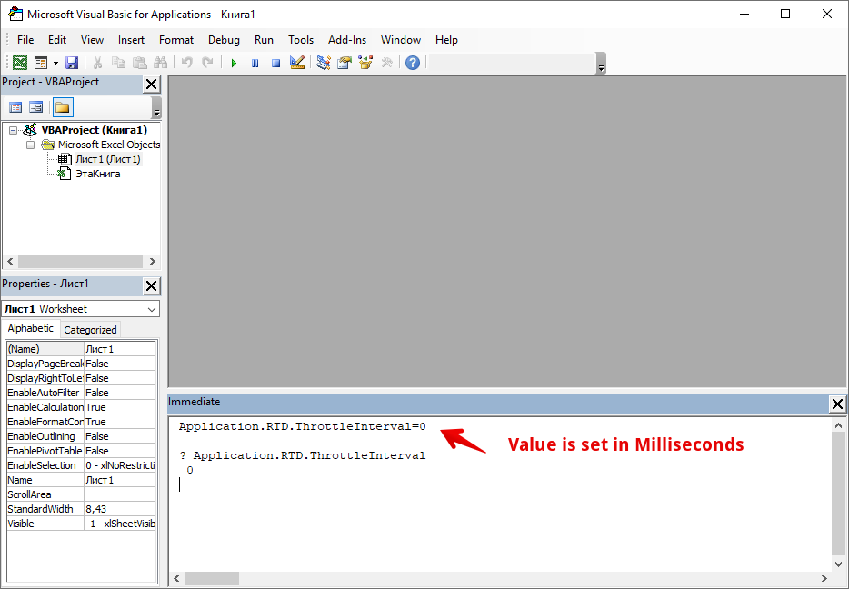

# Изменение интервала скорости обновления RTD в Excel

Интервал интервала скорости обновления данных по умолчанию составляет 2000 миллисекунд. Чтобы изменить его в Excel, выполните следующие действия:

1. В Excel перейдите в редактор Visual Basic, нажав **ALT + F11**.
2. Откройте окно Immediate Window и введите этот код: **`Application.RTD.ThrottleInterval=0`**  \(**Примечание:** если окно **Immediate Window** не открыто, нажмите **CTRL + G**, чтобы отобразить окно.\)
3. Убедитесь, что ваш курсор находится на строке, которую вы только что набрали, и затем нажмите ENTER. \(Примечание: '\(0\)' можно изменить, чтобы настроить желаемую скорость.\)
4. Чтобы убедиться, что он установлен правильно, введите эту строку кода в окне Immediate Window:

   **`? Application.RTD.ThrottleInterval`**

5. Убедитесь, что ваш курсор находится в конце этой строки, а затем нажмите ENTER. В окне должно отображаться 0; тогда вы знаете, что ваш интервал установлен правильно.


Значение Throttle Interval Value устанавливается в миллисекундах \(!\)


