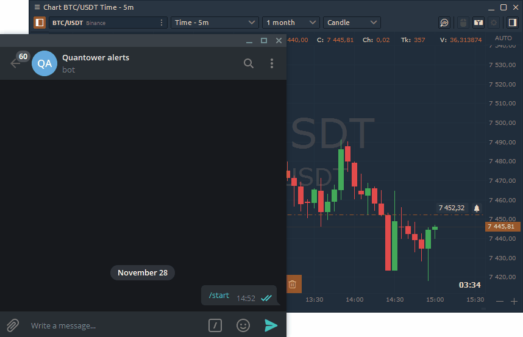
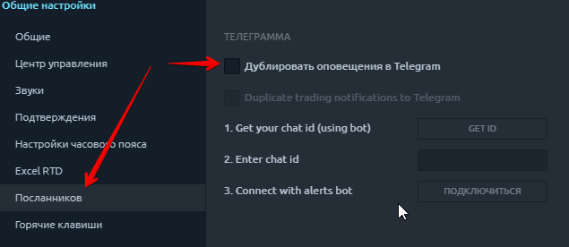
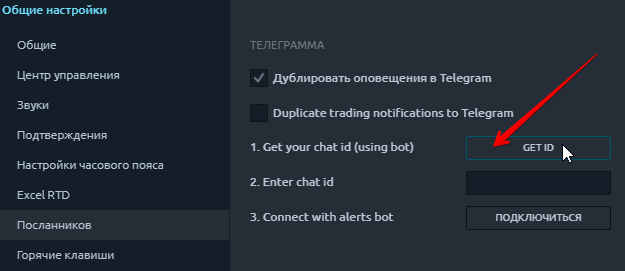
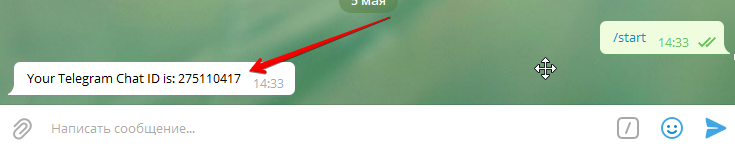
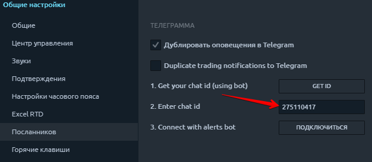
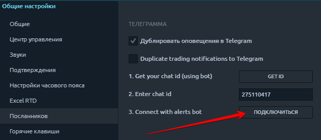

# Quantower Telegram Bot

Quantower Alert Bot отправит сообщение в вашу учетную запись Telegram обо всех событиях, которые вы установили на платформе. Например, установите на график ценовое оповещение, и когда цена достигнет этого уровня, будет отправлено уведомление в мессенджер.

## Как добавить Telegram Bot в свой аккаунт?

Чтобы добавить бота в Telegram, откройте Общие настройки платформы. **-&gt; Messengers -&gt; Duplicate alerts to Telegram**.

Укажите свой личный **идентификатор чата,** который вы можете узнать, нажав на кнопку «Получить идентификатор». 

Откроется новый бот **Chat ID Echo**, и он покажет **«Ваш идентификатор чата Telegram: xxxxxxx».** 

Скопируйте этот код с бота **Telegram** и введите этот ID чата в соответствующее поле в настройках Quantower:

Подключитесь к Quantower Alert Bot

Вы автоматически будете направлены в @quantower\_alerts\_bot, и это означает что Вы подключили уведомления и можете перейти к настройкам самого уведомления.

## Как получать уведомления в Telegram Bot?

Telegram Bot отправляет уведомления об оповещениях, которые вы установили на активных графиках или через список наблюдения. Если у вас еще нет настроенных уведомлений, бот будет в режиме ожидания.

Как только ваше оповещение сработает, вы получите уведомление в телеграмме со следующим текстом:

_**"Alert on ENQM21: price 13,379.00 reached."**_

Если вы активируете опцию **«Дублировать торговые уведомления в Telegram»**, то не только уведоления, а и все оповещения о торговых операциях будут автоматически перенаправляться в Telegram.

