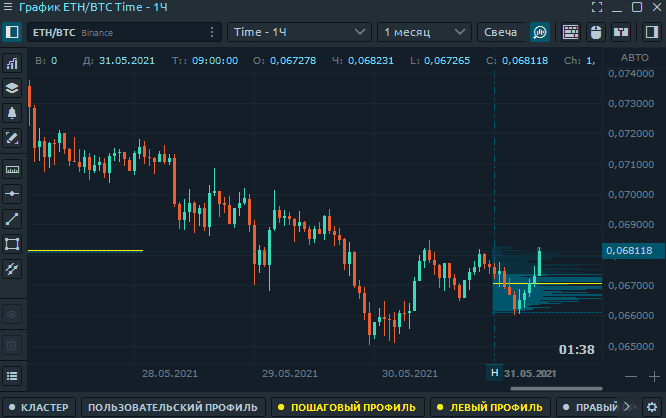

# Оптимизация Quantower на слабых ПК

Если Ваше оборудование не соответствует требованиям для оптимальной работы Quantower , то данная статья  поможет ускорить работу терминала на вашем ПК для комфортной работы и позволит пользователям с более слабой системой воспользоваться всеми преимуществами платформы при меньшей нагрузке.

* ****[**Требования к ПК**](optimizaciya-quantower-na-slabykh-pk.md#trebovaniya-k-pk)****
* [**Скорость передачи данных**](optimizaciya-quantower-na-slabykh-pk.md#skorost-peredachi-dannykh)****
* ****[**Список наблюдения**](optimizaciya-quantower-na-slabykh-pk.md#spisok-nablyudeniya)****
* ****[**Загрузка объемного анализа**](optimizaciya-quantower-na-slabykh-pk.md#optimizaciya-quantower-na-slabykh-pk)****
* ****[**Одновременное открытие нескольких панелей**](optimizaciya-quantower-na-slabykh-pk.md#odnovremennoe-otkrytie-neskolkikh-panelei)****
* ****[**DOM Surface уменьшение истории**](optimizaciya-quantower-na-slabykh-pk.md#dom-surface-umenshenie-istorii)****
* ****[**Как уменьшить скорость обновления Dom Trader**](optimizaciya-quantower-na-slabykh-pk.md#kak-umenshit-skorost-obnovleniya-dom-trader)****

## **Требования к ПК**

Терминал Quantower работает с большим количеством информации поступающей с разных бирж. Ниже приведены наши рекомендуемые требования к ПК:


* Windows 10
* [.NET Framework v.4.8](https://dotnet.microsoft.com/download/dotnet-framework/thank-you/net48-web-installer)
* Доступное дисковое пространство— 1 GB (зависит от объема загруженной истории)
* **Требования к оборудованию для Quantower зависят от того, что вы с ним делаете**. Большинство настольных систем могут запускать Quantower без каких-либо проблем.
* Следующие технические характеристики оборудования настоятельно рекомендуются для скорости системы: **16 GB RAM, минимум  4 core CPU, и SSD.**



**Microsoft официально прекратила поддержку Windows 8 и Windows 7**. Поэтому платформа может не запускаться или работать некорректно. Более подробную информацию о поддерживаемых версиях смотрите на официальном сайте Microsoft. \
****\
**Мы поддерживаем работу только на Windows 10.**


## Скорость передачи данных

На **г**[**лавной панели инструментов **](https://help.quantower.com/general-settings/main-toolbar)есть показатель Вашей скорости обработки запроса , следите за ним.

Оптимальные показатели данного параметра до 300-350. Для некоторых подключений, например для Binance, данный показатель это не чистый пинг, а время необходимое на отправку запроса, его обработку и получения ответа от биржи.

Если ваше соединение имеет выше параметр, то нужно обратится к Вашему провайдеру, либо уменьшить нагрузку на передачу данных. Поэтому, далее речь пойдет о том, как уменьшить нагрузку на передачу данных.

## **Список наблюдения**

Одна из самых распространенных ошибок пользователей со слабым оборудованием, это одновременное добавление в [**Список наблюдения **](https://app.gitbook.com/@quantower/s/quantower-ru/\~/drafts/-Mb0Ddwylpg7XBsm9aH-/analytics-panels/watchlist)всех существующих торговых символов, какие есть в [выбранном подключении.](https://app.gitbook.com/@quantower/s/quantower-ru/connections)

Действительно, список наблюдения мощный инструмент, для выбора и отбора торговых пар для торговли по различным параметрам, который можно использовать как скринер. \
Вместе с тем, при слабом ПК, рекомендуется:\
\- **ограничить количество торговых символов в списке. **Оставьте только те торговые пары, за которыми Вы следите и используете в торговле в текущий день. \
\-**уменьшить количество параметров для отбора** и сортировки.\
Это существенно снизит нагрузку.

## **Загрузка объемного анализа**

Начальная загрузка объемного анализа на [**графике **](https://app.gitbook.com/@quantower/s/quantower-ru/\~/drafts/-Mb0B1L-dpJcZ1tXEmpW/analytics-panels/chart)может занять определенное время. Это нормально, так как в это время происходит большой объем загрузки истории данных и расчета. Особенно это может выражаться при одновременной загрузке кластерного анализа, статистики по времени и пошагового объема.&#x20;


Н[ачиная с версии Version 1.103.1](https://www.quantower.com/release-notes) **\[Binance, Binance Futures, FTX, Bitmex]** , значительно **увеличена скорость загрузки** данных Volume Analysis.&#x20;


Вместе с тем, что бы оптимизировать нагрузку, **сократите одновременную загрузку объемного анализа сразу на нескольких графиках.**

## **Одновременное открытие нескольких панелей**

Quantower позволяет одновременное открытие неограниченного количества поверхностей для профессионального анализа ситуации на рынке. \
Для оптимизации работы платформы на слабых ПК, уменьшите количество одновременно открытых поверхностей и сократите их до минимально необходимого для качественной и быстрой работы на рынке.\
\
Создание и использование [**объединенных панелей (Binds)**](https://app.gitbook.com/@quantower/s/quantower-ru/\~/drafts/-Mb0ImBUTgEG2lCZ2fZg/general-settings/binds) с количеством более 2-3х,  так же влияет на производительность системы.&#x20;

.gif>)

## **DOM Surface уменьшение глубины рыночных данных**

Используя панель [**DOM Surface**](https://app.gitbook.com/@quantower/s/quantower-ru/\~/drafts/-Mb0Kwc5RioRibfpkZ17/analytics-panels/dom-surface)**,** трейдер видит все изменения лимитных ордеров в книге заказов (**в зависимости от глубины рыночных данных**), которая представлена ​​в виде тепловой карты.&#x20;

При длительной работе DOM SURFACE, история данных занимает память. Одним из способов оптимизации нагрузки, это уменьшение глубины рыночных данных до минимально необходимого параметра, используемого в Вашей торговле.\
Так же можно уменьшить количество дальних уровней отображаемых на тепловой карте, если Ваш стиль торговли не использует их.

## Как уменьшить скорость обновления Dom Trader

Этот параметр влияет на то, как часто данные будут обновляться в Dom Трейдер. Вам нужно поэкспериментировать и найти оптимальную настройку для вашего региона.\
Чем ниже данный параметр, тем чаще будут обновляться данные, и соответственно наоборот.


Слишком частое обновление Dom Трейдер может привести к значительным задержкам в обработке данных, если у вас слабый компьютер.


****
