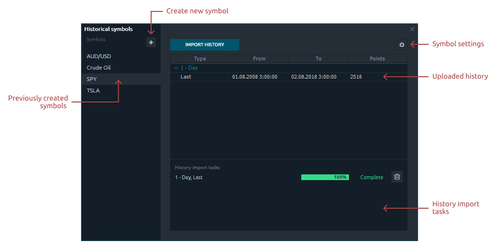
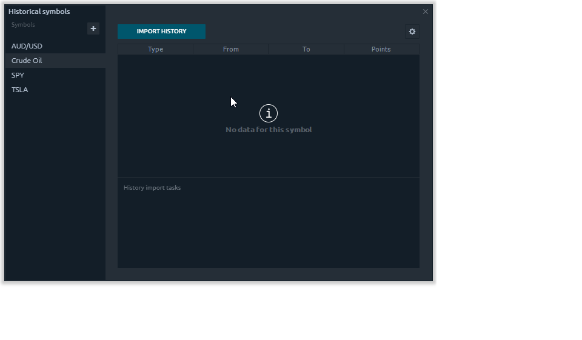
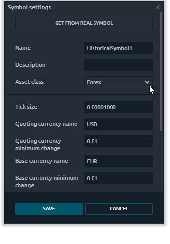

# Исторические символы

Если вам необходимо импортировать торговые котировки в Quantower от стороннего поставщика данных для выполнения бэктестирования или технического анализа, в этом случае незаменимы исторические символы. Например, вы можете загрузить любые данные о ценах с Quandl, IQFeed, NASDAQ или Yahoo и протестировать на них свою торговую идею.

Давайте вкратце посмотрим, как это работает.

## Как добавить новый исторический символ?

* Во-первых, вам нужно настроить параметры символа, который вы хотите загрузить. Если вы хотите провести бэктестинг, важно правильно установить все параметры - класс актива, размер тика и т. Д. 
* Вы можете заимствовать параметры из существующего символа.

  Импортируйте исторические котировки из файла .csv или из существующего символа. Например, загрузите историю торговли сырой нефтью из Quandl.

* Нажмите кнопку **«Импортировать историю»,** выберите «Импортировать из файла» и укажите путь к нужному файлу.
* После того, как вы импортировали файл, вам нужно его проанализировать. В настройках внимательно выберите Разделитель, Формат даты / времени, укажите все необходимые столбцы \(OHLC, Volume\).


Вы можете изменить формат даты / времени вручную в соответствии с форматом в файле.


* Выберите агрегирование \(Tick, Minute, Day\) и тип данных \(Ask, Bid, Last\) внизу таблицы.
* После завершения импорта вы можете работать с этой историей, выполняя тестирование на истории через History Player или технический анализ.

Чтобы просмотреть диаграмму импортированной истории прямо из панели «Исторические символы», щелкните правой кнопкой мыши строку данных и откройте диаграмму.


Если диаграмма не загружается, проверьте выбранный тип данных на диаграмме. Он должен соответствовать загруженной истории.


## Как изменить или удалить исторический символ?

Чтобы изменить настройки торгового символа, вам нужно выбрать нужный символ и щелкнуть значок шестеренки.

Чтобы удалить торговый символ, вам нужно выбрать нужный символ и щелкнуть значок корзины. Вы также можете удалить только импортированную историю для выбранного символа. Для этого щелкните правой кнопкой мыши импортированные данные и выберите «Удалить выбранную историю».

## Настройки символа

Чтобы правильно провести бэктестинг, вам необходимо настроить параметры символа, который вы хотите загрузить. Если запрашиваемая история относится к существующему торговому символу в Quantower, тогда настройки можно просто заимствовать, нажав кнопку «Получить из реального символа».

| **Имя** | Имя символа загрузки. Это может быть тикер или название, которое вам понятно. |
| :--- | :--- |
| Описание | Краткое описание символа или его полное название |
| Класс активов | Доступные типы активов - Forex, CFD, Equities, Futures, Crypto. |
| Размер тика | Это минимальное колебание цены выбранного торгового символа. |
| Имя базовой валюты | Имя базовой валюты для загруженного символа \(USD, EUR, CHF\) |
| Минимальное изменение базовой валюты | Это минимальное колебание цены выбранного торгового символа в денежном выражении за тик. |
| Название котируемой валюты | Название котируемой валюты для загруженного символа \(USD, EUR, CHF\) |
| минимальное колебание цены котируемой валюты | Это минимальное колебание цены котируемой валюты для выбранного торгового символа в денежной стоимости за тик. |
| Тип котировки | Доступный тип котировки - Размер лота, Стоимость тика |
| Размер лота | Минимальный доступный размер сделки для размещения заказа. Например, для валют стандартный лот равен 100 000 единиц базовой валюты. |
| Шаг лота | Минимальный шаг смены торгового лота. Для валютного рынка шаг лота = 0,01 или меньше. Для фьючерса шаг лота = 1 |
| **Мин. лот** | Минимальное количество лотов, доступных для торговли |
| **Макс. лот** | Максимальное количество лотов, доступных для торговли |

