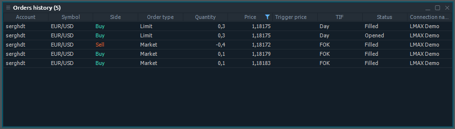
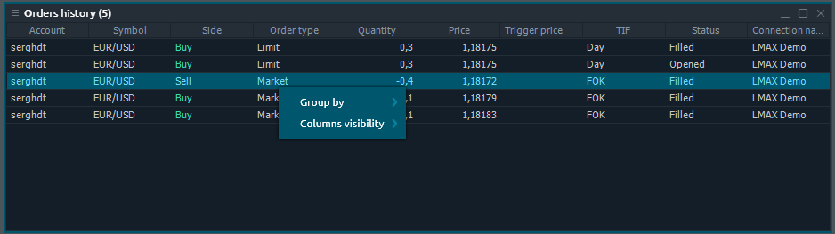

# История ордеров

Панель «История ордеров» связана с группой «Портфолио» боковой панели Центра управления.

## Доступные столбцы

| Счет | логин учетной записи, на которой была сделана сделка |
| :--- | :--- |
| Символ | Торговый символ |
| Описание | Comments for symbol |
| Тип символа | A symbol's market category \(CFD, spot, stocks, etc.\) |
| Дата окончания срока | Date of contract expiration |
| Цена исполнения | Price of option contract performance |
| Тип сделки  | Тип сделки \(ПОКУПКА или ПРОДАЖА\) |
| Тип ордера |  |
| Количество | Сумма ордера в лотах или единицах, в зависимости от того, что выбрано в диалоговом окне «Настройки». |
| Цена | Цена, по которой был исполнен заказ. |
| триггер цена |  |
| TIF | Срок действия ордера |
| Статус | Статус ордера |
| Дата / время | Дата и время размещения ордера |
| ID ордера | Уникальный номер, который торговая система присваивает каждому ордеру. |
| ID группы ордеров |  |
| Название соединения |  |

## Context menu actions

By right-clicking on each row of Order History panel, you will get a context menu with the following functions:

### Common actions

| **Group by** | Groups all rows by the selected column |
| :--- | :--- |
| **Columns visibility** | Allows to toggle the columns visibility |

