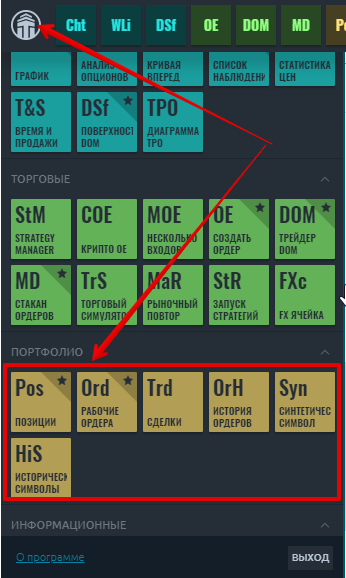
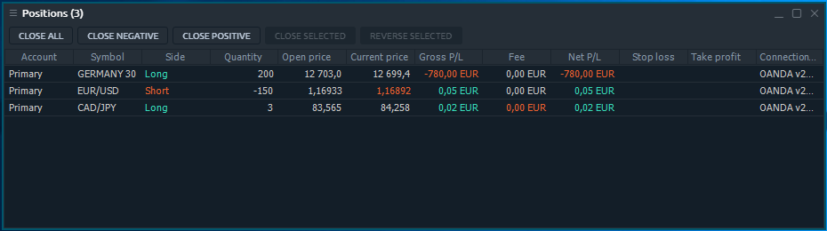
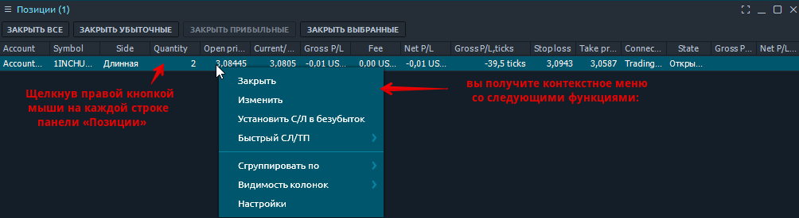

# Позиции

На панели «Позиции» отображаются все открытые на данный момент позиции. Как только вы открываете новую позицию, она появляется на этой панели и становится доступной для управления. Панель **Позиции** связана с группой **Портфолио** боковой панели Центра управления.

## Доступные столбцы

| Счет | логин учетной записи, на которой открыта позиция |
| :--- | :--- |
| Символ | торгуемый символ |
| Описание | комментарии к символу |
| Тип символа | рыночная категория символа \(CFD, спот, акции и т. д.\) |
| Дата окончания  | дата истечения контракта |
| ID позиции | уникальный номер, который торговая система присваивает каждой позиции |
| Тип сделки | тип сделки \(ПОКУПКА или ПРОДАЖА\) |
| Цена открытия | цена, по которой была открыта позиция |
| Текущая цена | рыночная цена, которую можно получить у брокера |
| Объем | объем позиции в лотах или единицах, в зависимости от того, что выбрано в диалоговом окне «Настройки». |
| Дата / время | дата и время открытия позиции |
| Валовая Прибыль / убыток | прибыль / убыток в валюте счета, рассчитывается исходя из разницы в цене |
| Прибыль / убыток**,** тики |  |
| **Прибыль P/L** | прибыль / убыток по позиции без учета комиссии |
| Расположение экспозиции | размещение позиции в валюте счета. Рассчитывается на основе цены открытия |
| Стоимость позиции \(цена открытия\) | открытая стоимость позиции. Рассчитывается на основе цены открытого рынка |
| Стоимость позиции \(текущая цена\) | текущая стоимость позиции. Рассчитывается исходя из текущей рыночной цены |
| Комиссия | показывает общую сумму комиссии, взятой за позицию |
| Swaps | суммы, собранные / выплаченные брокером при переносе позиции на новую дату валютирования |
| Дата окончания срока | дата истечения контракта |
| Цена исполнения | цена исполнения опционного контракта |
| Стоп-лосс | Цена стоп-лосса, установленная для позиции |
| Тейк-профит | Цена тейк-профита, установленная для позиции |

## Опции контекстного меню

Щелкнув правой кнопкой мыши на каждой строке панели «Позиции», вы получите контекстное меню со следующими функциями:

### Выбранные позиции \(и\) действия

<table>
  <thead>
    <tr>
      <th style="text-align:left"><b>&#x418;&#x437;&#x43C;&#x435;&#x43D;&#x438;&#x442;&#x44C; &#x43F;&#x43E;&#x437;&#x438;&#x446;&#x438;&#x44E;</b>
      </th>
      <th style="text-align:left">&#x412;&#x44B;&#x437;&#x44B;&#x432;&#x430;&#x435;&#x442; &#x44D;&#x43A;&#x440;&#x430;&#x43D;
        &#x43C;&#x43E;&#x434;&#x438;&#x444;&#x438;&#x43A;&#x430;&#x446;&#x438;&#x438;,
        &#x43F;&#x43E;&#x437;&#x432;&#x43E;&#x43B;&#x44F;&#x44E;&#x449;&#x438;&#x439;
        &#x434;&#x43E;&#x431;&#x430;&#x432;&#x43B;&#x44F;&#x442;&#x44C; &#x43E;&#x440;&#x434;&#x435;&#x440;&#x430;
        SL / TP &#x43A; &#x432;&#x44B;&#x431;&#x440;&#x430;&#x43D;&#x43D;&#x43E;&#x439;
        &#x43F;&#x43E;&#x437;&#x438;&#x446;&#x438;&#x438; &#x432;&#x440;&#x443;&#x447;&#x43D;&#x443;&#x44E;</th>
    </tr>
  </thead>
  <tbody>
    <tr>
      <td style="text-align:left"><b>&#x423;&#x441;&#x442;&#x430;&#x43D;&#x43E;&#x432;&#x438;&#x442;&#x44C; SL &#x432; &#x431;&#x435;&#x437;&#x443;&#x431;&#x44B;&#x442;&#x43E;&#x43A;</b>
      </td>
      <td style="text-align:left"></td>
    </tr>
    <tr>
      <td style="text-align:left"><b>&#x411;&#x44B;&#x441;&#x442;&#x440;&#x44B;&#x439; SL/TP</b>
      </td>
      <td style="text-align:left">&#x43F;&#x43E;&#x437;&#x432;&#x43E;&#x43B;&#x44F;&#x435;&#x442; &#x431;&#x44B;&#x441;&#x442;&#x440;&#x43E;
        &#x434;&#x43E;&#x431;&#x430;&#x432;&#x43B;&#x44F;&#x442;&#x44C; &#x43E;&#x440;&#x434;&#x435;&#x440;&#x430;
        SL / TP &#x43A; &#x432;&#x44B;&#x431;&#x440;&#x430;&#x43D;&#x43D;&#x43E;&#x439;
        &#x43F;&#x43E;&#x437;&#x438;&#x446;&#x438;&#x438;</td>
    </tr>
    <tr>
      <td style="text-align:left"><b>&#x417;&#x430;&#x43A;&#x440;&#x44B;&#x442;&#x44C; &#x43F;&#x43E;&#x437;&#x438;&#x446;&#x438;&#x44E;</b>
      </td>
      <td style="text-align:left">&#x41E;&#x43F;&#x446;&#x438;&#x438;: &#x437;&#x430;&#x43A;&#x440;&#x44B;&#x442;&#x44C;
        &#x432;&#x441;&#x435; &#x432;&#x44B;&#x431;&#x440;&#x430;&#x43D;&#x43D;&#x44B;&#x435;
        &#x43F;&#x43E;&#x437;&#x438;&#x446;&#x438;&#x438;, &#x432;&#x441;&#x435;
        &#x43F;&#x43E;&#x437;&#x438;&#x446;&#x438;&#x438; &#x43F;&#x43E; &#x432;&#x44B;&#x431;&#x440;&#x430;&#x43D;&#x43D;&#x43E;&#x43C;&#x443;
        &#x441;&#x438;&#x43C;&#x432;&#x43E;&#x43B;&#x443;, &#x432;&#x441;&#x435;
        &#x43F;&#x43E;&#x437;&#x438;&#x446;&#x438;&#x438; &#x434;&#x43B;&#x44F;
        &#x432;&#x44B;&#x431;&#x440;&#x430;&#x43D;&#x43D;&#x43E;&#x433;&#x43E;
        &#x441;&#x447;&#x435;&#x442;&#x430;, &#x432;&#x441;&#x435; &#x43F;&#x43E;&#x437;&#x438;&#x446;&#x438;&#x438;</td>
    </tr>
    <tr>
      <td style="text-align:left"><b>&#x420;&#x435;&#x432;&#x435;&#x440;&#x441;</b>
      </td>
      <td style="text-align:left">
        
&#x43F;&#x43E;&#x437;&#x432;&#x43E;&#x43B;&#x44F;&#x435;&#x442; &#x43F;&#x435;&#x440;&#x435;&#x432;&#x435;&#x440;&#x43D;&#x443;&#x442;&#x44C;
          &#x432;&#x44B;&#x431;&#x440;&#x430;&#x43D;&#x43D;&#x44B;&#x435; &#x43E;&#x442;&#x43A;&#x440;&#x44B;&#x442;&#x44B;&#x435;
          &#x43F;&#x43E;&#x437;&#x438;&#x446;&#x438;&#x438; &#x432; &#x43E;&#x431;&#x440;&#x430;&#x442;&#x43D;&#x443;&#x44E;
          &#x441;&#x442;&#x43E;&#x440;&#x43E;&#x43D;&#x443;.

        
*** &#x434;&#x430;&#x43D;&#x43D;&#x430;&#x44F; &#x43E;&#x43F;&#x446;&#x438;&#x44F;
          &#x434;&#x43E;&#x441;&#x442;&#x443;&#x43F;&#x43D;&#x430; &#x43D;&#x435;
          &#x432;&#x43E; &#x432;&#x441;&#x435;&#x445; &#x43F;&#x43E;&#x434;&#x43A;&#x43B;&#x44E;&#x447;&#x435;&#x43D;&#x438;&#x44F;&#x445;,
          &#x430; &#x43B;&#x438;&#x448;&#x44C; &#x432; &#x442;&#x435;&#x445;, &#x433;&#x434;&#x435;
          &#x43F;&#x43E;&#x441;&#x442;&#x430;&#x432;&#x449;&#x438;&#x43A; &#x434;&#x430;&#x43D;&#x43D;&#x44B;&#x445;
          &#x43F;&#x440;&#x435;&#x434;&#x43E;&#x441;&#x442;&#x430;&#x432;&#x43B;&#x44F;&#x435;&#x442;
          &#x442;&#x430;&#x43A;&#x443;&#x44E; &#x432;&#x43E;&#x437;&#x43C;&#x43E;&#x436;&#x43D;&#x43E;&#x441;&#x442;&#x44C;.

      </td>
    </tr>
  </tbody>
</table>

### Общие фильтры

| Группировать по | Группирует все строки по выбранному столбцу |
| :--- | :--- |
| Видимость столбцов | Позволяет переключать видимость столбцов |

## Управление позициями горячими кнопками

Чтобы эффективно управлять своей позицией, на панели «Позиции» есть панель «Горячие кнопки». Это позволяет трейдеру выполнять наиболее важные действия с каждой, несколькими или всеми доступными открытыми позициями в один клик.


В зависимости от настроек панели горячие кнопки могут работать без экрана подтверждения. Будьте осторожны при их использовании.


### Список горячих кнопок

| Точка безубыточности |  |
| :--- | :--- |
| **Закрыть все** | закрывает все открытые позиции |
| **CLX все** | закрывает все открытые позиции и отменяет все ордера |
| **Отменить все** | отменяет все позиции |
| **Закрыть убыточные** | закрывает позиции с отрицательной прибылью / убытком |
| **Закрыть прибыльные** | закрывает позиции с положительной прибылью / убытком |
| **Закрыть позиции в лонг** | закрывает позиции с Side = Long |
| **Закрыть позиции в шорт** | закрывает позиции с Side = Short |
| **Закрыть по символу** | закрывает все позиции по выбранному символу и счету |
| **Закрыть выбранное** | закрывает все выбранные позиции |
| **Реверс** | меняет позиции по выбранному символу и счету |
| **Реверс выбранного** | меняет все выбранные позиции на противоположные |
| **CLX** | закрывает открытые позиции и отменяет заявки по выбранному символу и счету |

### Видимость горячих кнопок

По умолчанию не все доступные горячие кнопки отображаются на панели инструментов панели «Позиции». Вы можете управлять видимостью этих кнопок с помощью контекстного меню: щелкните правой кнопкой мыши и переключите нужные кнопки.


Горячие кнопки расположены на панели инструментов панели, поэтому становятся недоступными после отключения панели инструментов для определенной панели в настройках панели.


