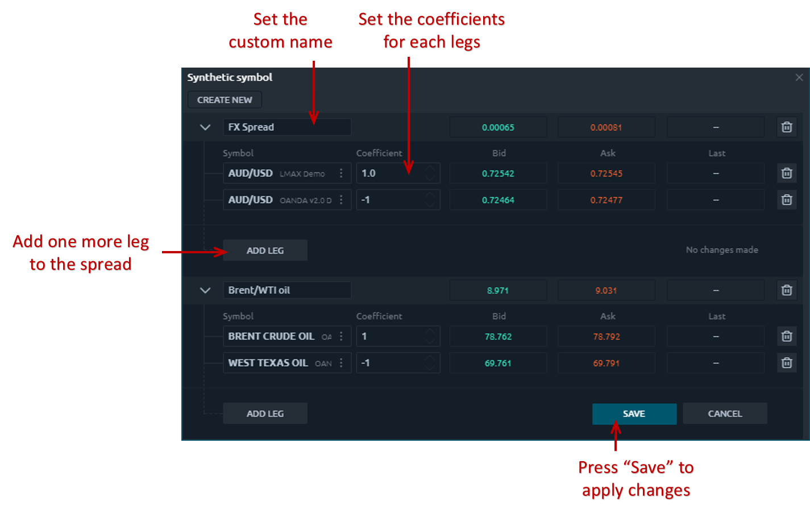
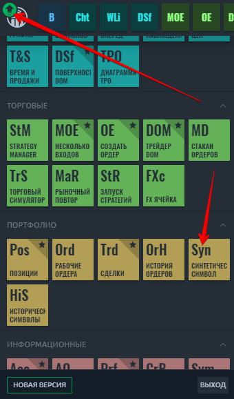
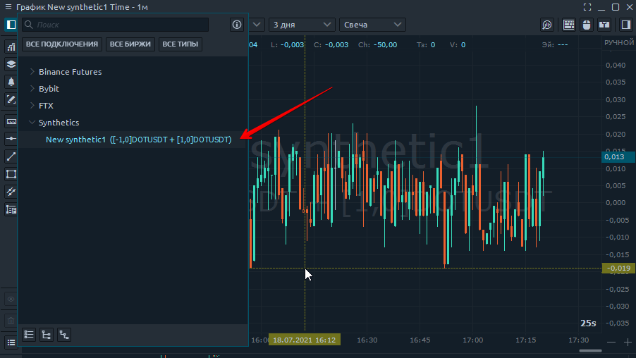
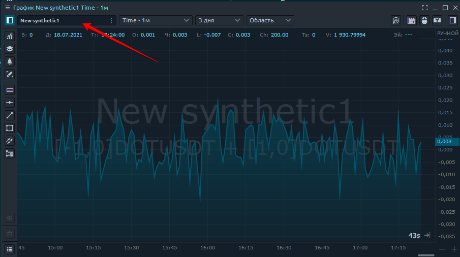
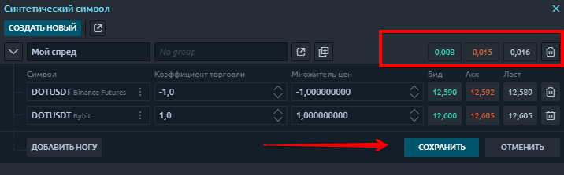
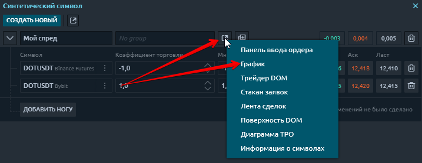
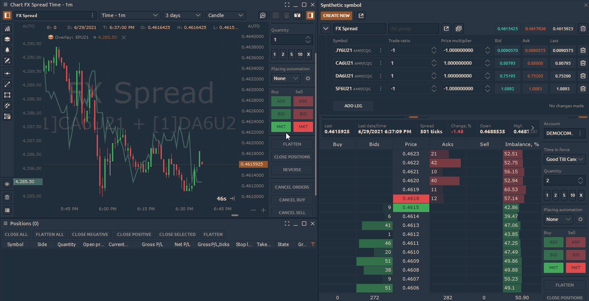

# Синтетические символы

## Что такое синтетические символы

Панель Synthetic Symbols позволяет создавать любые нестандартные инструменты (символы) или спреды, которыми вы можете торговать и использовать в качестве индикатора текущей рыночной ситуации или рыночных расхождений.



**Торговля спредом** - это стратегия, которая одновременно создает длинную и короткую позицию для разных активов, чтобы снизить риск всего портфеля. Каждая сторона спреда называется **«ногой»,** для которой необходимо установить весовой коэффициент, то есть количество контрактов на покупку или продажу. Нейтральная к рынку позиция, которая не зависит от того, пойдет ли рынок вверх или вниз, достигается при правильном выборе этих коэффициентов.

## Как создать собственный спред в Quantower?

Например, давайте создадим валютный спред с несколькими парами форекс (мы будем использовать фьючерсные контракты **на соединении CQG**).

* Откройте панель «Синтетические символы» и нажмите **«Создать новый»**.

* Задайте название для своего спреда и выберите торговый инструмент.

.png>)

* Нажмите «Добавить ногу», чтобы добавить еще один инструмент. Вы можете добавлять неограниченное количество инструментов, создавая новые «ноги».
* Установите коэффициенты для каждой ноги. В нашем примере мы покупаем 1  DOT / USDT на бирже ByBit и продаем 1 DOT / USDTна бирже Binance.
* Нажмите кнопку «Сохранить», чтобы рассчитать полученный спред.
* Откройте панель «График» и выберите свой спред из списка инструментов.


**Коэффициэнт торговли** - это количество контрактов на торговлю по каждой ноге в спреде. Они несут ответственность только за торговлю!

**Множитель цен** - это коэффициенты для построения графика спреда. Они отвечают только за просмотр графика спреда!


* Установите множитель цены для каждой ноги, чтобы построить график для нашего спреда.

В нашем примере мы устанавливаем следующие соотношения: \
1 отрицательный коэффициент для DOT / USDTна бирже Binance.\
1 положительный коэффициент для DOT / USDT на бирже ByBit

* Нажмите кнопку «Сохранить», чтобы рассчитать полученный спред.

Откройте панель «График» и выберите свой спред из списка инструментов или откройте спред прямо из панели «Синтетический символ».

### Как разместить заказ на индивидуальный спред?


В настоящее время платформа не поддерживает размещение лимитных ордеров для синтетических спредов, а поддерживает только рыночные ордера.


Когда вы открываете позицию для выбранного синтетического спреда, платформа открывает позиции для каждого инструмента, включенного в этот спред. Размер и сторона позиции, соответствующие значениям, заданным в поле «Trade Ratio».


**Торговый коэффициент **- это количество контрактов на торговлю по каждой ноге в спреде. Они несут ответственность только за торговлю!

