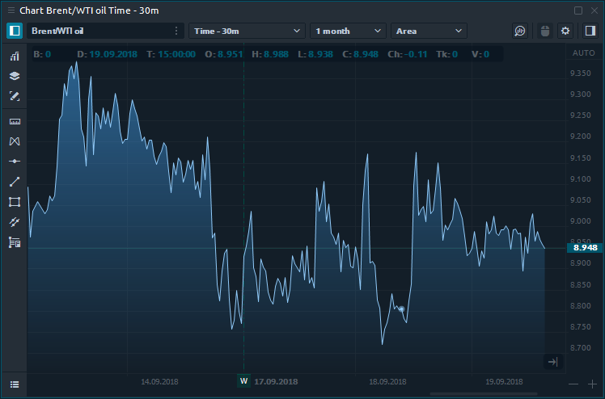

# Синтетические символы

## Что такое синтетические символы

Панель "синтетические символы" позволяет создавать любые нестандартные инструменты \(символы\) или спреды, которыми вы можете торговать и использовать в качестве индикатора текущей рыночной ситуации или рыночных расхождений.



Торговля спредом - это стратегия, которая одновременно создает длинную и короткую позицию для разных активов, чтобы снизить риск всего портфеля. **Каждая транзакция в торговле спредом называется «ногой», для которой необходимо установить весовой коэффициент, то есть количество контрактов на покупку или продажу.** Нейтральная к рынку позиция, которая не зависит от того, пойдет ли рынок вверх или вниз, достигается при правильном выборе этих коэффициентов.

## Как создать пользовательский спред в Quantower?

Например, давайте построим спред между разными брокерами в рамках одного актива и посмотрим, есть ли разница в ценах. Это классический пример брокерского арбитража.

* Откройте панель «Синтетические символы» и нажмите «Создать синтетик».
* Задайте название для своего спреда и выберите торговый инструмент.
* Нажмите «Добавить ногу», чтобы добавить еще один инструмент. Вы можете добавлять неограниченное количество инструментов, создавая новые «ноги».
* Установите коэффициенты для каждой ноги. В нашем примере мы покупаем 1 лот AUD / USD у брокера LMAX и продаем 1 лот AUD / USD у брокера OANDA.
* Нажмите кнопку «Сохранить», чтобы рассчитать полученный спред.
* Откройте панель «График» и выберите свой спред из списка инструментов.

