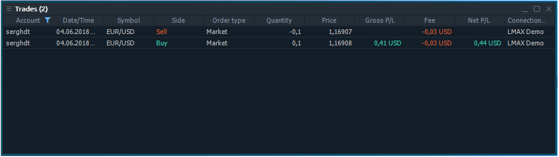
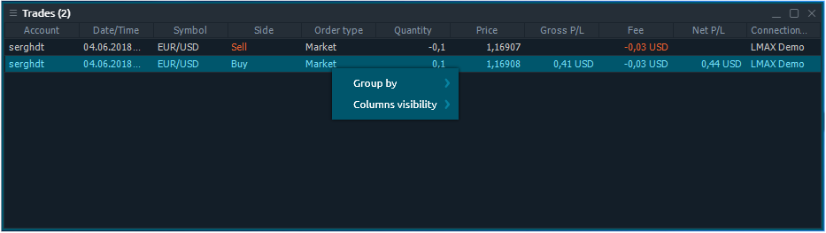

# Сделки

Панель «Сделки» связана с группой «Портфолио панели» боковой панели Центра управления.

## Доступные столбцы

| Счет | логин учетной записи, на которой была сделана сделка |
| :--- | :--- |
| Дата / время | Дата и время совершения сделки |
| Символ | Торговый символ |
| Описание | Комментарии к символу |
| Тип символа | Категория рынка символа \(CFD, спот, акции и т. Д.\) |
| Дата окончания срока | Дата истечения контракта |
| Цена исполнения | Цена исполнения  контракта |
| Тип сделки | Тип сделки \(ПОКУПКА или ПРОДАЖА\) |
| Тип ордера |  |
| Сумма сделки, ед. | Сумма сделки в лотах или единицах, в зависимости от того, что выбрано в диалоговом окне «Настройки». |
| Цена | Цена, по которой была совершена сделка |
| Валовая прибыль / убыток | Прибыль / убыток в валюте счета, рассчитывается исходя из разницы в цене |
| Комиссии | Показывает общую сумму комиссии, взятой за сделку |
| Чистая прибыль / убыток | Прибыль / убыток по сделке без учета комиссии |
| Сумма сделки |  |
| ID сделки | Уникальный номер, который торговая система присваивает каждой сделке. |
| ID ордера | Уникальный номер, который торговая система присваивает каждому ордеру. |
| Название соединения |  |

## Действия в контекстном меню

Щелкнув правой кнопкой мыши на каждой строке панели сделок, вы получите контекстное меню со следующими функциями:

### Общие действия

| **Группировать по** | Группирует все строки по выбранному столбцу |
| :--- | :--- |
| Видимость столбцов | Позволяет переключать видимость столбцов |

