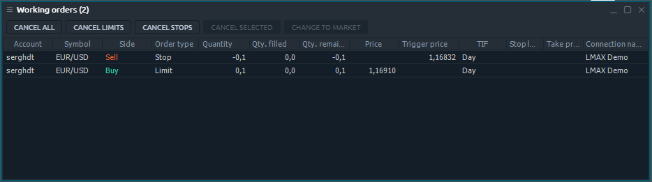
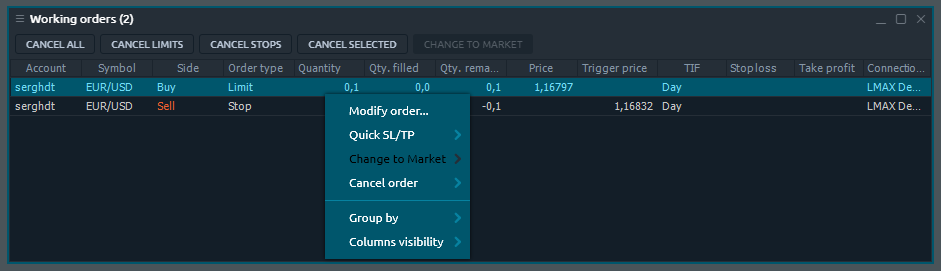

# Рабочие ордера

Как только вы разместите новый ордер, он появится на этой панели и станет доступным для управления. Панель рабочих заказов связана с группой Портфолио боковой панели Центра управления.

## Доступные столбцы

| Счет | Имя для входа в аккаунт, в котором размещен ордер |
| :--- | :--- |
| Символ | Торговый символ |
| Описание | Комментарии к символу |
| Тип символа | Категория рынка символа \(CFD, спот, акции и т. Д.\) |
| Дата окончания  | Дата истечения контракта |
| Цена исполнения | Цена исполнения  контракта |
| Тип сделки | Тип сделки \(ПОКУПКА или ПРОДАЖА\) |
| Тип ордера | Тип ордера |
| Объем ордера | Объем ордера в лотах или единицах, в зависимости от того, что выбрано в диалоговом окне «Настройки». |
| Объем ордера исполненный | Выполненное количество заказа, при частичном исполнении |
| Объем ордера оставшийся | Разница между общим объемом ордера и исполненным |
| Цена | Цена, по которой будет исполнен заказ. |
| Триггер цена | Триггер цена, при достижении которой выставляется стоп лосс или тейк профит |
| TIF | Срок действия ордера |
| Статус | Статус ордера |
| Текущая цена | Текущая рыночная цена на символ ордера |
| Стоп лосс | Цена стоп-лосса, установленная для ордера |
| Тейк профит | Цена тейк-профита, установленная для ордера |
| Дата / время | Дата и время размещения заказа |
| ID ордера | A unique number that the trading system assigns to each order |
| ID группы ордеров |  |
| Название соединения |  |

### Действия в контекстном меню

Щелкнув правой кнопкой мыши на каждой строке панели «Рабочие ордера», ​​вы получите контекстное меню со следующими функциями:

### Действия по выбранным ордерам

| Изменить порядок | Вызывает экран модификации, позволяющий изменять параметры ордеров |
| :--- | :--- |
| Быстрый SL / TP | Позволяет быстро добавлять ордера SL / TP к выбранным ордерам |
| Изменить на "маркет" | Изменить тип ордера на "Маркет" для выбранных ордеров |
| Отменить ордер | Позволяет отменить все выбранные ордера, все ордера по выбранному символу, все ордера по выбранной учетной записи, все ордера |

### Общие действия

| **Group by** | Groups all rows by the selected column |
| :--- | :--- |
| **Columns visibility** | Allows to toggle the columns visibility |

## Hot buttons toolbar

In order to manage your orders efficiently, there is a Hot buttons toolbar in Working orders panel. It allows trader to perform the most crucial actions with each, several or all available order in one click.


Depending on the panel settings, hot buttons can proceed without confirmation screen. Please be careful while using them.


### Hot buttons list

| **Cancel all** | Cancel all orders |
| :--- | :--- |
| **Cancel buy** | Cancel all buy orders |
| **Cancel sell** | Cancel all sell orders |
| **Cancel limits** | Cancel all limit orders |
| **Cancel stops** | Cancel all stop orders |
| **Cancel days** | Cancel all orders with TIF Day |
| **Cancel GTCs** | Cancel all orders with TIF GTC |
| **Cancel selected** | Cancel all selected orders |
| **Cancel &lt;Symbol&gt;** | Cancel all orders by selected Symbol |
| **Modify order** | Show Modify order screen for selected orders |
| **Change to Market** | Change order type to Market for selected orders |

### Hot buttons visibility

By default, not all of the available Hot buttons are displayed on Working orders panel's toolbar. You can manage visibility of that buttons using the context menu: right-click with your mouse and toggle the desired buttons.


Hot buttons are situated on panel's toolbar, so become unavailable once you disable toolbar for specific panel in panel's settings.


