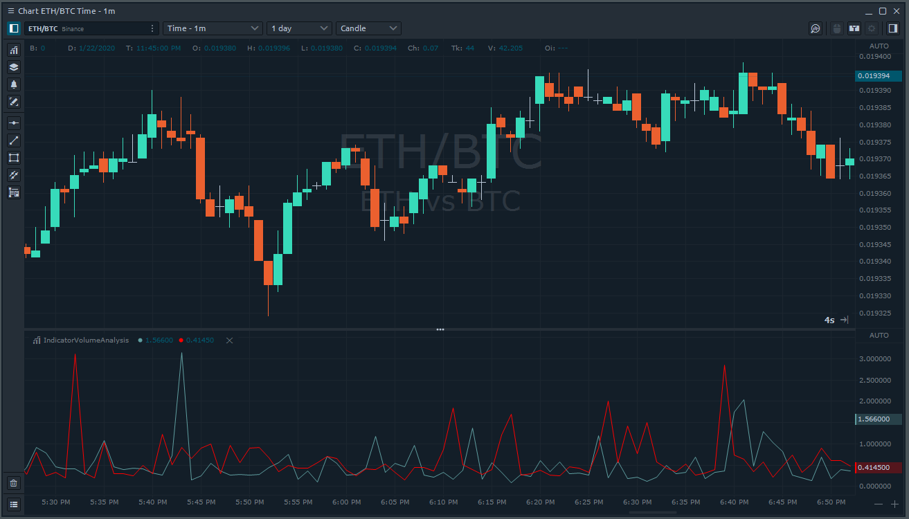

# Доступ к данным анализа объема из индикаторов

Торговая платформа Quantower имеет широкий набор[ **инструментов анализа объема**](https://www.quantower.com/volumeanalysistools), расширенную аналитическую функциональность, которая позволяет вам видеть торгуемый объем на каждом уровне цены, оценивать баланс между покупателями и продавцами и понимать намерения трейдеров относительно будущей цены.

Вы можете легко получить доступ ко всем данным анализа объемов из вашего индикатора. По умолчанию графики не загружают такие данные, так как для получения полной истории сделок требуется время. Вам необходимо уведомить график, что он нужен вашему индикатору для расчетов, и вы можете сделать это, реализовав специальный интерфейс IVolumeAnalysisIndicator:

```csharp
public class IndicatorVolumeAnalysis : Indicator, IVolumeAnalysisIndicator
{       
    ...
```

Он содержит только один метод VolumeAnalysisData\_Loaded и он будет вызван, когда все необходимые данные закончат загрузку:

```csharp
public void VolumeAnalysisData_Loaded()
{
    // Add your logic here
}
```

Если вам нужно знать текущее состояние загрузки, вы можете использовать VolumeAnalysisCalculationProgress из HistoricalData. Если загрузка была запущена, этот объект будет установлен, и вы можете узнать текущее состояние или даже процент загруженных данных:

```csharp
if (HistoricalData.VolumeAnalysisCalculationProgress.State != VolumeAnalysisCalculationState.Finished
    Core.Instance.Loggers.Log(HistoricalData.VolumeAnalysisCalculationProgress.ProgressPercent.ToString());
```

По завершении загрузки объект Total будет доступен для каждого HistoryItem из HistoricalData, который обеспечивает доступ к агрегированным данным анализа объема:

```csharp
HistoricalData[0].VolumeAnalysisData.Total.Volume
HistoricalData[0].VolumeAnalysisData.Total.Trades
HistoricalData[0].VolumeAnalysisData.Total.AverageBuySize
```

Список всех доступных типов данных:

| Тип данных | Описание |
| :--- | :--- |
| Объем | Общий размер всех позиций, исполненных на каждом ценовом уровне или ценовом диапазоне. |
| Объем покупки | Общий размер всех позиций на покупку, выполненных на каждом ценовом уровне или ценовом диапазоне. |
| Объем продажи | Общий размер всех позиций на продажу, выполненных на каждом ценовом уровне или ценовом диапазоне. |
| Сделки | Количество контрактов \(сделок\), заключенных на каждом ценовом уровне. |
| Buy Сделки | Количество сделок на покупку, выполненных на каждом ценовом уровне. |
| Sell Сделки | Количество сделок на продажу, выполненных на каждом ценовом уровне. |
| Buy Объем в процентах | Показывает, сколько процентов от общего объема относится к сделкам на покупку |
| Sell Объем в процентах | Показывает, сколько процентов от общего объема относится к сделкам на продажу |
| Дельта | Показывает разницу в торговом объеме между покупателями и продавцами. Позволяет оценить, кто в данный момент контролирует цену на рынке. |
| Дельта-процент | Показывает разницу \(%\) в торговом объеме между покупателями и продавцами. Позволяет оценить, кто в данный момент контролирует цену на рынке. |
| Средний размер | Средний объем позиции, которая была исполнена по определенной цене или ценовому диапазону. |
| Средний Купить Размер | Средний объем позиции на покупку, которая была исполнена по определенной цене или в ценовом диапазоне. |
| Средний размер продажи | Средний объем позиции на продажу, которая была исполнена по определенной цене или ценовому диапазону. |
| Максимальный объем одной сделки | Показывает максимальный объем одной сделки, которая была исполнена по определенной цене или ценовому диапазону. |
| Максимальный объем одной сделки процент   | Показывает максимальный \(%\) объем одной сделки, которая была исполнена по определенной цене или ценовому диапазону. |

Except **Total** \(aggregated\) information you have access to Volume analysis data for each price from the bar. It is available in PriceLevels dictionary and contains same data types as Total:

```csharp
this.HistoricalData[0].VolumeAnalysisData.PriceLevels[1.2564].Volume
```

As an example let's create a simple indicator, that will draw 2 lines in the separate window of the chart. First one will show AverageBuySize and second AverageSellSize. This is full source code:

```csharp
using System;
using System.Drawing;
using TradingPlatform.BusinessLayer;
using TradingPlatform.BusinessLayer.Modules.Indicators;

namespace IndicatorVolumeAnalysis
{   
    public class IndicatorVolumeAnalysis : Indicator, IVolumeAnalysisIndicator
    {
        public IndicatorVolumeAnalysis()
            : base()
        {
            // Defines indicator's name and description.
            Name = "IndicatorVolumeAnalysis";
            Description = "My indicator's annotation";

            // Defines line on demand with particular parameters.
            AddLineSeries("AverageBuySize", Color.CadetBlue, 1, LineStyle.Solid);
            AddLineSeries("AverageSellSize", Color.Red, 1, LineStyle.Solid);

            // By default indicator will be applied on main window of the chart
            SeparateWindow = true;
        }

        public void VolumeAnalysisData_Loaded()
        {
            // Set value to all previous indicators points
            for (int i = 0; i < this.Count; i++)
            {
                SetValue(this.HistoricalData[i].VolumeAnalysisData.Total.AverageBuySize, 0, i);
                SetValue(this.HistoricalData[i].VolumeAnalysisData.Total.AverageSellSize, 1, i);
            }
        }

        protected override void OnUpdate(UpdateArgs args)
        {            
            // Volume analysis data not loaded yet
            if (this.HistoricalData.VolumeAnalysisCalculationProgress == null || this.HistoricalData.VolumeAnalysisCalculationProgress.State != VolumeAnalysisCalculationState.Finished)
                return;

            // Example of access Volume Analysis data
            SetValue(this.HistoricalData[0].VolumeAnalysisData.Total.AverageBuySize, 0);
            SetValue(this.HistoricalData[0].VolumeAnalysisData.Total.AverageSellSize, 1);            
        }               
    }
}
```

When we build this indicator and add on the chart we can see next result:



In this topic, we showed you the simple example of indicator based on volume analysis data. You may improve it and create really advanced and complex indicator, similar to Volume Analysis tools from Quantower, for example Cluster Chart. In our next topics we will provide an example of drawing volume profiles on the chart.

