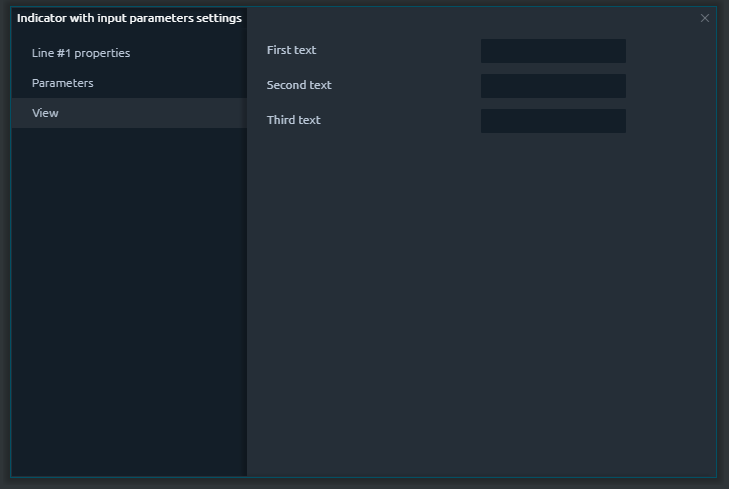
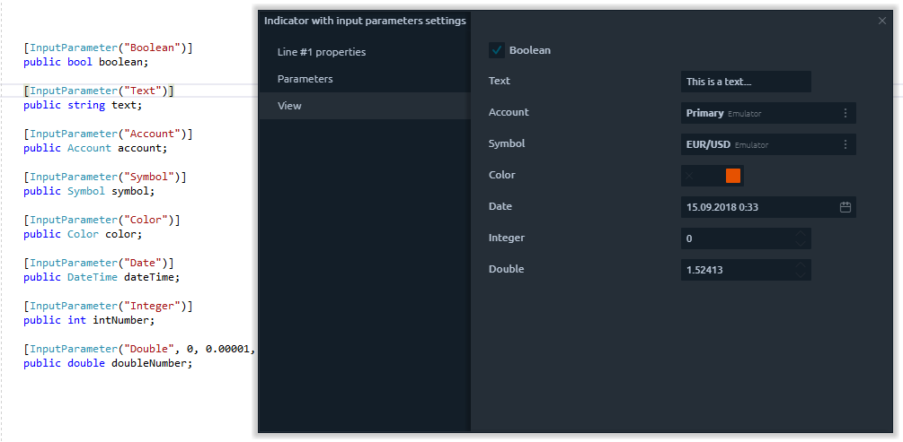

# Входящие параметры

## Общее

В предыдущем разделе мы показали вам, как создать базовый индикатор с помощью Visual Studio с расширением Quantower Algo и использовать его на графике в торговой платформе. Мы создали индикатор Simple Moving Average с жестко запрограммированными параметрами. Но что, если нам нужно изменить эти параметры? Например, мы хотим использовать цены открытия вместо цен закрытия или использовать другой период. Перекомпилировать индикатор каждый раз не очень удобно, и мы предоставляем вам возможность легкой настройки ваших скриптов с помощью так называемых входных параметров.

## Что такое входящий параметр?

После добавления индикатора на график вы можете найти на нем пункт меню «Настройка», отображающий окно «Настройки». Индикаторы обычно имеют некоторые общие настройки для настройки линий и определенные настройки, связанные с их алгоритмом или расчетами.

Вы можете создать любое количество входных параметров, необходимых в ваших скриптах. Их можно использовать как для индикаторов, так и для стратегий.

С технической точки зрения Входной параметр - это обычная переменная, отмеченная специальным атрибутом. На данный момент мы поддерживаем основные базовые типы: строка, число, дата, время, счет, символ, список опций и другие.

Мы подробно покажем, как объявлять каждый тип входных параметров и как их настраивать.

## Типы входящих параметров

### Текст

Иногда может потребоваться, чтобы пользователь предоставил некоторую текстовую информацию, например, для отображения на графике. Для этого вам нужно объявить строковую переменную и пометить ее как **InputAttribute.** Вам необходимо указать имя входного параметра, которое будет отображаться на экране настроек:

```csharp
[InputParameter("Text")]
public string text;
```

Если вы вызовете экран настроек, вы увидите текстовое поле, которое вы можете использовать для ввода значения. Вот и все - ваш первый входной параметр готов:


Если у вас есть несколько входящих параметров и вы хотите расположить их в соответствующем порядке, вы можете применить параметр SortIndex для каждого Входящего параметра:

```csharp
[InputParameter("First text", 1)]
public string firstText;

[InputParameter("Second text", 2)]
public string secondText;

[InputParameter("Third text", 3)]
public string thirdText;
```

Как видите, параметры отображаются в указанном порядке:



### Логический

Если вам нужен простой переключатель, например, для включения опции, вы можете использовать переменную типа bool с атрибутом InputParameter:

```csharp
[InputParameter("Boolean")]
public bool boolean;
```

### Число

Один из важнейших типов входных параметров - числа. Входные параметры могут применяться к переменным типа int, double, long и decimal:

```csharp
[InputParameter("Integer")]
public int intNumber;
```

Вы можете указать дополнительные параметры - минимальное / максимальное значение, приращение и десятичные разряды.

```csharp
[InputParameter("Double", 0, 0.00001, 10, 0.00001, 5)]
public double doubleNumber;
```

### Символ

Иногда может потребоваться возможность выбора символа, например, в случае расчета корреляции между символом на графике и другим символом. И снова - все, что вам нужно, просто объявить переменную и отметить ее атрибутом InputParameter:

```csharp
[InputParameter("Symbol")]
public Symbol symbol;
```

### Акаунт

Если ваш скрипт выполняет какую-либо торговую операцию, вам необходимо указать настройки учетной записи. Используйте для этого переменную типа Account:

```csharp
[InputParameter("Account")]
public Account account;
```

## Дата Время

Обычно настройки DateTime используются для указания некоторого диапазона истории, например, левой и правой границы загруженной истории:

```csharp
[InputParameter("Date")]
public DateTime dateTime;
```

### Цвет

Параметры ввода цвета сохраняют значение цвета в формате RGB:

```csharp
[InputParameter("Color")]
public Color color;
```

### Список с опциями

Список с опциями Входной параметр позволяет выбрать значение из предопределенного списка возможных состояний

```csharp
[InputParameter("Simple price types list", 1, variants: new object[]{
    "Close", PriceType.Close,
    "Open", PriceType.Open,
    "High", PriceType.High,
    "Low", PriceType.Low,
    "Typical", PriceType.Typical,
    "Median", PriceType.Median,
    "Weighted", PriceType.Weighted
})]
```

## Заключение

Подводя итог всему сказанному выше, мы собрали все типы входных параметров, чтобы показать вам, как они могут выглядеть на экране настроек:



Этих основных типов входных параметров достаточно для создания сложных индикаторов и стратегий с широким списком настроек. Несмотря на это, мы постоянно добавляем новые типы входных параметров. Не стесняйтесь обращаться к нам и предлагать свои варианты - мы открыты для отзывов наших пользователей.

