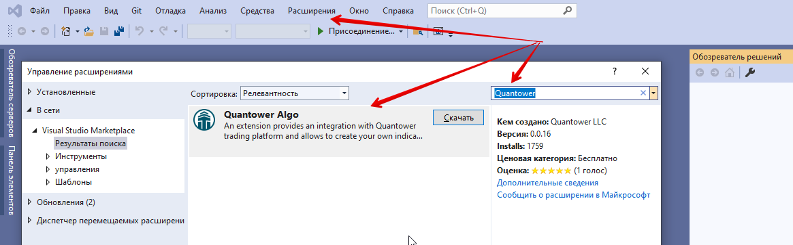
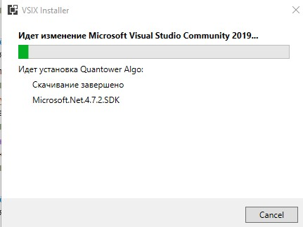
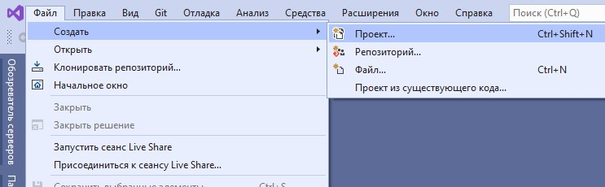
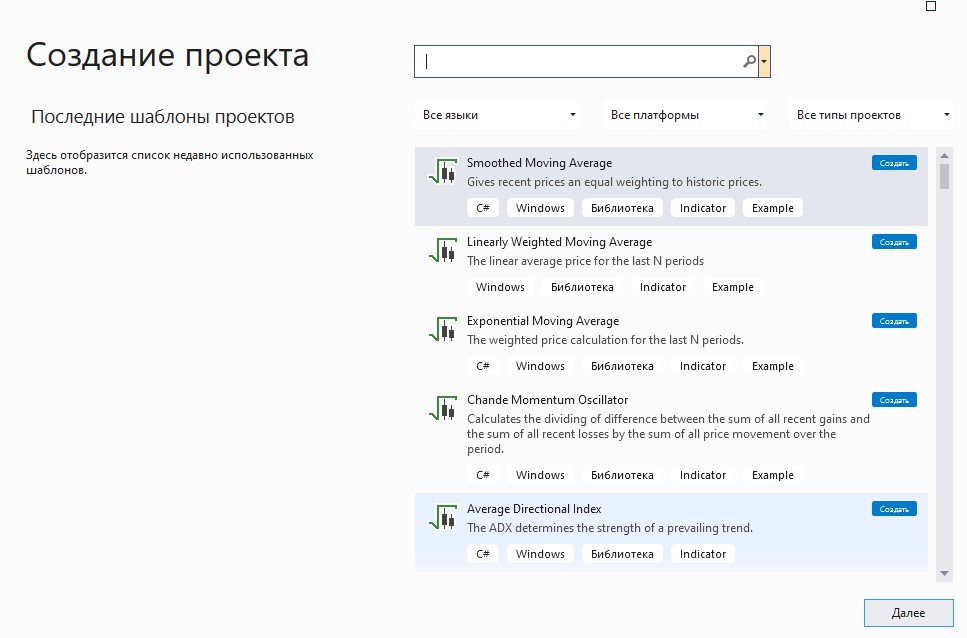

# Установка Visual Studio

Visual Studio - это интегрированная среда разработки (IDE) от Microsoft, которая включает редактор кода с IntelliSense, отладчик, поддержку систем управления версиями и многие другие профессиональные функции. Текущая поддерживаемая версия **Visual Studio - 2019.**


Мы рекомендуем вам использовать самую базовую версию Visual Studio - версию Community, которая доступна бесплатно.


Вы можете скачать [**Visual Studio с официального сайта**](https://visualstudio.microsoft.com/ru/thank-you-downloading-visual-studio/?sku=Community\&rel=16). Для его установки требуется около 10 минут и 2,5 ГБ свободного места на жестком диске.



Загрузите веб-установщик и запустите его. После инициализации вам будет предложено выбрать необходимые компоненты. Для использования с расширением Quantower Algo нам понадобится только рабочая нагрузка **«Разработка рабочего стола NET».** Вы также можете снять флажок с дополнительных компонентов, чтобы уменьшить размер установки:

Продолжите установку, и через несколько минут, после загрузки и применения необходимых пакетов, Visual Studio запустится автоматически:

Теперь нам нужно установить расширение **Quantower Algo** из Visual Studio Marketplace. Используйте пункт главного меню _**«Инструменты -> Расширения и обновления ...», **_чтобы открыть Менеджер расширений. Введите **«Quantower»** в поле поиска на вкладке «Интернет», и вы найдете необходимое расширение:

Щелкните** "Загрузить"**. Visual Studio попросит вас перезапустить, чтобы завершить процесс установки расширения.

Чтобы проверить, успешно ли установлен Quantower Algo, щелкните пункт меню _**«Файл -> Создать -> Проект»**_, введите «Индикатор», и вы увидите специальный тип проекта для пустого индикатора:

Теперь все готово для создания [**вашего первого индикатора.**](https://app.gitbook.com/@quantower/s/quantower-ru/\~/drafts/-MbWdSvrjFLRXlV514IW/quantower-algo/simple-indicator)****
